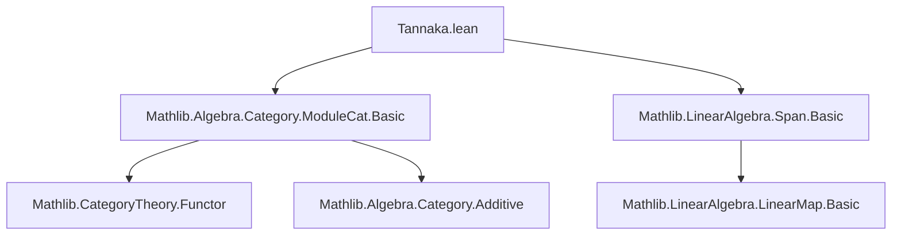

**Technical Brief: `Tannaka.lean` (Lean 4)**  
*Domain: Category-theoretic algebra / Tannaka duality for rings*  

---

### 1. **Key Definitions & Theorems**

| Name | Type | Purpose |
|------|------|---------|
| `ringEquivEndForget₂` | `R ≃+* End (AdditiveFunctor.of (forget₂ (ModuleCat.{u} R) AddCommGrpCat.{u}))` | Constructs the ring isomorphism between a ring `R` and the endomorphism ring of the additive forgetful functor `Module R → AddCommGroup`. This is the core statement of *Tannaka duality for rings* in this formalization. |
| `forget₂` | `ModuleCat R ⥤ AddCommGrpCat` | The forgetful functor from `R`-modules to abelian groups (via underlying additive group). |
| `AdditiveFunctor.of` | `AddCommGrpCat ⥤ Additive (AddCommGrpCat)` | Embeds `AddCommGrpCat` into its additiveication (used to make the functor additive, needed for endomorphism ring structure). |
| `DistribSMul.toAddMonoidHom` | `M → M` (additive hom) | For `r : R`, the map `x ↦ r • x` is an additive monoid homomorphism; used to define the natural transformation component. |

---

### 2. **Naming Conventions**

- **Prefixes**:
  - `ringEquivEndForget₂`: Encodes the object (`ring`), operation (`EquivEnd`), and functor (`Forget₂`) involved.
  - `forget₂`: Standard Lean/CategoryTheory naming for “second forgetful functor” (here: `ModuleCat R → AddCommGrpCat`).
  - `ofHom`, `of`: Standard for embedding morphisms/objects into enriched categories.
- **Suffixes**:
  - `₂`: Indicates this is the *second* forgetful functor variant (likely distinguishing from `forget₁ : ModuleCat R ⥤ Ab` or `forget : ModuleCat R ⥤ Type u`).
- **Other**:
  - `homMk`: Constructor for morphisms in a functor category (here, natural transformations).
  - `congr_fun`: Used to apply extensionality to natural transformations.

---

### 3. **Tactic Stack**

| Tactic | Usage |
|--------|-------|
| `simp` | Simplifying definitions (e.g., `left_inv _ := by simp`) |
| `ext` | Proving equality of natural transformations or functions by extensionality (`ext M (x : M)`) |
| `congr_arg` | Applying congruence to preserve equality under application |
| `symm.trans` | Rewriting equalities backwards and composing |
| `cat_disch` | Custom tactic (likely defined in the project) to discharge category-theoretic goals (used in `map_add'` and `map_mul'`) |

> Note: No `ring`, `linarith`, or `aesop` appear—this proof is highly structured around naturality and universal properties.

---

### 4. **Proof Logic**

The proof proceeds in three phases:

1. **Definition of the forward map** (`toFun`):  
   For `r : R`, define a natural transformation whose component at module `M` is the additive hom `x ↦ r • x`. This uses `DistribSMul.toAddMonoidHom` to ensure additivity.

2. **Definition of the inverse** (`invFun`):  
   Evaluate a natural transformation `φ` at the canonical module `R` (viewed as a module over itself) on the element `1 : R`. This recovers the scalar `r`.

3. **Verification of inverse properties**:
   - `left_inv`: `invFun (toFun r) = r` follows by `simp`.
   - `right_inv`: `toFun (invFun φ) = φ` uses naturality of `φ` along the map `R → M`, `1 ↦ x`, i.e., the module hom `LinearMap.toSpanSingleton R M x`. The key step is:
     $$
     \varphi_M(x) = \varphi_M(\varphi_{R}(1) \cdot x) = \varphi_R(1) \cdot x
     $$
     via naturality and `one_smul`.
   - `map_add'` and `map_mul'`: Show the equivalence is a ring homomorphism; discharged by `cat_disch`, likely using `ext` and naturality again.

---

### 5. **Imports**

| Import | Role |
|--------|------|
| `Mathlib.Algebra.Category.ModuleCat.Basic` | Provides `ModuleCat`, `forget₂`, module homs, scalar multiplication properties. |
| `Mathlib.LinearAlgebra.Span.Basic` | Provides `LinearMap.toSpanSingleton`, the canonical map `R → M` sending `1 ↦ x`, used in naturality argument. |

> No heavy homological algebra or monoidal structure imports—this is a *basic* Tannaka result for rings, not for Hopf algebras or tensor categories.

---

### 6. **Mermaid Diagrams**

#### Dependency Graph (File-Level)



#### Conceptual Overview of the Theorem

```mermaid
graph LR
  R[Ring R] -->|construct| F[Forgetful Functor Forget₂ : ModuleCat R → AddCommGrpCat]
  F -->|take End| E[End(Forget₂)]
  R <-->|ringEquivEndForget₂| E
  style R fill:#f9f,stroke:#333
  style E fill:#bbf,stroke:#333
```

#### Proof Sketch (Naturality Step)

```mermaid
graph LR
  R[R] -->|1 ↦ x| M[M]
  subgraph Natural Square
    R -->|φ_R(1)•–| R
    M -->|φ_M(–)| M
  end
  R -- φ_R(1)•x --> M
  R -- x --> M
  R -- φ_R(1)•– --> R
  style R fill:#f9f,stroke:#333
  style M fill:#bbf,stroke:#333
```

> The naturality square for `φ` along `LinearMap.toSpanSingleton R M x` yields:  
> $$
\varphi_M(x) = \varphi_M(\varphi_R(1) \cdot 1) = \varphi_R(1) \cdot x
$$

---

### 7. **Summary**

This file formalizes the *classical Tannaka duality for rings*:  
> A ring `R` is canonically isomorphic to the ring of natural transformations of the additive forgetful functor `Module R → AddCommGroup`.

It uses only basic module theory and category theory, with a clean, constructive proof relying on naturality and the universal property of free modules (via `LinearMap.toSpanSingleton`). The naming and structure follow Mathlib conventions, with `forget₂` and `ringEquivEndForget₂` indicating the specific variant of forgetful functor and duality isomorphism.
