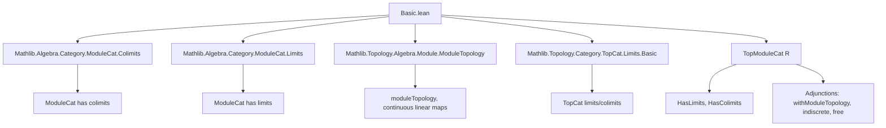
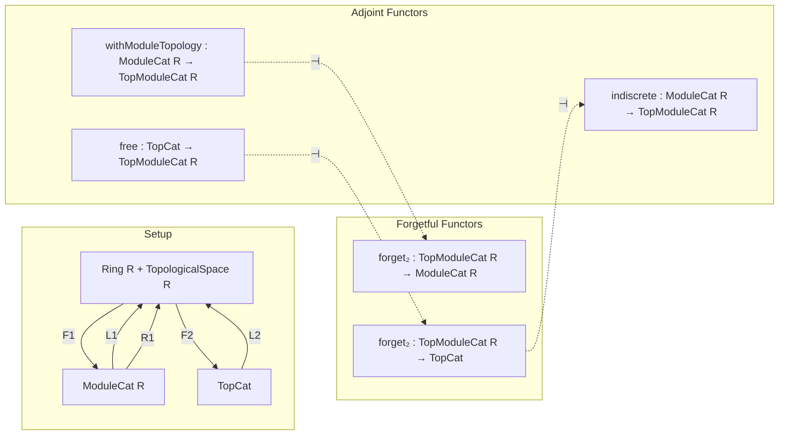
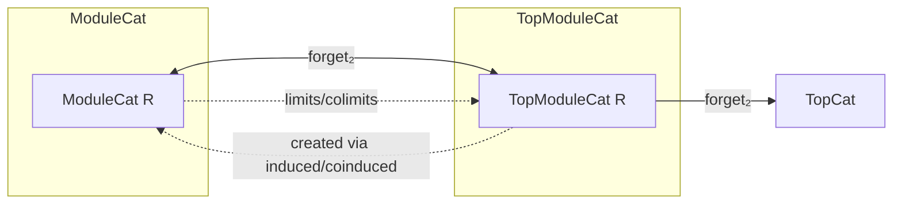

**Technical Brief: `Basic.lean` — Category of Topological Modules (`TopModuleCat R`)**

---

### 1. **Key Definitions & Theorems**

| Name | Type / Structure | Purpose |
|------|------------------|---------|
| `TopModuleCat R` | `Type u → Type v → Type (max u v)` (structure) | Category of topological $R$-modules: modules equipped with a topology making addition and scalar multiplication continuous. |
| `Hom.hom` | `X ⟶ Y → X →L[R] Y` | Projection of a morphism in `TopModuleCat` to its underlying continuous linear map. |
| `ofHom` | `(f : X →L[R] Y) → of R X ⟶ of R Y` | Inclusion of continuous linear maps into `TopModuleCat` morphisms. |
| `ofIso` | `X ≃L[R] Y → X ≅ Y` | Construct an isomorphism in `TopModuleCat` from a continuous linear equivalence. |
| `toContinuousLinearEquiv` | `X ≅ Y → X ≃L[R] Y` | Inverse of `ofIso`: extract a continuous linear equivalence from an iso. |
| `coinduced f` | `TopModuleCat R` | Coinduced topology on a module $M$ along a family of maps $f_i : X_i \to M$, making it the *finest* topological module structure making all $f_i$ continuous. |
| `induced f` | `TopModuleCat R` | Induced topology on $M$ along $f_i : M \to X_i$, the *coarsest* topology making all $f_i$ continuous. |
| `withModuleTopology R` | `ModuleCat R ⥤ TopModuleCat R` | Left adjoint to forgetful functor: equips a module with the *module topology* (finest making it a topological module). |
| `withModuleTopologyAdj R` | `withModuleTopology R ⊣ forget₂ ...` | Adjointness witnessing that `withModuleTopology` is left adjoint to forgetful functor. |
| `indiscrete R` | `ModuleCat R ⥤ TopModuleCat R` | Right adjoint to forgetful functor: equips a module with the indiscrete topology. |
| `indiscreteAdj R` | `forget₂ ... ⊣ indiscrete R` | Adjointness for indiscrete topology. |
| `free R` | `TopCat ⥤ TopModuleCat R` | Free topological module functor: sends a space $X$ to $X \to_0 R$ (finitely supported functions) with coinduced topology from singletons. |
| `freeAdj R` | `free R ⊣ forget₂ ...` | Free-forgetful adjunction between `TopCat` and `TopModuleCat`. |
| `isColimit`, `isLimit` | `IsColimit (ofCocone c)`, `IsLimit (ofCone c)` | Show that colimits/limits in `TopModuleCat` are created by the forgetful functor to `ModuleCat`. |
| `hasColimits`, `hasLimits` | `HasColimits (TopModuleCat R)`, `HasLimits (TopModuleCat R)` | `TopModuleCat R` has all small colimits and limits. |
| `PreservesLimits (forget₂ ...)` | `PreservesLimits (forget₂ (TopModuleCat R) TopCat)` | Forgetful functor to `TopCat` preserves limits. |

---

### 2. **Naming Conventions**

- **Prefixes**:
  - `coinduced`, `induced`: for topologies defined via universal properties (final/initial w.r.t. a family).
  - `ofHom`, `ofIso`, `of`: for constructing objects/morphisms from unbundled data.
  - `withModuleTopology`, `indiscrete`, `free`: for adjoint functors.
- **Suffixes**:
  - `Adj`: adjunctions (`withModuleTopologyAdj`, `indiscreteAdj`, `freeAdj`).
  - `hom`: for projections to underlying continuous linear maps (`Hom.hom`, `hom_ofHom`, `hom_id`, etc.).
  - `ofCocone`, `ofCone`: for lifting cones/cocones from `ModuleCat` to `TopModuleCat`.
- **`is_`/`has_`**: for properties (`isTopologicalAddGroup`, `hasColimits`, `isColimit`, `isLimit`).
- **`forget₂`**: for forgetful functors to structured categories (e.g., `forget₂ (TopModuleCat R) (ModuleCat R)`).

---

### 3. **Tactic Stack**

Frequently used tactics in proofs:

| Tactic | Usage |
|--------|-------|
| `ext` | Extensionality for functions, homs, topologies (e.g., `ext x`, `ext f`, `ext y`). |
| `rw [...]` | Rewriting using `@[simp]` lemmas, definitions, and universal properties. |
| `simp` / `simp only` | Simplification using `@[simp]` lemmas (e.g., `hom_id`, `hom_comp`, `coe_freeObj`). |
| `congr!` / `congr` | Congruence reasoning for equality of functions/topologies. |
| `grw` | `grep rewrite` — used for rewriting under binders or complex expressions (e.g., `grw [← hτ₃]`). |
| `exact`, `refine`, `apply` | Proof construction, especially with `continuous_` lemmas. |
| `infer_instance` | Solving typeclass goals (e.g., `IsTopologicalAddGroup`, `ContinuousSMul`). |
| `cat_disch` | Category-theoretic tactic for discharging morphism equalities (used in `toContinuousLinearEquiv`). |
| `convert` | For partial equality proofs where typeclass inference fills gaps. |

---

### 4. **Proof Logic**

- **Structure of proofs**:
  - **Construction first**: Define underlying type + topology + verify properties (`continuousAdd`, `continuousSMul`).
  - **Universal properties**: Use `continuous_iff_le_induced`, `continuous_iff_coinduced_le`, `coinduced_le_iff_le_induced`, `induced_compose`, etc., to reduce continuity to known facts.
  - **Lift/unlift along forgetful functors**: Most constructions (limits, colimits, adjoints) are defined by:
    1. Lifting objects/cones/cocones via forgetful functor.
    2. Equipping the underlying module with induced/coinduced topology.
    3. Proving the resulting cone/cocone is limiting/colimiting using `isLimit`/`isColimit`.
  - **Adjunctions**: Defined via unit/counit natural transformations; triangle identities verified using `ext` and simplifications (e.g., `freeAdj` triangle proofs use `Finsupp.lhom_ext'` and `LinearMap.ext_ring`).
- **Induction is not used** — proofs are mostly *constructive* and *universal property-based*.

---

### 5. **Imports**

| Import | Purpose |
|--------|---------|
| `Mathlib.Algebra.Category.ModuleCat.Colimits` | Colimits in `ModuleCat`. |
| `Mathlib.Algebra.Category.ModuleCat.Limits` | Limits in `ModuleCat`. |
| `Mathlib.Topology.Algebra.Module.ModuleTopology` | Module topology, continuity of linear maps. |
| `Mathlib.Topology.Category.TopCat.Limits.Basic` | Basic limit/colimit theory in `TopCat`. |

These imports define the ambient categorical and topological algebraic structure.

---

### 6. **Mermaid Diagrams**

#### **Dependency Graph (Module-Level)**

#### **Overview of Theory Flow**

#### **Limit/Colimit Creation**

---

### 7. **Future Work (from docstring)**

- Show that `forget₂ (TopModuleCat R) TopCat` **preserves filtered colimits**.

This would require proving that colimits in `TopCat` of underlying spaces agree with those in `TopModuleCat`, using the coinduced topology construction.

---

### 8. **Summary**

This file formalizes the **category of topological modules over a topological ring**, establishing:
- Its categorical structure (preadditive, concrete over `→L[R]`).
- Existence of all small limits and colimits, **created by the forgetful functor to `ModuleCat`**.
- Three key adjunctions:
  - `withModuleTopology ⊣ forget₂` (left adjoint = finest topology),
  - `forget₂ ⊣ indiscrete` (right adjoint = indiscrete topology),
  - `free ⊣ forget₂` (free topological module = finitely supported functions with coinduced topology).

The formalization is clean, modular, and leverages Lean’s `ConcreteCategory`, `Limits`, and `TopologicalSpace` infrastructure.
