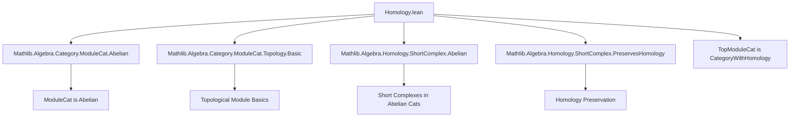
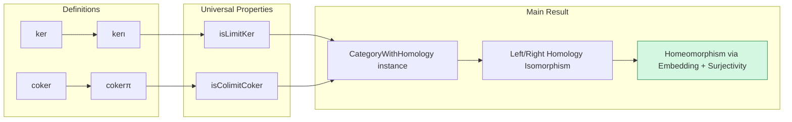

Here is the **technical metadata extraction** for the provided `Homology.lean` file:

---

### **1. Key Definitions & Theorems**

| Name | Type / Purpose |
|------|----------------|
| `ker` | `abbrev`: Kernel object in `TopModuleCat R`, defined as `of R φ.hom.ker` (kernel of underlying linear map with subspace topology). |
| `kerι` | `def`: Inclusion morphism `ker φ ⟶ M`, induced by the subtype inclusion; continuous due to `continuous_subtype_val`. |
| `isLimitKer` | `def`: Proof that `kerι φ` satisfies the universal property of a kernel in `TopModuleCat R`. |
| `coker` | `abbrev`: Cokernel object in `TopModuleCat R`, defined as `of R (N ⧸ φ.hom.range)` (quotient by range with quotient topology). |
| `cokerπ` | `def`: Projection morphism `N ⟶ coker φ`, induced by the quotient map; continuous by construction. |
| `isColimitCoker` | `def`: Proof that `cokerπ φ` satisfies the universal property of a cokernel in `TopModuleCat R`. |
| `instance : CategoryWithHomology (TopModuleCat R)` | `instance`: Main theorem: `TopModuleCat R` admits a *category-with-homology* structure, i.e., left and right homology objects are canonically isomorphic *as topological modules*, despite not being abelian. |

---

### **2. Naming Conventions**

- **Prefixes**:
  - `ker_`, `coker_`: Standard homological algebra prefixes.
  - `ι` (iota): Used for canonical inclusions (e.g., `kerι`, `ι` in forks/coforks).
  - `π` (pi): Used for canonical projections (e.g., `cokerπ`, `π` in forks/coforks).
- **Suffixes**:
  - `_comp`: For equations expressing composition with canonical maps yielding zero (e.g., `kerι_comp`, `comp_cokerπ`).
  - `_apply`: For pointwise evaluation lemmas (e.g., `kerι_apply`, `hom_cokerπ`).
  - `isLimit_`, `isColimit_`: For universal property proofs (limit/colimit cones).
- **Other**:
  - `of`: Constructor for objects in `TopModuleCat` from a topological module.
  - `ofHom`: Constructor for morphisms in `TopModuleCat` from a continuous linear map.

---

### **3. Tactic Stack**

Frequent tactics used in proofs:

| Tactic | Role |
|--------|------|
| `ext` | Extensionality for morphisms (equality of continuous linear maps). |
| `rw [...]` | Rewriting using definitions/simp lemmas. |
| `simp` / `simp_rw` | Simplification using definitional equalities and lemmas (e.g., `kerι_apply`, `hom_zero`). |
| `dsimp` | Definitional simplification (e.g., in `isLimitKer`, `isColimitCoker`). |
| `rfl` | Reflexivity for definitional equalities (e.g., in `kerι_apply`, `hom_cokerπ`). |
| `exact` / `infer_instance` | Instantiating typeclass instances (e.g., `Mono`, `Epi`). |
| `have hF : ...` + `have hF' : ...` | Intermediate lemma introduction for structured proof. |
| `refine` | Partial proof construction, especially for universal properties. |
| `tauto` | Automated reasoning for trivial logical implications (e.g., continuity of quotient map). |
| `isEmbedding_of_isOpenQuotientMap_of_isInducing` | Key topological lemma for comparing homology topologies. |

---

### **4. Proof Logic**

The proof proceeds in two phases:

1. **Construction of kernels and cokernels**:
   - Define `ker` and `coker` as underlying modules with subspace/quotient topology.
   - Prove they satisfy universal properties (`isLimitKer`, `isColimitCoker`) using standard module-theoretic constructions and continuity arguments.

2. **Verification of `CategoryWithHomology` structure**:
   - For any short complex `S`, construct left and right homology data (`D₁`, `D₂`) using `isLimitKer` and `isColimitCoker`.
   - Use `ShortComplex.leftRightHomologyComparison'` to get a comparison map `F`.
   - Show `F` is an isomorphism in `TopModuleCat`:
     - **Bijectivity**: Via `forget₂` reflection and `isIso_iff_bijective`.
     - **Homeomorphism**: Via `isHomeomorph_iff_isEmbedding_surjective`, where:
       - Surjectivity follows from bijectivity.
       - Embedding follows from `isEmbedding_of_isOpenQuotientMap_of_isInducing`, leveraging:
         - Openness of quotient maps (`Submodule.isOpenQuotientMap_mkQ`).
         - Inducing property of inclusions (`Subtype.val_injective`).
         - Compatibility of maps under forgetful functor (via `← ContinuousLinearMap.coe_comp'`).

---

### **5. Imports**

| Import | Purpose |
|--------|---------|
| `Mathlib.Algebra.Category.ModuleCat.Abelian` | Background on `ModuleCat` as abelian. |
| `Mathlib.Algebra.Category.ModuleCat.Topology.Basic` | Topological module basics (e.g., quotient/subspace topology). |
| `Mathlib.Algebra.Homology.ShortComplex.Abelian` | General theory of short complexes and homology in abelian categories. |
| `Mathlib.Algebra.Homology.ShortComplex.PreservesHomology` | Tools for comparing homology across functors (used in `map_leftRightHomologyComparison'`). |

---

### **6. Mermaid Diagrams**

#### **Dependency Graph (Module-Level)**

#### **Overview of File Structure**

---

### **7. Summary**

This file establishes that although `TopModuleCat R` is not abelian, it supports a well-behaved homology theory: left and right homology objects are canonically isomorphic *as topological modules*. The key insight is that the subspace and quotient topologies on kernels and cokernels behave compatibly with homology constructions, and the forgetful functor to topological spaces reflects isomorphisms. The proof combines categorical universal properties with topological arguments (especially about quotient maps and embeddings), showcasing Lean’s ability to unify algebra and topology.

--- 

Let me know if you'd like a formalized dependency graph or a tactic-level proof trace.
