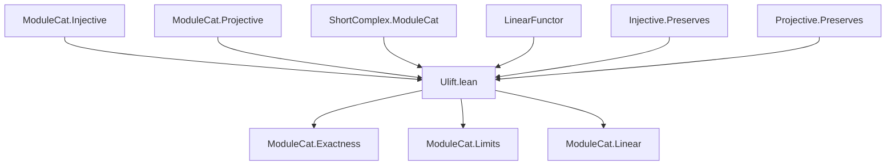

**Technical Brief: `Ulift.lean` — Universe Lift Functor in `ModuleCat`**

---

### **1. Key Definitions & Theorems**

| Name | Type / Signature | Purpose |
|------|------------------|---------|
| `uliftFunctor` | `ModuleCat.{v} R ⥤ ModuleCat.{max v v'} R` | Universe lift functor: lifts $R$-modules and maps to higher universe level via `ULift`. |
| `fullyFaithfulUliftFunctor` | `(uliftFunctor R).FullyFaithful` | Proves `uliftFunctor` is fully faithful (bijective on hom-sets). |
| `uliftFunctorForgetIso` | `ModuleCat.uliftFunctor.{v'} R ⋙ forget _ ≅ forget _ ⋙ CategoryTheory.uliftFunctor.{v'}` | Shows compatibility of `uliftFunctor` with the underlying type lift. |
| `uliftFunctor_map_exact` | `(S : ShortComplex …) → S.Exact → (S.map (uliftFunctor R)).Exact` | Proves `uliftFunctor` preserves exactness of short complexes. |
| `PreservesProjectiveObjects` | `[Small R] → (uliftFunctor R).PreservesProjectiveObjects` | Under smallness assumption, `uliftFunctor` sends projective modules to projective ones. |
| `PreservesInjectiveObjects` | `[Small R] → (uliftFunctor R).PreservesInjectiveObjects` | Under smallness assumption, `uliftFunctor` sends injective modules to injective ones. |
| `Linear` | `[CommRing R] → (uliftFunctor R).Linear R` | For commutative rings, `uliftFunctor` is a linear functor (i.e., respects scalar multiplication). |

---

### **2. Naming Conventions**

- **Prefixes**:
  - `uliftFunctor`: main functor definition.
  - `fullyFaithfulUliftFunctor`: property of the functor.
  - `uliftFunctorForgetIso`: coherence isomorphism with forgetful functor.
  - `uliftFunctor_map_exact`: action on morphisms of short complexes.

- **Suffixes**:
  - `Functor`: indicates a categorical functor.
  - `Iso`: indicates an isomorphism (natural transformation with inverse).
  - `Exact`: indicates preservation of exactness.
  - `Preserves…Objects`: indicates preservation of categorical properties (projective/injective).

- **Pattern**: `uliftFunctor` + property/instance name (e.g., `PreservesProjectiveObjects`, `Linear`).

---

### **3. Tactic Stack**

Frequently used tactics in proofs:

| Tactic | Usage |
|--------|-------|
| `rw` | Rewriting definitions (e.g., `uliftFunctor`, `exact_iff_function_exact`). |
| `simp only [...]` | Simplifying using `simps`-generated lemmas and equivalences (`ULift.moduleEquiv`, etc.). |
| `dsimp` | Definitional simplification (e.g., unfolding `uliftFunctor`). |
| `exact` | Directly applying known lemmas (e.g., `Module.Projective.of_equiv`). |
| `change` | Changing goal to a definitionally equal but more convenient form. |
| `infer_instance` | Solving typeclass goals (e.g., `Limits.PreservesLimitsOfSize`). |
| `cat_disch` | Category-theoretic discharge tactic (likely from `CategoryTheory` library). |

---

### **4. Proof Logic**

- **Structure of proofs**:
  - **Functor definition**: Explicitly defined via `obj` and `map`, using `ULift.moduleEquiv` to transport structure.
  - **Fully faithful**: Construct explicit preimage map using `ULift.moduleEquiv.toLinearMap` and its inverse.
  - **Preservation of limits/colimits**:
    - Limits: via reflection + preservation through forgetful functor.
    - Colimits: via `exact_tfae` equivalence (exactness ⇒ finite colimit preservation).
  - **Projective/injective preservation**:
    - Uses `Module.Projective.of_equiv` and `Module.ulift_injective_of_injective`.
    - Requires `Small R` to ensure lifting doesn’t increase cardinality beyond smallness bound.
  - **Linearity**: Immediate from `CommRing R` structure and `ULift`’s module structure.

- **Common pattern**: Reduce to module-level facts via `ModuleCat.of` / `ofHom`, then apply module-theoretic lemmas.

---

### **5. Imports**

| Import | Role |
|--------|------|
| `Mathlib.Algebra.Category.ModuleCat.Injective` | Injective objects in `ModuleCat`. |
| `Mathlib.Algebra.Category.ModuleCat.Projective` | Projective objects in `ModuleCat`. |
| `Mathlib.Algebra.Homology.ShortComplex.ModuleCat` | Short complexes and exactness in `ModuleCat`. |
| `Mathlib.CategoryTheory.Linear.LinearFunctor` | Linear functors between module categories. |
| `Mathlib.CategoryTheory.Preadditive.Injective.Preserves` | General theory of injective object preservation. |
| `Mathlib.CategoryTheory.Preadditive.Projective.Preserves` | General theory of projective object preservation. |

---

### **6. Mermaid Diagrams**

#### **Dependency Graph (Module-Level)**



#### **Overview of `Ulift.lean` Theory**

```mermaid
flowchart LR
  subgraph Definitions
    D1[uliftFunctor] 
    D2[fullyFaithfulUliftFunctor]
    D3[uliftFunctorForgetIso]
  end

  subgraph Properties
    P1[Preserves Limits]
    P2[Preserves Colimits]
    P3[Preserves Projectives]
    P4[Preserves Injectives]
    P5[Linear (CommRing)]
  end

  D1 --> D2
  D1 --> D3
  D1 --> P1
  D1 --> P2
  D1 --> P3
  D1 --> P4
  D1 --> P5

  P2 -.->|via exact_tfae| P1
  P3 & P4 -.->|via Module.* lemmas| D1
```

---

### **7. Summary**

This file formalizes the **universe lift functor** on the category of modules over a ring $R$, establishing its foundational categorical properties:

- It is **fully faithful** and **additive**.
- It **preserves finite limits and colimits**, hence is **exact**.
- Under the assumption that $R$ is small, it **preserves projective and injective objects**.
- For commutative rings, it is a **linear functor**.

The proofs rely heavily on the equivalence `ULift.moduleEquiv`, which transports module structure across universe levels, and standard results from homological algebra and category theory in `Mathlib`.

--- 

Let me know if you'd like a formalized dependency graph or a summary of related files (e.g., `ShortComplex.lean`, `Injective.lean`, etc.).
