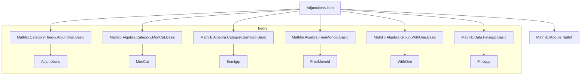
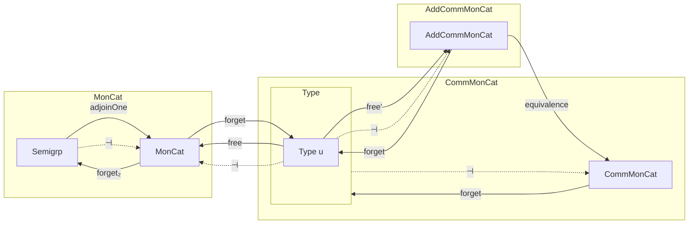

**Technical Brief: Adjunctions.lean**

---

### 1. KEY DEFINITIONS & THEOREMS

| Name | Type / Signature | Purpose |
|------|------------------|---------|
| `adjoinOne` | `Semigrp.{u} ⥤ MonCat.{u}` | Functor adjoins a unit to a semigroup (via `WithOne S`) to produce a monoid. |
| `hasForgetToSemigroup` | `HasForget₂ MonCat Semigrp` | Provides the forgetful functor `MonCat → Semigrp` (removes the unit). |
| `adjoinOneAdj` | `adjoinOne ⊣ forget₂ MonCat Semigrp` | Proves the adjunction: *adjoin one* is left adjoint to *forget to semigroup*. |
| `free` (in `MonCat`) | `Type u ⥤ MonCat.{u}` | Free monoid functor: sends type `α` to `FreeMonoid α`. |
| `adj` (in `MonCat`) | `free ⊣ forget MonCat` | Free-forgetful adjunction for monoids. |
| `free` (in `AddCommMonCat`) | `Type u ⥤ AddCommMonCat.{u}` | Free *commutative* additive monoid functor: `α ↦ α →₀ ℕ` (finitely supported functions). |
| `adj` (in `AddCommMonCat`) | `free ⊣ forget AddCommMonCat` | Free-forgetful adjunction for commutative additive monoids. |
| `instance : forget ... .IsRightAdjoint` | `IsRightAdjoint (forget ...)` | Encodes that the forgetful functor is a right adjoint (i.e., has a left adjoint: the free functor). |
| `instance` in `CommMonCat` | `IsRightAdjoint (forget CommMonCat)` | Derives adjointness for commutative monoids via composition of adjunctions. |

---

### 2. NAMING CONVENTIONS

- **Prefixes**:
  - `adjoinOne`, `adjoinZero` (to additive version): indicate *adjoining* a unit/zero.
  - `free`: for free object functors.
  - `forget`, `forget₂`: standard forgetful functors; `forget₂` for relative forgetful functors between structured categories (e.g., `MonCat → Semigrp`).
- **Suffixes**:
  - `Adj`: for adjunctions (`adjoinOneAdj`, `adj`).
  - `ofHom`, `of`: for constructing morphisms in concrete categories from underlying maps.
- **Pattern**:
  - `homEquiv` used in `Adjunction.mkOfHomEquiv` to define natural bijections `Hom(FX, Y) ≅ Hom(X, GY)`.
  - `lift`, `mapMulHom`, `map`: standard categorical constructions for functors on algebraic structures.

---

### 3. TACTIC STACK

| Tactic | Usage Frequency | Role |
|--------|-----------------|------|
| `ext` | High | To prove equality of morphisms (especially in concrete categories) by extensionality. |
| `simp` / `rfl` | High | Simplify goals using definitional equalities and structure morphism properties. |
| `rfl` | Medium | For trivial equalities (e.g., identity maps). |
| `dsimp` | Medium | Simplify definitional equalities before `ext`. |
| `apply ... .symm.injective` | Medium | To reduce equalities in quotient-like constructions (e.g., `Finsupp.liftAddHom`). |
| `intros` | Medium | In naturality/symmetry proofs. |
| `MonCat.hom_ext`, `Finsupp.liftAddHom.symm.injective` | Medium | Category-specific extensionality principles. |

---

### 4. PROOF LOGIC

- **Structure of proofs**:
  - **Functor definitions** are straightforward: `obj` and `map` are defined explicitly, with `map_id` and `map_comp` verified using extensionality (`hom_ext`).
  - **Adjunctions** are constructed via `Adjunction.mkOfHomEquiv`, requiring:
    1. A natural bijection `Hom(FX, Y) ≅ Hom(X, GY)`.
    2. Naturality in both arguments (only `naturality_left_symm` is checked explicitly; the other follows by symmetry).
  - **Naturality proofs**:
    - For `adjoinOneAdj`: reduce to `WithOne.lift` naturality, then `ext` on `⟨_ | _⟩` (sum type case analysis).
    - For `free ⊣ forget`: reduce to `FreeMonoid.lift` naturality, then use `FreeMonoid.hom_eq`.
    - For `AddCommMonCat.adj`: `unit` and `counit` are defined explicitly; naturality of `counit` uses `Finsupp.liftAddHom.symm.injective` and `simp`.
- **Induction / case analysis**: Used only in `adjoinOneAdj` proof (on `WithOne S` elements: `inl` or `inr`).
- **No explicit induction** on natural numbers or lists—algebraic structures are handled via universal properties (`FreeMonoid.lift`, `Finsupp.liftAddHom`).

---

### 5. IMPORTS (Primary Dependencies)

| Module | Role |
|--------|------|
| `Mathlib.CategoryTheory.Adjunction.Basic` | Core adjunction machinery (`mkOfHomEquiv`, `unit`, `counit`, `IsRightAdjoint`). |
| `Mathlib.Algebra.Category.MonCat.Basic` | Category of monoids and monoid homomorphisms. |
| `Mathlib.Algebra.Category.Semigrp.Basic` | Category of semigroups. |
| `Mathlib.Algebra.FreeMonoid.Basic` | Free monoid construction and universal property (`lift`). |
| `Mathlib.Algebra.Group.WithOne.Basic` | `WithOne S`: adjoin unit to semigroup; `WithOne.mapMulHom`, `lift`. |
| `Mathlib.Data.Finsupp.Basic`, `SMulWithZero` | Finitely supported functions; used for free *commutative* monoid (`α →₀ ℕ`). |
| `Mathlib.Module.NatInt` | Used implicitly for `ℕ`-action in `Finsupp` constructions. |

---

### 6. MERMAID DIAGRAMS

#### Dependency Graph (Top-Level Modules)

#### Overview of Adjunctions in the File

- **Arrows**:
  - Solid: functors.
  - Dashed: adjunctions (`⊣`).
- **Equivalence**: `AddCommMonCat.equivalence.toAdjunction` links additive and commutative monoids.

---

### 7. SUMMARY

This file formalizes three foundational adjunctions in category theory of algebraic structures:

1. **Adjoin unit** ⊣ **Forget to semigroup** (`MonCat`).
2. **Free monoid** ⊣ **Forgetful** (`MonCat`).
3. **Free commutative monoid** (`α ↦ α →₀ ℕ`) ⊣ **Forgetful** (`AddCommMonCat`), and deduces the case for `CommMonCat`.

All proofs rely on universal properties (via `lift`, `hom_ext`, `injective` lemmas) and avoid explicit constructions, adhering to Lean’s *concrete category* and *adjunction* abstractions.

--- 

*Prepared for Domain-Specific AI Agent training.*
