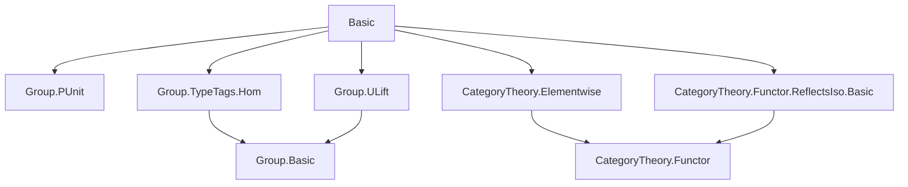
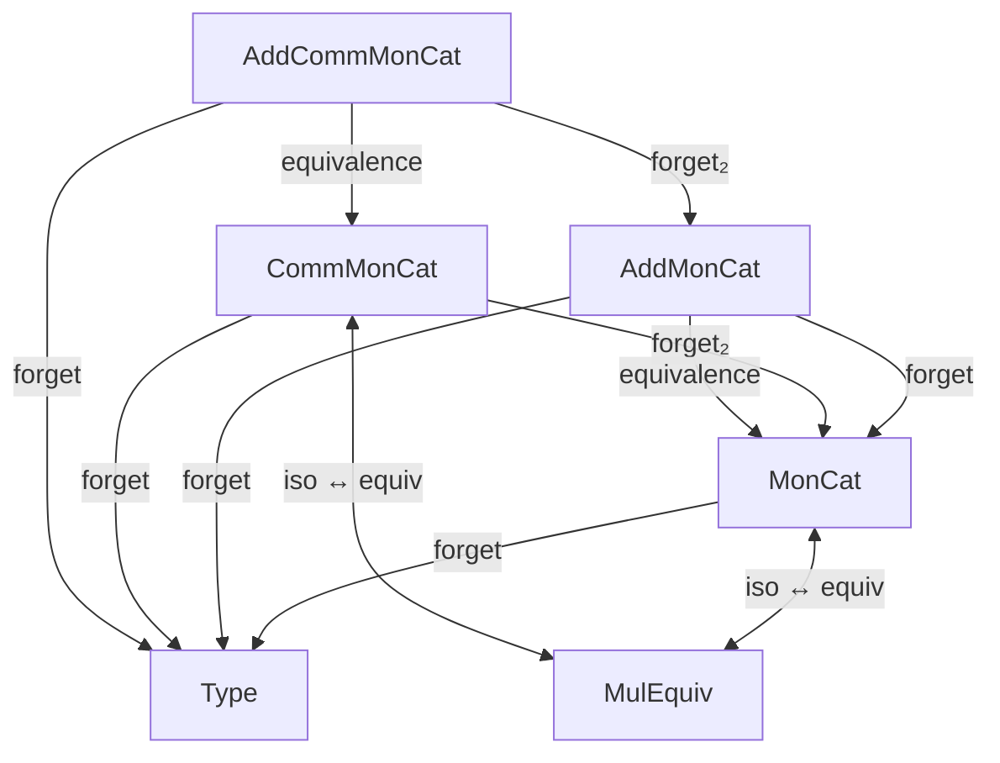

### Technical Brief: `Basic.lean` — Category-Theoretic Bundling of Monoids and Additive Monoids

---

#### **1. Key Definitions & Theorems**

| Name | Type / Structure | Purpose |
|------|------------------|---------|
| `AddMonCat` | `Type (u + 1)` | Bundled category of additive monoids and additive monoid homomorphisms |
| `MonCat` | `Type (u + 1)` | Bundled category of monoids and monoid homomorphisms |
| `AddCommMonCat` | `Type (u + 1)` | Bundled category of additive commutative monoids and homs |
| `CommMonCat` | `Type (u + 1)` | Bundled category of commutative monoids and homs |
| `MonCat.Hom`, `AddMonCat.Hom`, `CommMonCat.Hom`, `AddCommMonCat.Hom` | `Structure` | Morphism spaces defined via underlying `→*` / `→+` homs |
| `of` | `Type u → [Monoid M] → MonCat` | Constructor for bundled objects |
| `ofHom` | `M →* N → of M ⟶ of N` | Embedding of monoid homs into categorical morphisms |
| `Hom.hom` | `Hom X Y → X → Y` | Projection to underlying function/hom |
| `forget`, `forget₂` | `Functor` | Forgetful functors (e.g., `CommMonCat → MonCat`) |
| `uliftFunctor` | `MonCat.{v} ⥤ MonCat.{max v u}` | Universe lifting functor |
| `MulEquiv.toMonCatIso`, `MulEquiv.toCommMonCatIso` | `X ≃* Y → MonCat.of X ≅ MonCat.of Y` | Convert multiplicative equivalences to categorical isos |
| `monCatIsoToMulEquiv`, `commMonCatIsoToMulEquiv` | `X ≅ Y → X ≃* Y` | Convert categorical isos to multiplicative equivalences |
| `mulEquivIsoMonCatIso`, `mulEquivIsoCommMonCatIso` | `X ≃* Y ≅ (X ≅ Y)` | Equivalence between `≃*` and categorical isomorphism |
| `AddMonCat.equivalence`, `AddCommMonCat.equivalence` | `AddMonCat ≌ MonCat` | Equivalence of categories via `Multiplicative`/`Additive` adjunction |
| `fullyFaithfulForgetToMonCat` | `(forget₂ CommMonCat MonCat).FullyFaithful` | Forgetful functor from commutative to noncommutative monoids is ff |
| `MonCat.forget_reflects_isos`, `CommMonCat.forget_reflects_isos` | `ReflectsIsomorphisms` instance | Forgetful functors reflect isomorphisms |

---

#### **2. Naming Conventions**

- **Prefixes**:
  - `of`: constructor for bundled objects (`of M`)
  - `ofHom`: constructor for bundled morphisms (`ofHom f`)
  - `hom`: projection to underlying hom (`f.hom`)
  - `coe_`, `forget_`, `forget₂_`: forgetful functor actions
  - `uliftFunctor`: universe lifting
  - `equivalence`: categorical equivalences

- **Suffixes**:
  - `Iso`: categorical isomorphism (`toMonCatIso`, `toCommMonCatIso`)
  - `Hom`: morphism type (`MonCat.Hom`)
  - `Cat`: category name (`MonCat`, `AddMonCat`, `CommMonCat`, `AddCommMonCat`)
  - `ext`, `simp`: proof attributes (`ext`, `simp`)

- **`to_additive`**: pervasive attribute for additive analogues (e.g., `to_additive AddMonCat`)

---

#### **3. Tactic Stack**

- `rfl`: most lemmas are definitional (`rfl` proofs)
- `simp`: used in `@[simp]` lemmas and `by simp` goals
- `ext`: used in extensionality lemmas (`ext`, `hom_ext`)
- `by rfl`: definitional equalities
- `by simp`: for rewriting using `simps` projections
- `inferInstance`: for automatically inferring instances (e.g., `ReflectsIsomorphisms`)
- `set_option backward.privateInPublic true`: to allow private fields in public structures

---

#### **4. Proof Logic**

- **Definitional reasoning dominates**: Most proofs are `rfl` or `by simp`, reflecting that the bundled categories are *strictly* concrete (i.e., morphisms are *defined* as underlying homs).
- **Extensionality**: Morphism equality follows from pointwise equality (`ext`, `hom_ext`), leveraging `ConcreteCategory.hom_ext`.
- **Equivalence proofs**: Use `Iso.refl _` for unit/counit isos in categorical equivalences.
- **Isomorphism ↔ Equivalence**: Bidirectional conversion via `toMonCatIso` / `monCatIsoToMulEquiv`, with proofs via `ext; simp`.
- **Forgetful functors**: Fully faithful and reflect isomorphisms — proofs use `ofHom` and `hom_ext`.

---

#### **5. Imports**

| Import | Purpose |
|--------|---------|
| `Mathlib.Algebra.Group.PUnit` | Default `Monoid PUnit`, `AddMonoid PUnit` instances |
| `Mathlib.Algebra.Group.TypeTags.Hom` | `→*`, `→+`, `MulEquiv`, `MonoidHom`, `AddMonoidHom` |
| `Mathlib.Algebra.Group.ULift` | `ULift`, `MulEquiv.ulift` for universe lifting |
| `Mathlib.CategoryTheory.Elementwise` | `elementwise` style lemmas (e.g., `comp_apply`) |
| `Mathlib.CategoryTheory.Functor.ReflectsIso.Basic` | `ReflectsIsomorphisms` typeclass |

---

#### **6. Mermaid Diagrams**

##### **Dependency Graph (Module-Level)**



##### **Category Structure Overview**



##### **Morphism Bundling Flow**

```mermaid
graph LR
  X →* Y[Monoid Hom] -->|ofHom| X ⟶ Y[MonCat Morphism]
  X ⟶ Y -->|Hom.hom| X → Y[Underlying Function]
  X →+ Y[AddMonoid Hom] -->|ofHom| X ⟶ Y[AddMonCat Morphism]
```

---

#### **7. Theory Scope**

This module establishes the *foundational categorical framework* for monoids and additive monoids in Lean:

- **Bundled categories** (`MonCat`, `AddMonCat`, `CommMonCat`, `AddCommMonCat`) as `ConcreteCategory`s.
- **Forgetful functors** and their properties (fully faithful, reflects isos).
- **Equivalences** between additive and multiplicative worlds via `Multiplicative`/`Additive`.
- **Isomorphism ↔ Equivalence** theorems linking categorical structure to algebraic equivalences.
- **Universe lifting** functors for type-theoretic flexibility.

It serves as the *base layer* for higher algebraic structures (e.g., rings, modules) in `Mathlib`, where monoid/homomorphism categories are reused as building blocks.

--- 

✅ **Summary**: This file formalizes the *concrete category of monoids* and its variants, with heavy reliance on definitional equality and `to_additive` mirroring. It is a canonical example of *bundled category construction* in Lean’s category theory library.
