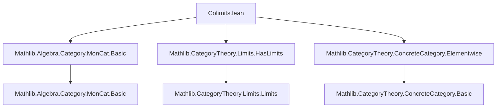
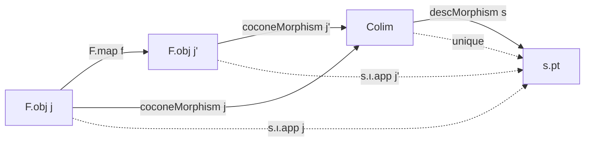

### Technical Brief: Colimits in `MonCat`

---

#### **1. Key Definitions & Theorems**

| Name | Type / Signature | Purpose |
|------|------------------|---------|
| `Prequotient F` | `Type (max u v)` | Inductive type of *raw* monoid expressions over the diagram `F : J ⥤ MonCat`, generated by `of`, `one`, `mul`. |
| `Relation F` | `Prequotient F → Prequotient F → Prop` | Small equivalence relation generated by: monoid axioms, diagram morphism compatibility, and congruence for `mul`. |
| `colimitSetoid F` | `Setoid (Prequotient F)` | The equivalence relation `Relation F` packaged as a `Setoid`. |
| `ColimitType F` | `Type v` | Underlying type of the colimit: `Quotient (colimitSetoid F)`. |
| `monoidColimitType F` | `Monoid (ColimitType F)` | Constructs the monoid structure on the colimit type via quotient lifting. |
| `colimit F` | `MonCat` | The colimit object in `MonCat`, bundled as a monoid. |
| `coconeFun F j x` | `ColimitType F` | Embeds an element `x : F.obj j` into the colimit. |
| `coconeMorphism F j` | `F.obj j ⟶ colimit F` | The universal cocone leg (monoid homomorphism). |
| `colimitCocone F` | `Cocone F` | The cocone with apex `colimit F` and legs `coconeMorphism F`. |
| `descFunLift F s` | `Prequotient F → s.pt` | Lifts a cocone `s` to a function on raw expressions (before quotienting). |
| `descFun F s` | `ColimitType F → s.pt` | Induced map on the quotient (well-defined by `Relation`-compatibility). |
| `descMorphism F s` | `colimit F ⟶ s.pt` | The unique mediating morphism in `MonCat`. |
| `colimitIsColimit F` | `IsColimit (colimitCocone F)` | Proves the universal property: existence & uniqueness of mediating morphism. |
| `hasColimits_monCat` | `HasColimits MonCat` | Concludes that `MonCat` has all small colimits. |

---

#### **2. Naming Conventions**

- **Prefixes**:
  - `Prequotient`, `Relation`, `colimitSetoid`, `ColimitType`, `colimit`: structural naming for intermediate constructions.
  - `cocone*`: for cocone legs (`coconeFun`, `coconeMorphism`).
  - `desc*`: for the universal mediating morphism (`descFunLift`, `descFun`, `descMorphism`).
  - `quot_*`: for simplification lemmas about `Quot.mk` (e.g., `quot_one`, `quot_mul`).
- **Suffixes**:
  - `*Lift`: pre-quotient lift (before quotienting).
  - `*Fun`: underlying function (before bundling as hom).
  - `*Morphism`: bundled homomorphism.
  - `*naturality`: lemmas about naturality of cocone legs.
- **Operation naming**:
  - `mul`, `one`, `of`: match inductive constructors.
  - Axiom relations: `mul_assoc`, `one_mul`, `mul_one`.
  - Congruence rules: `mul_1`, `mul_2`.

---

#### **3. Tactic Stack**

- **Core tactics**:
  - `induction` (on `Relation`, `Prequotient`, `Quotient`)
  - `ext` (extensionality for functions/morphisms)
  - `rw`, `simp`, `rfl`
  - `apply`, `solve_by_elim`
  - `dsimp`, `infer_instance`
- **Pattern**:
  - Prove well-definedness on quotients via `Quot.lift`/`Quot.map₂` + `induction` on `Relation`.
  - Uniqueness via `induction` on `Quotient` elements and naturality.
  - Monoid homomorphism proofs via `map_one'`, `map_mul'` and `ofHom`.

---

#### **4. Proof Logic**

The proof follows a **standard categorical colimit construction** for algebraic categories:

1. **Syntax (raw expressions)**:
   - Build `Prequotient F`: free monoid on disjoint union of diagram objects.
2. **Relations**:
   - Define `Relation F` inductively to enforce:
     - Monoid axioms (`mul_assoc`, `one_mul`, `mul_one`)
     - Compatibility with diagram morphisms (`map`)
     - Congruence for `mul` (`mul_1`, `mul_2`)
3. **Quotient**:
   - Package `Relation` as `colimitSetoid`, define `ColimitType` as `Quotient`.
4. **Structure**:
   - Lift `one`, `mul` to the quotient using `Quot.map₂` and `Relation`-congruence.
   - Verify monoid axioms via `Quot.ind`.
5. **Cocone**:
   - Define `coconeMorphism` via `ofHom` using `map_one'`, `map_mul'`.
   - Prove naturality (`cocone_naturality`) directly from `Relation.map`.
6. **Universal property**:
   - Define `descFunLift` on raw expressions (inductive recursion).
   - Show it respects `Relation` (induction on `Relation`), yielding `descFun`.
   - Bundle as `descMorphism` using `ofHom`.
   - Prove uniqueness via `induction` on `Quotient` and naturality.

---

#### **5. Imports & Dependencies**

| Module | Role |
|--------|------|
| `Mathlib.Algebra.Category.MonCat.Basic` | Defines `MonCat`, `of`, `ofHom`, monoid homs. |
| `Mathlib.CategoryTheory.Limits.HasLimits` | Provides `HasColimits`, `IsColimit`, `Cocone`, etc. |
| `Mathlib.CategoryTheory.ConcreteCategory.Elementwise` | Enables `ext` proofs for morphisms in concrete categories (e.g., `MonCat`). |

> **Note**: No heavy homological algebra or spectral sequences — purely syntactic construction.

---

#### **8. Mermaid Diagrams**

##### **Dependency Graph (File-Level)**



##### **Overview of Construction Flow**

```mermaid
flowchart LR
  J[J] -->|F: J ⥤ MonCat| Diagram[Diagram]
  Diagram --> Raw[Prequotient F]
  Raw -->|inductive Relation| Quotient[Quotient (colimitSetoid F)]
  Quotient --> ColimType[ColimitType F]
  ColimType -->|Monoid instance| ColimObj[colimit F : MonCat]
  ColimObj --> Cocone[coconeCocone F]
  Cocone -->|Universal property| Desc[descMorphism F s]
  Desc -->|uniq + existence| IsColim[colimitIsColimit F]
  IsColim --> HasColim[hasColimits_monCat]
```

##### **Universal Property Diagram (Categorical)**



---

#### **Key Insight**

This file demonstrates **syntactic construction of colimits** in an algebraic category:
- No prior knowledge of monoids is assumed beyond their *signature* (operations + axioms).
- The same pattern would work for groups, rings, modules, etc., by changing the `Relation` constructors.
- Lean’s inductive types and quotient types make this *fully formalizable* and *tacticizable*.

This is a canonical example of **"algebra as a doctrine"** in categorical logic — colimits exist because the theory of monoids is finitary and regular.
