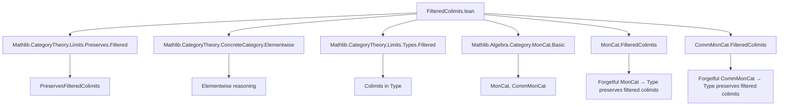

### Technical Brief: `FilteredColimits.lean`

---

#### **1. Key Definitions & Theorems**

| Name | Type / Signature | Purpose |
|------|------------------|---------|
| `M.{v, u} F` | `abbrev M := (F ⋙ forget MonCat).ColimitType` | Underlying type of the filtered colimit of a diagram `F : J ⥤ MonCat` in `Type`. |
| `M.mk F x` | `(Σ j, F.obj j) → M F` | Canonical projection into the colimit type (as a quotient). |
| `colimitOne F` | `One (M F)` | Defines the multiplicative unit `1` in the colimit monoid. |
| `colimitMul F` | `Mul (M F)` | Defines multiplication on the colimit type, using filteredness to lift multiplication from the diagram. |
| `colimitMulOneClass F` | `MulOneClass (M F)` | Verifies unit laws for multiplication. |
| `colimitMonoid F` | `Monoid (M F)` | Constructs the full monoid structure on `M F`. |
| `colimit F` | `def colimit : MonCat.{max v u}` | The *bundled* colimit monoid object in `MonCat`. |
| `coconeMorphism F j` | `F.obj j ⟶ colimit F` | Component of the colimit cocone in `MonCat`. |
| `colimitCocone F` | `Cocone F` | The cocone over `F` with apex `colimit F`. |
| `colimitDesc F t` | `colimit F ⟶ t.pt` | Universal morphism from the colimit to any other cocone apex. |
| `colimitCoconeIsColimit F` | `IsColimit (colimitCocone F)` | Proves the cocone is a colimit in `MonCat`. |
| `forget_preservesFilteredColimits` | `instance PreservesFilteredColimits (forget MonCat)` | Main theorem: the forgetful functor `MonCat → Type` preserves filtered colimits. |
| `colimitCommMonoid F` | `CommMonoid (M F)` | Shows the colimit of a diagram of *commutative* monoids is commutative. |
| `colimit F : CommMonCat` | `def colimit : CommMonCat` | Bundled colimit in `CommMonCat`. |
| `forget₂Mon_preservesFilteredColimits` | `instance PreservesFilteredColimits (forget₂ CommMonCat MonCat)` | Forgetful `CommMonCat → MonCat` preserves filtered colimits. |
| `forget_preservesFilteredColimits` (for `CommMonCat`) | `instance PreservesFilteredColimits (forget CommMonCat)` | Forgetful `CommMonCat → Type` preserves filtered colimits. |

---

#### **2. Naming Conventions**

- **Prefixes**:
  - `colimit_`: for constructions and properties of the colimit object/morphism.
  - `M.`: for operations on the underlying type of the colimit.
  - `cocone_`: for cocone components and naturality.
  - `forget_`, `forget₂_`: for forgetful functors and their preservation properties.

- **Suffixes**:
  - `_mk`: for projections from the diagram to the colimit.
  - `_eq`: for unfolding or equality lemmas (e.g., independence of representatives or choices).
  - `_aux`: for auxiliary definitions before quotienting (e.g., `colimitMulAux`).
  - `_isColimit`: for proofs that a cocone is a colimit.

- **Other patterns**:
  - `max'`, `leftToMax`, `rightToMax`, `bowtie`, `tulip`: filtered category combinator names.
  - `ofHom`, `of`: for bundling functions into homomorphisms.

---

#### **3. Tactic Stack**

| Tactic | Usage Frequency | Purpose |
|--------|-----------------|---------|
| `simp_rw` | High | Rewriting with definitional equalities and lemmas like `map_mul`, `F.map_comp`. |
| `simp` | Very High | Simplifying goals using `colimit_mul_mk_eq'`, `colimit_one_eq`, etc. |
| `obtain` / `rcases` | High | Extracting witnesses from existential hypotheses (e.g., `x.mk_surjective`). |
| `apply` / `exact` | Medium | Applying lemmas like `M.mk_eq`, `colimitMulAux_eq_of_rel_left`. |
| `rw` | Medium | Rewriting using key lemmas (e.g., `mul_comm`, `mul_assoc`). |
| `dsimp` | Medium | Definitional simplification (e.g., after unfolding `colimitMulAux`). |
| `congr_arg` / `congr_fun` | Low | Proving extensionality of homomorphisms. |
| `MonCat.ext`, `AddMonCat.ext` | Medium | Extensionality for monoid homomorphisms. |
| `hom_ext` | Medium | Extensionality for morphisms in `CommMonCat`/`MonCat`. |
| `refine` | Medium | Structured proof construction (e.g., quotient lifting). |
| `cases` | Low | Case analysis on dependent pairs. |

---

#### **4. Proof Logic**

The logical flow follows a standard *cocone construction + verification* pattern:

1. **Construct underlying type**:
   - Define `M := (F ⋙ forget MonCat).ColimitType`, i.e., the colimit in `Type`.

2. **Lift algebraic structure**:
   - Define `1` using a chosen object `j₀` (justified by filteredness ⇒ nonempty).
   - Define multiplication via `colimitMulAux`, using `IsFiltered.max` to find a common extension.
   - Prove well-definedness using filteredness axioms (`tulip`, `bowtie`) and diagram commutativity.

3. **Verify algebraic laws**:
   - Unit laws: reduce to unit laws in some `F.obj j` via `colimit_mul_mk_eq'`.
   - Associativity: lift three elements to a common `F.obj j` using `max₃` and `map_mul`.
   - Commutativity (for `CommMonCat`): lift to common `max' i j`, use `mul_comm` in `F.obj (max' i j)`.

4. **Verify universal property**:
   - Construct `colimitDesc` using the universal property in `Type`.
   - Prove it's a homomorphism (unit/multiplication preservation).
   - Show cocone naturality and uniqueness.

5. **Conclude preservation**:
   - Use `preservesColimit_of_preserves_colimit_cocone` to deduce `PreservesFilteredColimits`.

---

#### **5. Imports**

| Import | Purpose |
|--------|---------|
| `Mathlib.CategoryTheory.Limits.Preserves.Filtered` | Theory of functors preserving filtered colimits. |
| `Mathlib.CategoryTheory.ConcreteCategory.Elementwise` | Elementwise reasoning in concrete categories (e.g., `congr_hom`). |
| `Mathlib.CategoryTheory.Limits.Types.Filtered` | Construction of filtered colimits in `Type`. |
| `Mathlib.Algebra.Category.MonCat.Basic` | Basic definitions: `MonCat`, `CommMonCat`, `forget`, `forget₂`. |

---

#### **6. Mermaid Diagrams**

##### **Dependency Graph (High-Level)**

##### **Overview of File Structure**

```mermaid
flowchart LR
  Start[FilteredColimits.lean] --> MonCatSection[MonCat.FilteredColimits]
  MonCatSection --> TypeColimit[Construct M : Type]
  TypeColimit --> MulDef[Define multiplication]
  MulDef --> WellDefined[Prove well-definedness]
  WellDefined --> UnitLaws[Verify unit laws]
  UnitLaws --> Assoc[Verify associativity]
  Assoc --> BundledMonoid[Build colimit : MonCat]
  BundledMonoid --> Cocone[Build cocone]
  Cocone --> Universal[Verify universal property]
  Universal --> Preserves[Prove forget preserves filtered colimits]

  MonCatSection --> CommMonCatSection[CommMonCat.FilteredColimits]
  CommMonCatSection --> CommMul[Show multiplication commutes]
  CommMul --> BundledCommMonoid[Build colimit : CommMonCat]
  BundledCommMonoid --> Preserves2[Prove forget₂ and forget preserve filtered colimits]
```

---

#### **7. Theory Context**

This file is part of the **category theory library in Mathlib**, specifically targeting **algebraic structures and their limits/colimits**. It contributes to the broader project of showing that *algebraic forgetful functors preserve filtered colimits*, a key fact used in:
- Constructing algebraic objects from diagrams (e.g., direct limits of rings, modules).
- Proving that algebraic theories are *finitary* (i.e., commute with filtered colimits).
- Enabling elementwise reasoning in colimits (via `M.mk_surjective`, `M.mk_eq`, etc.).

The structure mirrors standard categorical constructions:
- **Type-level colimit** → **algebraic lifting** → **verification of laws** → **universal property**.

The use of `tulip` and `bowtie` lemmas reflects the need to handle *multiple paths* in filtered diagrams, ensuring consistency of definitions.

--- 

Let me know if you'd like a formalized summary in Lean syntax or a dependency graph for specific lemmas.
