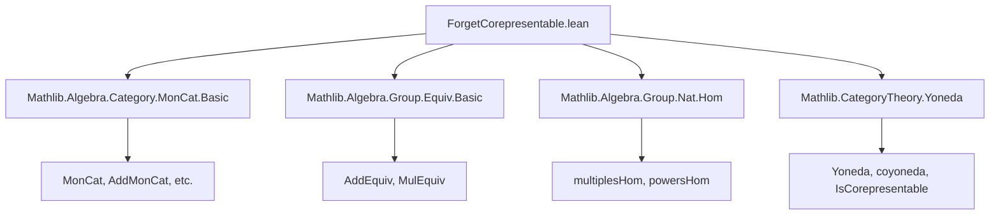

### Technical Brief: `ForgetCorepresentable.lean`

---

#### **1. Key Definitions & Theorems**

| Name | Type | Purpose |
|------|------|---------|
| `uliftMultiplesHom` | `M ≃ (ULift.{u} ℕ →+ M)` | Equivalence between elements of an additive monoid `M` and additive monoid homomorphisms from `ULift ℕ`, via image of `1`. |
| `uliftPowersHom` | `M ≃ (ULift.{u} (Multiplicative ℕ) →* M)` | Equivalence between elements of a monoid `M` and monoid homomorphisms from `ULift (Multiplicative ℕ)`, via image of `Multiplicative.ofAdd 1`. |
| `MonCat.coyonedaObjIsoForget` | `coyoneda.obj (op (of (ULift.{u} (Multiplicative ℕ)))) ≅ forget MonCat.{u}` | Shows the forgetful functor `MonCat ⥤ Type` is corepresentable by `ULift (Multiplicative ℕ)`. |
| `CommMonCat.coyonedaObjIsoForget` | `coyoneda.obj (op (of (ULift.{u} (Multiplicative ℕ)))) ≅ forget CommMonCat.{u}` | Same as above, but for commutative monoids. |
| `AddMonCat.coyonedaObjIsoForget` | `coyoneda.obj (op (of (ULift.{u} ℕ))) ≅ forget AddMonCat.{u}` | Forgetful functor on additive monoids is corepresentable by `ULift ℕ`. |
| `AddCommMonCat.coyonedaObjIsoForget` | `coyoneda.obj (op (of (ULift.{u} ℕ))) ≅ forget AddCommMonCat.{u}` | Forgetful functor on additive commutative monoids is corepresentable by `ULift ℕ`. |
| `MonCat.forget_isCorepresentable` | `IsCorepresentable (forget MonCat.{u})` | Instance witnessing that the forgetful functor is corepresentable. Analogous for other categories. |

---

#### **2. Naming Conventions**

- **Prefixes**:
  - `ulift*`: Indicates use of `ULift` to avoid universe polymorphism issues.
  - `*Hom`: Denotes homomorphism spaces (e.g., `uliftMultiplesHom`, `uliftPowersHom`).
  - `coyonedaObjIsoForget`: Standard pattern for corepresentability isomorphisms.
- **Suffixes**:
  - `Hom`: For homomorphism types (`→+`, `→*`).
  - `Equiv`: For equivalences (e.g., `AddEquiv`, `MulEquiv`).
  - `Congr`: For congruence lemmas (e.g., `addMonoidHomCongrLeftEquiv`).
- **Category-theoretic naming**:
  - `coyoneda.obj (op (of X))`: Standard way to denote the representable presheaf `Hom(-, X)` in `Cᵒᵖ ⥤ Type`.
  - `forget C`: Standard notation for the forgetful functor from a concrete category `C` to `Type`.

---

#### **3. Tactic Stack**

- `simp_rw` (via `@[simps!]` attribute): Used to simplify and unfold definitions in `simps`-friendly way.
- `trans`: Used to chain equivalences/isomorphisms.
- `toIso`: Converts an equivalence/isomorphism of components into a natural isomorphism.
- `NatIso.ofComponents`: Constructs a natural isomorphism from component-wise isomorphisms.
- Implicit use of `ConcreteCategory.homEquiv`: From `ConcreteCategory` interface, giving `Hom(M, N) ≃ M.carrier → N.carrier`.

No heavy automation (e.g., `aesop`, `ring`) is used—proofs are mostly definitional or rely on pre-existing equivalences.

---

#### **4. Proof Logic**

- **Core idea**: Use the universal property of `ℕ` (as the free additive monoid on one generator) and `Multiplicative ℕ` (as the free monoid on one generator).
- For each category (`MonCat`, `CommMonCat`, `AddMonCat`, `AddCommMonCat`):
  1. Define a natural equivalence between elements of an object `M` and homomorphisms from a fixed “universal” object (`ULift ℕ` or `ULift (Multiplicative ℕ)`).
  2. Use `ConcreteCategory.homEquiv` to relate `Hom(ULift ..., M)` in the category to functions on the carrier.
  3. Compose with `uliftMultiplesHom` / `uliftPowersHom` to get the desired equivalence.
  4. Package this as a natural isomorphism using `NatIso.ofComponents`.
  5. Conclude corepresentability via `Functor.IsCorepresentable.mk'`.

Induction or case analysis is not needed—proofs are definitional and rely on existing lemmas about free structures.

---

#### **5. Imports**

| Import | Purpose |
|--------|---------|
| `Mathlib.Algebra.Category.MonCat.Basic` | Defines `MonCat`, `AddMonCat`, `CommMonCat`, `AddCommMonCat`, and their forgetful functors. |
| `Mathlib.Algebra.Group.Equiv.Basic` | Provides `AddEquiv`, `MulEquiv`, and their hom-congruences. |
| `Mathlib.Algebra.Group.Nat.Hom` | Contains `multiplesHom`, `powersHom`, foundational lemmas about homs from `ℕ`. |
| `Mathlib.CategoryTheory.Yoneda` | Provides `coyoneda`, `IsCorepresentable`, and related machinery. |

---

#### **6. Mermaid Diagrams**

##### **Dependency Graph (Module-Level)**



##### **Theoretical Overview (Corepresentability)**

```mermaid
graph LR
  C[Category C] -->|forget| Type
  C -->|coyoneda.obj(op X)| Cᵒᵖ ⥤ Type
  Type <-->|iso| Cᵒᵖ ⥤ Type
  X["X = ULift ℕ or ULift(Multiplicative ℕ)"] -->|corep| forget
```

##### **Component-wise Equivalence (for each M)**

```mermaid
graph LR
  M[M : C] -->|Hom_C(X, M)| M.carrier
  X -->|uliftMultiplesHom / uliftPowersHom| Hom_C(X, M) ≃ M.carrier
  ConcreteCategory.homEquiv -->|reduces| Hom_C(X, M) → M.carrier
```

---

#### **7. Summary**

This file establishes that the forgetful functors from the categories of monoids, commutative monoids, additive monoids, and additive commutative monoids to `Type` are all **corepresentable**, with representing objects `ULift (Multiplicative ℕ)` and `ULift ℕ`. The proof leverages the universal property of `ℕ` as a free (additive) monoid on one generator, and uses `ULift` to keep universe levels consistent. The structure is uniform across all four categories, with minor variations in the representing object and homomorphism type (`→+` vs `→*`).
