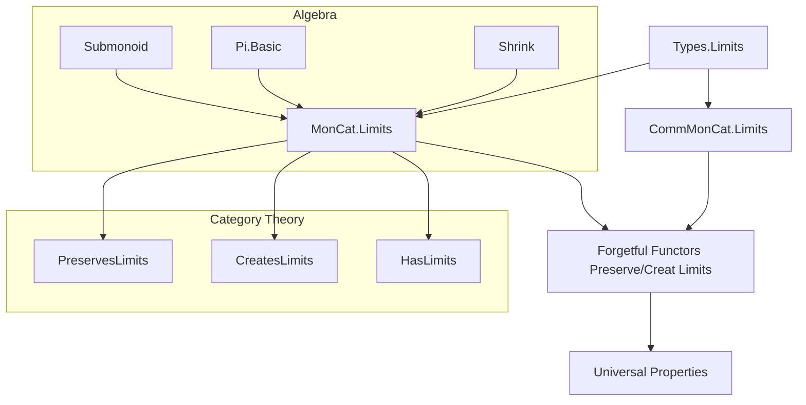
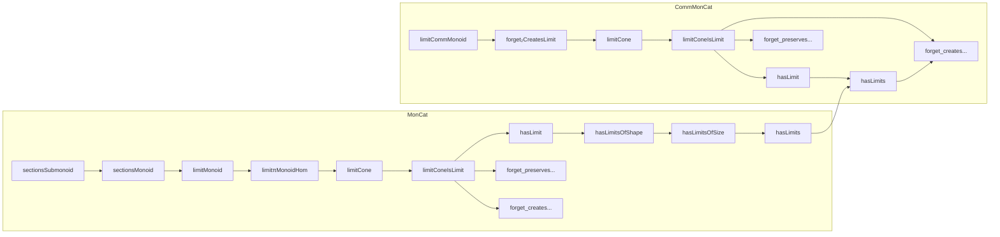

**Technical Brief: Limits in `MonCat` and `CommMonCat`**

---

### 1. KEY DEFINITIONS & THEOREMS

| Name | Type / Signature | Purpose |
|------|------------------|---------|
| `sectionsSubmonoid F` | `Submonoid (∀ j, F.obj j)` | Constructs the submonoid of *flat sections* (i.e., natural transformations `1 ⇒ F`) inside the product monoid of all sections. |
| `sectionsMonoid` | `Monoid (F ⋙ forget MonCat).sections` | Induces a monoid structure on flat sections via `sectionsSubmonoid`. |
| `limitπMonoidHom j` | `(limitCone.pt) →* (F ⋙ forget MonCat).obj j` | The projection from the limit object (as a monoid) to each component, as a monoid homomorphism. |
| `limitCone F` | `Cone F` | Constructs a cone in `MonCat` whose apex is `MonCat.of` applied to the limit in `Types`. |
| `limitConeIsLimit F` | `IsLimit (limitCone F)` | Proves that `limitCone F` is a limit cone in `MonCat`. |
| `hasLimit F` | `HasLimit F` | Instantiates existence of limits for any small diagram `F`. |
| `hasLimitsOfShape J` | `[Small J] → HasLimitsOfShape J MonCat` | Ensures existence of limits of shape `J` when `J` is small. |
| `hasLimitsOfSize` | `[UnivLE v u] → HasLimitsOfSize w v MonCat` | Ensures existence of all limits of size bounded by universe levels. |
| `hasLimits` | `HasLimits MonCat` | Full statement: `MonCat` has all limits. |
| `forget_preservesLimitsOfShape` | `[Small J] → PreservesLimitsOfShape J (forget MonCat)` | Forgets limits: underlying types of limits in `MonCat` are computed as limits in `Types`. |
| `forget_preservesLimitsOfSize` / `forget_preservesLimits` | `PreservesLimitsOfSize` / `PreservesLimits` | Full preservation of all limits by `forget MonCat`. |
| `forget_createsLimit` / `forget_createsLimits` | `CreatesLimit` / `CreatesLimits` | `forget MonCat` *creates* limits: every limit in `Types` lifts uniquely to a limit in `MonCat`. |
| `limitCommMonoid` | `CommMonoid (Types.Small.limitCone ...).pt` | Induces a *commutative* monoid structure on the limit of a diagram in `CommMonCat`, using the submonoid of sections. |
| `forget₂CreatesLimit` | `CreatesLimit F (forget₂ CommMonCat MonCat)` | Shows that the forgetful functor `CommMonCat → MonCat` creates limits. |
| `limitCone F` (in `CommMonCat`) | `Cone F` | Limit cone in `CommMonCat`, constructed via `liftLimit` from the `MonCat` limit. |
| `hasLimits CommMonCat` | `HasLimits CommMonCat` | `CommMonCat` has all limits. |
| `forget_createsLimits CommMonCat` | `CreatesLimits (forget CommMonCat)` | `forget CommMonCat` creates all limits (via factorization through `MonCat`). |

---

### 2. NAMING CONVENTIONS

- **Prefixes**:
  - `limitCone`: internal construction of a limit cone (internal use only).
  - `limitπ`: projections from the limit.
  - `hasLimit`, `hasLimitsOfShape`, `hasLimitsOfSize`, `hasLimits`: existence of limits.
  - `forget_preserves...`, `forget_creates...`: properties of the forgetful functor.
  - `sectionsSubmonoid`, `sectionsMonoid`: sections-based constructions.

- **Suffixes**:
  - `Monoid`, `CommMonoid`, `AddMonoid`, `AddCommMonoid`: typeclass instances.
  - `Hom`, `of`: for morphism/from-object constructors (`ofHom`, `of`).
  - `IsLimit`, `Preserves...`, `Creates...`: categorical properties.

- **To-additive variants**: All definitions/theorems for `MonCat` have `to_additive`-annotated counterparts for `AddMonCat`/`AddCommMonCat`.

---

### 3. TACTIC STACK

Frequent tactics used in proofs:

- `simp` / `dsimp`: simplification using definitional equalities, especially for `π`, `map_mul`, `map_one`.
- `rw`: rewriting using naturality, cone morphism properties, or isomorphisms.
- `rfl`: reflexivity for definitional equalities (e.g., `map_mul'`, `map_one'`).
- `congr`: congruence for function extensionality or equality of homs.
- `ext`: extensionality for morphisms in concrete categories (`MonCat.ext`, `CommMonCat.ext`).
- `apply ... mk`: constructing instances via `mk` constructors (e.g., `HasLimit.mk`, `IsLimit.ofFaithful`).
- `refine`: partial proof construction, filling holes with `?_`.
- `funext`: function extensionality (used in `Cones.ext`).
- `equivShrink_*`: lemmas about `Shrink` and `equivShrink`, used to transport algebraic structure.

---

### 4. PROOF LOGIC

**General proof strategy**:

1. **Construct underlying limit in `Types`**:
   - Use `Types.Small.limitCone` for diagrams in `Types`.
   - Show its sections form a small type (hypothesis: `Small (Functor.sections ...)`).

2. **Lift algebraic structure**:
   - For `MonCat`: define `sectionsSubmonoid`, induce `Monoid` on sections, then transport via `Shrink`.
   - For `CommMonCat`: restrict to the submonoid of sections (already commutative), inherit `CommMonoid`.

3. **Define cone in `MonCat`/`CommMonCat`**:
   - Apex = `of (limit in Types)`.
   - Projections = `ofHom (limitπMonoidHom)`; verify naturality and monoid homomorphism properties.

4. **Prove universal property**:
   - Use `IsLimit.ofFaithful` with `forget MonCat` (faithful, reflects isos, creates limits).
   - Show that any cone over `F` in `MonCat` maps via `forget` to a cone in `Types`, which factors uniquely through the `Types`-limit.
   - Lift the mediating map back to `MonCat` using `ofHom`, checking algebraic preservation.

5. **Preservation/creation by forgetful functors**:
   - `PreservesLimits`: follows from `limitConeIsLimit` and `Types.Small.limitConeIsLimit`.
   - `CreatesLimits`: via `createsLimitOfReflectsIso` or factorization through `MonCat` for `CommMonCat`.

6. **Inductive extension to larger classes**:
   - `HasLimitsOfShape` → `HasLimitsOfSize` → `HasLimits`: via universe lifting and smallness assumptions.

---

### 5. IMPORTS

| Module | Role |
|--------|------|
| `Mathlib.Algebra.Category.MonCat.Basic` | Basic definitions of `MonCat`, `CommMonCat`, forgetful functors. |
| `Mathlib.Algebra.Group.Pi.Basic` | Product monoids (used for `∀ j, F.obj j`). |
| `Mathlib.Algebra.Group.Shrink` | `Shrink` type and `equivShrink` for universe shifting. |
| `Mathlib.Algebra.Group.Submonoid.Defs` | Submonoid definitions and `toMonoid`. |
| `Mathlib.CategoryTheory.Limits.Creates` | Theory of `CreatesLimit`, `PreservesLimit`, etc. |
| `Mathlib.CategoryTheory.Limits.Types.Limits` | Limits in `Types`, including `Types.Small.limitCone`. |

---

### 6. MERMAID DIAGRAMS

#### Dependency Graph (High-Level)

#### Overview of File Structure

---

### 7. SUMMARY

This file establishes that:

- **`MonCat` and `CommMonCat` have all limits**, constructed explicitly via limits in `Types`.
- **The forgetful functors `MonCat → Types` and `CommMonCat → Types` preserve and create all limits**, meaning limits in these categories are computed pointwise on underlying types.
- **The proofs rely on**:
  - Submonoid of sections,
  - Transport of algebraic structure via `Shrink`,
  - Faithfulness and creation properties of forgetful functors,
  - Categorical limit machinery (`IsLimit.ofFaithful`, `createsLimitOfReflectsIso`).

The structure is highly modular and reusable: once limits in `Types` are available, the rest follows by algebraic reflection and categorical abstraction.
