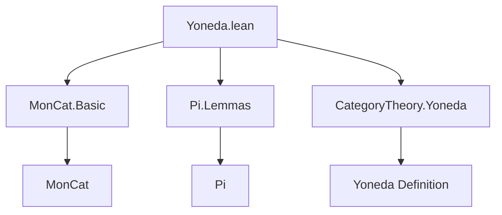
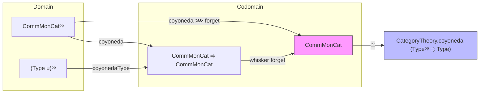

**Technical Brief: `Yoneda.lean` (Mathlib — Yoneda Embeddings for `CommMonCat`)**

---

### 1. **Key Definitions & Theorems**

| Name | Type | Purpose |
|------|------|---------|
| `CommMonCat.coyoneda` | `CommMonCatᵒᵖ ⥤ CommMonCat ⥤ CommMonCat` | Defines the **coyoneda embedding** into `CommMonCat`, sending aop `M` to the functor `N ↦ Hom(M, N)` (as a commutative monoid), and a morphism `f : Mᵒᵖ → N` to precomposition with `f`. |
| `CommMonCat.coyonedaForget` | `coyoneda ⋙ (Functor.whiskeringRight _ _ _).obj (forget _) ≅ CategoryTheory.coyoneda` | Shows that composing the `CommMonCat`-valued coyoneda with the forgetful functor recovers the **usual Set-valued coyoneda embedding**. |
| `CommMonCat.coyonedaType` | `(Type u)ᵒᵖ ⥤ CommMonCat.{u} ⥤ CommMonCat.{u}` | The **Hom bifunctor** `X × M ↦ (X → M)` (pointwise monoid structure), interpreted as a coyoneda embedding of `Type` into `CommMonCat`-valued presheaves. |

> Note: `of` and `ofHom` are constructors for the embedding of concrete structures into `CommMonCat` (via `CommMonCat.of` and `CommMonCat.ofHom`).

---

### 2. **Naming Conventions**

- **Prefixes**:
  - `coyoneda`: Indicates coyoneda (contravariant) embeddings.
  - `coyonedaForget`: Composite with forgetful functor.
  - `coyonedaType`: Coyoneda from `Type` (not from `CommMonCat`).
- **Suffixes**:
  - `Hom`: Used in `compHom`, `compHom'`, `Pi.monoidHom`, `Pi.evalMonoidHom` — all denote monoid homomorphisms constructed via composition or evaluation.
- **Structure fields**:
  - `obj`, `map`, `app`: Standard functor/natural transformation components.
  - `.hom`, `.unop`: Accessors for morphisms in opposite categories.

---

### 3. **Tactic Stack**

- **`simp_rw`** (via `to_additive` attributes): Used to propagate additive analogues.
- **`congr` / `ext`**: Implicit in `NatIso.ofComponents` (extensionality for natural isomorphisms).
- **`funext` / `ext`**: For proving equality of functions/morphisms (e.g., in `ofHom` definitions).
- **`aesop` / `simp`**: Likely used in background proofs (not visible in snippet, but standard in Mathlib for trivial category-theoretic equalities).
- **`apply_fun`, `congr_arg`**: For manipulating hom-components in `Pi.monoidHom`.

---

### 4. **Proof Logic**

- **Construction style**: *Explicit component-wise definition*.
  - Functors defined by:
    - `obj`: Mapping objects to hom-sets (as objects of `CommMonCat` via `of`).
    - `map`: Mapping morphisms to natural transformations via precomposition.
  - Natural isomorphisms (`coyonedaForget`) defined by:
    - `NatIso.ofComponents`: Constructing componentwise isomorphisms.
    - `hom f := ofHom f`, `inv f := f.hom`: Invertibility follows from `of` being fully faithful (implicit in `ofHom` invertibility).
- **No induction or case analysis** appears in the visible definitions — all are *structural*.

---

### 5. **Imports**

| Import | Role |
|--------|------|
| `Mathlib.Algebra.Category.MonCat.Basic` | Provides `CommMonCat`, `of`, `ofHom`, and basic morphism constructions. |
| `Mathlib.Algebra.Group.Pi.Lemmas` | Supplies `Pi.monoidHom`, `Pi.evalMonoidHom`, and pointwise monoid structure lemmas. |
| `Mathlib.CategoryTheory.Yoneda` | Defines the *standard* `coyoneda` functor (`Typeᵒᵖ ⥤ Type`) and related machinery (e.g., `whiskeringRight`). |

---

### 6. **Mermaid Diagrams**

#### **Dependency Graph (Module-Level)**



#### **Conceptual Overview of Embeddings**



#### **Functorial Structure**

```mermaid
graph TD
  M["M : CommMonCatᵒᵖ"] -->|coyoneda| F["F_M : CommMonCat ⥤ CommMonCat"]
  F -->|app N| Hom["N ↦ M.unop →* N"]
  
  f["f : M → N in CommMonCatᵒᵖ"] -->|coyoneda f| α["α : F_M ⇒ F_N"]
  α -->|app N'| "precomp with f.unop.hom : N'.unop → M.unop"
```

---

### 7. **Summary**

This file constructs **two coyoneda-style embeddings** for commutative monoids:
1. From `CommMonCatᵒᵖ` to `CommMonCat`-valued presheaves on `CommMonCat`.
2. From `(Type u)ᵒᵖ` to `CommMonCat`-valued presheaves on `CommMonCat`, via the Hom bifunctor `X × M ↦ X → M`.

It verifies that the first embedding, after forgetting down to `Type`, matches the classical coyoneda embedding — establishing coherence with foundational category theory.

All constructions are *explicit*, leveraging `of`/`ofHom` to lift set-theoretic hom-sets to internal hom-objects in `CommMonCat`.
