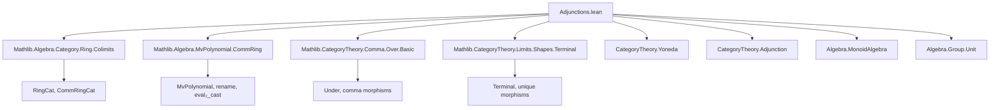

**Technical Brief: Adjunctions in `CommRingCat`**

---

### 1. KEY DEFINITIONS & THEOREMS

| Name | Type / Signature | Purpose |
|------|------------------|---------|
| `free : Type u ⥤ CommRingCat.{u}` | Functor | Sends a type `α` to the multivariate polynomial ring `ℤ[α]`; constructs the *free commutative ring* on a set of generators. |
| `adj : free ⊣ forget CommRingCat.{u}` | Adjunction | Establishes that `free` is left adjoint to the forgetful functor `CommRingCat ⥤ Type`. |
| `coyoneda : Type vᵒᵖ ⥤ CommRingCat.{u} ⥤ CommRingCat.{max u v}` | Functor | Interprets `Fun(-, R)` as a functor in both arguments: contravariant in the type argument, covariant in the ring argument. |
| `coyonedaAdj (R : CommRingCat.{u}) : (coyoneda.flip.obj R).rightOp ⊣ yoneda.obj R` | Adjunction | Currying adjunction: `Hom(Fun(n, R), S) ≅ Fun(n, Hom(R, S))`. |
| `coyonedaUnique {n : Type v} [Unique n] : coyoneda.obj (op n) ≅ 𝟭 CommRingCat` | Natural isomorphism | Shows that when `n` is a singleton, `Fun(n, -)` is naturally isomorphic to the identity functor. |
| `monoidAlgebra (R : CommRingCat) : CommMonCat ⥤ Under R` | Functor | Sends a commutative monoid `G` to the monoid algebra `R[G]`, viewed as an object under `R`. |
| `monoidAlgebraAdj (R : CommRingCat) : monoidAlgebra R ⊣ Under.forget R ⋙ forget₂ _ _` | Adjunction | Universal property of monoid algebras: `R[G] → S` corresponds bijectively to monoid maps `G → Sˣ`. |
| `forget₂Adj {R : CommRingCat} (hR : IsInitial R) : monoidAlgebra R ⋙ Under.forget R ⊣ forget₂ _ _` | Adjunction | Special case of monoid algebra adjunction when `R = ℤ` (via initiality), yielding `G ↦ ℤ[G] ⊣ (-)ˣ`. |
| `instance monoidAlgebra.IsLeftAdjoint` | Instance | Confirms `monoidAlgebra R` is always a left adjoint. |
| `instance forget₂.IsRightAdjoint` | Instance | Confirms the forgetful functor `CommRingCat → CommMonCat` (sending ring to its unit group) is a right adjoint. |

---

### 2. NAMING CONVENTIONS

- **Functor names**: `free`, `coyoneda`, `monoidAlgebra`, `adj`, `coyonedaAdj`, `monoidAlgebraAdj`, `forget₂Adj`
- **Adjoint names**: `*_Adj` suffix (e.g., `adj`, `coyonedaAdj`, `monoidAlgebraAdj`)
- **Isomorphism names**: `*_Iso` or `*_Unique` (e.g., `coyonedaUnique`)
- **Component names**: `unit`, `counit`, `left_triangle_components`, `right_triangle_components`
- **Hom-equivalence helpers**: `homEquiv`, `hom_ext`, `RingHom.ext`, `MonoidAlgebra.ringHom_ext`
- **Category-theoretic operations**: `.flip`, `.rightOp`, `.op`, `.obj`, `.map`, `.app`, `.homMk`

---

### 3. TACTIC STACK

Frequent tactics used in proofs:

| Tactic | Usage |
|--------|-------|
| `ext` | Extensionality for functions, ring homomorphisms, natural transformations, etc. |
| `simp` / `simp only` | Simplification using `@[simps]` lemmas and definitional equalities (e.g., `free_obj_coe`, `coyonedaAdj`) |
| `apply ... ext` | Proving equality of ring homomorphisms via `RingHom.ext` or `MonoidAlgebra.ringHom_ext` |
| `congrArg` | Congruence for equality of morphisms (e.g., in `adj`) |
| `dsimp` | Definitional simplification before `ext` or `simp` |
| `apply ...` + `intro` + `simp` | Standard pattern for verifying naturality and triangle identities |
| `apply MonoidAlgebra.liftNCRingHom` | Constructing ring maps from monoid maps into units |

---

### 4. PROOF LOGIC

The proofs follow a standard **adjunction-by-universal-property** pattern:

1. **Define the hom-equivalence** (or unit/counit) explicitly.
2. **Verify naturality** (often via `ext` + `simp` or `ringHom_ext`).
3. **Check triangle identities** (unit-counit equations), again using extensionality and simplification.
4. **Leverage existing equivalences**:
   - `homEquiv` for polynomial rings (`MvPolynomial` universal property),
   - `Pi.evalRingHom` / `Pi.ringHom` for function spaces,
   - `MonoidAlgebra.liftNCRingHom` for monoid algebras.

Induction is *not* used; proofs are mostly *constructive* and *extensional*, relying on universal properties of polynomial rings, function spaces, and monoid algebras.

---

### 5. IMPORTS (Primary Dependencies)

| Module | Role |
|--------|------|
| `Mathlib.Algebra.Category.Ring.Colimits` | Colimits in ring categories (used implicitly for `Under` and `CommRingCat` structure) |
| `Mathlib.Algebra.MvPolynomial.CommRing` | Multivariate polynomial rings as commutative rings |
| `Mathlib.CategoryTheory.Comma.Over.Basic` | Comma categories (`Under R`) and their universal properties |
| `Mathlib.CategoryTheory.Limits.Shapes.Terminal` | Terminal objects (used in `coyonedaUnique`) |

Also relies on:
- `CategoryTheory.Yoneda`
- `CategoryTheory.Adjunction`
- `Algebra.MonoidAlgebra`
- `Algebra.Group.Unit`
- `Data.Pi.Ring` (for `Pi.ringHom`, `Pi.evalRingHom`)

---

### 6. DEPENDENCY & OVERVIEW DIAGRAM

#### 📐 Module Dependency Graph (Mermaid)



#### 🧭 Theoretical Overview (Mermaid)

```mermaid
graph LR
  subgraph "Type → CommRingCat"
    T[Type u] -->|free| CR[CommRingCat]
  end

  subgraph "Adjunctions"
    CR -->|forget| T
    CR -->|coyoneda.flip R| CR
    CR -->|yoneda R| CommRingCat
    CR -->|monoidAlgebra R| Under R
    CR -->|forget₂| CommMonCat
  end

  subgraph "Universal Properties"
    free ⊣ forget
    coyoneda.flip R ⊣ yoneda R
    monoidAlgebra R ⊣ Under.forget R ⋙ forget₂
    monoidAlgebra ℤ ⊣ (-)ˣ
  end

  T -.->|polynomial ring| CR
  CR -.->|unit group| CommMonCat
  CR -.->|function space| CR
```

---

### 7. SUMMARY

This file formalizes **four fundamental adjunctions** in the category of commutative rings (`CommRingCat`), establishing that:

- Polynomial rings are free commutative rings,
- Function spaces `Fun(n, -)` are left adjoint to hom-functors `Hom(R, -)` (a “currying” adjunction),
- Monoid algebras `R[G]` are left adjoint to the unit group functor,
- In particular, `ℤ[G]` is left adjoint to `(-)ˣ`.

The proofs are clean, extensional, and rely heavily on the universal properties encoded in `homEquiv`, `MonoidAlgebra.liftNCRingHom`, and `Pi.ringHom`. The structure reflects a modern, category-theoretic approach to algebra, emphasizing *functoriality* and *universality* over explicit constructions.

--- 

Let me know if you'd like a formalized dependency graph (e.g., `.dot` or `.svg`) or a breakdown of how `monoidAlgebraAdj` relates to `forget₂Adj`.
