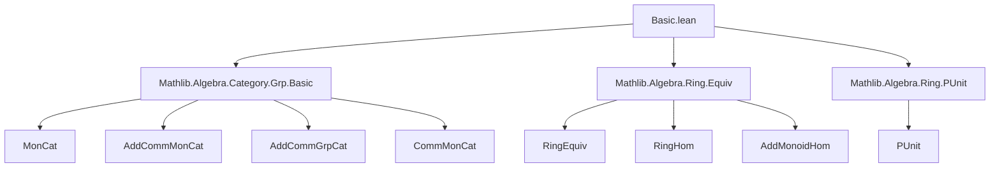
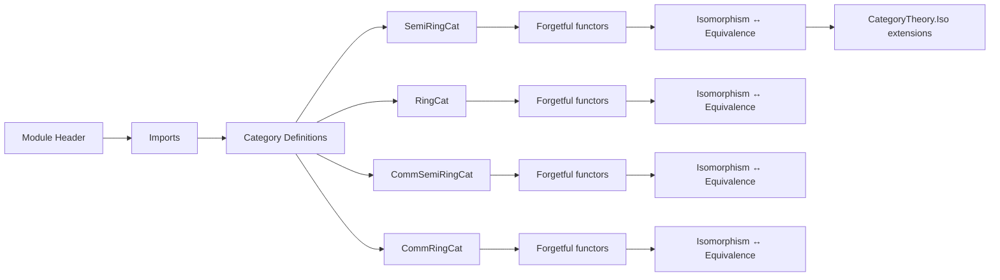

### Technical Brief: `Basic.lean` — Category-Theoretic Foundations for Rings and Semirings

---

#### **1. Key Definitions & Theorems**

| Name | Type / Structure | Purpose |
|------|------------------|---------|
| `SemiRingCat` | `Type (u+1)`-valued structure | Bundled category of semirings; objects are types with `Semiring`, morphisms are semiring homs (`→+*`). |
| `RingCat` | `Type (u+1)`-valued structure | Bundled category of rings. |
| `CommSemiRingCat` | `Type (u+1)`-valued structure | Bundled category of commutative semirings. |
| `CommRingCat` | `Type (u+1)`-valued structure | Bundled category of commutative rings. |
| `Hom` (e.g., `SemiRingCat.Hom`) | `Structure` | Morphism type defined as `R →+* S`, with `hom'` field. |
| `ofHom` | `R →+* S → R ⟶ S` | Embeds a ring hom into a categorical morphism. |
| `forget` | `C → Type u` | Forgetful functor to `Type u`, sending object to its carrier. |
| `hasForget₂` instances | `HasForget₂ C D` | Forgetful functors between categories (e.g., `RingCat → SemiRingCat`). |
| `RingEquiv.toSemiRingCatIso`, `toRingCatIso`, etc. | `R ≃+* S → R ≅ S` | Equivalence of rings ⇒ isomorphism in the respective category. |
| `semiRingCatIsoToRingEquiv`, etc. | `R ≅ S → R ≃+* S` | Isomorphism in category ⇒ ring equivalence. |
| `fullyFaithfulForget₂ToSemiRingCat`, etc. | `FullyFaithful` | Forgetful functors are fully faithful (i.e., bijective on homs). |
| `forgetReflectIsos` | `ReflectsIsomorphisms` | Isomorphisms detected by forgetful functor. |

**Key Theorems (Simp lemmas)**  
All categories satisfy:
- `hom_id`, `hom_comp`, `id_apply`, `comp_apply`, `hom_ext`, `ofHom_id`, `ofHom_comp`, `ofHom_apply`, `inv_hom_apply`, `hom_inv_apply`.
- `forget_obj`, `forget_map`.
- `forgetToRingCat_obj`, `forgetToRingCat_map_hom`.

**Equivalence of isomorphisms and ring equivalences**  
- `semiRingCatIsoToRingEquiv`, `ringCatIsoToRingEquiv`, etc., are inverses of `to*CatIso`, and satisfy simp lemmas like `semiRingCatIsoToRingEquiv_toRingHom`.

---

#### **2. Naming Conventions**

| Pattern | Meaning | Examples |
|--------|---------|----------|
| `of` | Constructor for bundled objects | `of R`, `ofHom f` |
| `hom'` | Underlying function field in `Hom` | `f.hom' : R →+* S` |
| `hom` | Projection to underlying function | `f.hom` (via `ConcreteCategory.hom`) |
| `forget` | Forgetful functor | `forget SemiRingCat`, `forget₂ RingCat SemiRingCat` |
| `fullyFaithfulForget₂To*` | Fully faithful forgetful functors | `fullyFaithfulForget₂ToSemiRingCat` |
| `*CatIsoToRingEquiv` | Isomorphism → ring equivalence | `ringCatIsoToRingEquiv` |
| `RingEquiv.to*CatIso` | Ring equivalence → isomorphism | `RingEquiv.toRingCatIso` |
| `hasForget₂` | Forgetful functors between categories | `hasForgetToAddCommMonCat`, `hasForgetToCommMonCat` |

Suffixes:
- `Cat` → category name (`SemiRingCat`, `RingCat`, etc.)
- `Iso` → categorical isomorphism
- `Equiv` → ring equivalence (`≃+*`)
- `Hom` → morphism type
- `forget` → forgetful functor

---

#### **3. Tactic Stack**

| Tactic | Usage |
|--------|-------|
| `rfl` | Proving definitional equalities (e.g., `ofHom_id`, `hom_id`, `forget_obj`) |
| `simp` | Simplifying compositions, identities, applications (e.g., `id_apply`, `comp_apply`) |
| `ext` | Extensionality for morphisms (`hom_ext`) and ring equivalences |
| `by simp` | Short proofs relying on `simp`-lemmas (e.g., `inv_hom_apply`) |
| `let ... exact` | In `reflects`, constructing ring equivalence from isomorphism |
| `set_option backward.privateInPublic true` | To allow private constructors in public definitions (used for `Hom.mk`) |

No heavy automation (e.g., `linarith`, `ring`, `aesop`) is used — proofs are mostly definitional or `simp`-based.

---

#### **4. Proof Logic**

- **Structure**: All categories are defined as `ConcreteCategory`s over `Type u`, with morphisms as ring homs.
- **Category laws**: Verified definitional via `rfl` (e.g., `comp_apply`, `id_apply`).
- **Isomorphisms ↔ Ring equivalences**:
  - `RingEquiv.to*CatIso` constructs an iso from an equivalence.
  - `*CatIsoToRingEquiv` constructs an equivalence from an iso using `RingEquiv.ofRingHom`.
  - Proofs of inverse properties use `ext` + `simp`.
- **Forgetful functors**:
  - Defined via `HasForget₂` with `obj`/`map` sending objects/morphisms to underlying ones.
  - Fully faithfulness shown by constructing preimage via `ofHom`.
- **Reflection of isomorphisms**:
  - Given `f : R ⟶ S` such that `forget f` is iso, construct `e : R ≃+* S` using `RingEquiv.ofRingHom`.
  - Then apply `to*CatIso` to get `R ≅ S`, and show it equals `f`.

Induction or case analysis is *not* used — all arguments are structural or definitional.

---

#### **5. Imports**

| Module | Purpose |
|--------|---------|
| `Mathlib.Algebra.Category.Grp.Basic` | Provides `MonCat`, `AddCommMonCat`, `AddCommGrpCat`, `CommMonCat` |
| `Mathlib.Algebra.Ring.Equiv` | Provides `RingEquiv`, `RingHom`, `toAddMonoidHom`, etc. |
| `Mathlib.Algebra.Ring.PUnit` | Provides `PUnit` as default inhabited semiring/ring |

---

#### **8. Mermaid Diagrams**

##### **Dependency Graph (Theory Scope)**



##### **Category Hierarchy Overview**

```mermaid
graph TD
  CommRingCat -->|forget₂| RingCat
  RingCat -->|forget₂| SemiRingCat
  CommSemiRingCat -->|forget₂| SemiRingCat
  SemiRingCat -->|forget| Type u

  RingCat -->|forget₂| AddCommGrpCat
  SemiRingCat -->|forget₂| AddCommMonCat
  SemiRingCat -->|forget₂| MonCat
  CommSemiRingCat -->|forget₂| CommMonCat
  CommRingCat -->|forget₂| CommMonCat
  CommRingCat -->|forget₂| CommSemiRingCat
```

##### **Morphism Equivalence Flow**

```mermaid
graph LR
  R ≃+* S -->|toRingCatIso| R ≅ S [in RingCat]
  R ≅ S [in RingCat] -->|ringCatIsoToRingEquiv| R ≃+* S

  R ≃+* S -->|toSemiRingCatIso| R ≅ S [in SemiRingCat]
  R ≅ S [in SemiRingCat] -->|semiRingCatIsoToRingEquiv| R ≃+* S

  %% Same for Comm variants
```

##### **File Overview**



--- 

This file forms the foundational categorical infrastructure for algebraic structures in Mathlib, enabling higher-level constructions (e.g., sheaves of rings, schemes) by providing a uniform, proof-relevant framework for rings and semirings as concrete categories.
