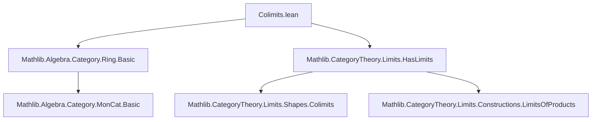
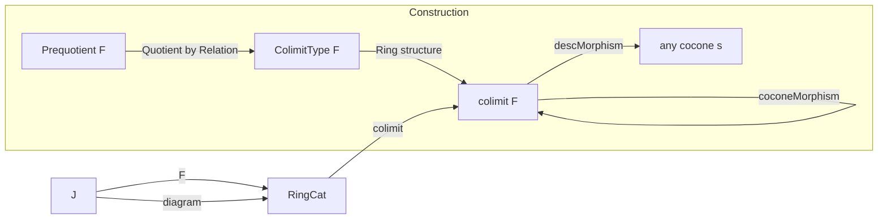
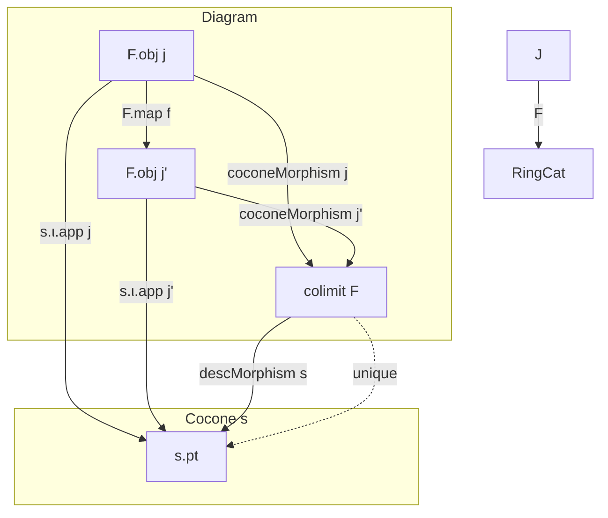

### Technical Brief: Colimits in `RingCat` and `CommRingCat`

---

#### **1. Key Definitions & Theorems**

| Name | Type / Signature | Purpose |
|------|------------------|---------|
| `Prequotient F` | `Type v` (inductive) | Represents *raw ring expressions* built from elements of the diagram `F : J ⥤ RingCat` using ring operations (`zero`, `one`, `add`, `mul`, `neg`) and injections `of j x`. |
| `Relation F` | `Prequotient F → Prequotient F → Prop` (inductive) | Smallest equivalence relation containing:  • congruence w.r.t. operations (`neg_1`, `add_1`, etc.)  • ring axioms (`zero_add`, `add_comm`, `mul_assoc`, etc.)  • diagram identifications (`map`)  • operation compatibility with `of` (`zero`, `add`, `mul`, `neg`). |
| `colimitSetoid F` | `Setoid (Prequotient F)` | Encapsulates `Relation F` as a setoid (reflexive, symmetric, transitive). |
| `ColimitType F` | `Type v` | Underlying type of the colimit: `Quotient (colimitSetoid F)`. |
| `colimit F` | `RingCat` | The colimit object in `RingCat`, constructed as `RingCat.of (ColimitType F)`. |
| `coconeMorphism F j` | `F.obj j ⟶ colimit F` | Canonical morphism from each diagram object to the colimit. |
| `descMorphism F s` | `colimit F ⟶ s.pt` | Mediating morphism from colimit to any other cocone `s`. |
| `colimitIsColimit F` | `IsColimit (colimitCocone F)` | Proves that `colimitCocone F` satisfies the universal property of a colimit. |
| `hasColimits_ringCat` | `HasColimits RingCat` | Concludes that `RingCat` has all small colimits. |
| `hasColimits_commRingCat` | `HasColimits CommRingCat` | Same for `CommRingCat`. |

> **Note**: The `CommRingCat` version mirrors `RingCat`, with the only structural difference being the inclusion of `mul_comm` in `Relation` and `CommRing` structure on `ColimitType`.

---

#### **2. Naming Conventions**

- **Prefixes**:
  - `Prequotient.`: Inductive type for raw expressions.
  - `Relation.`: Equivalence relation generators.
  - `colimit*`: Colimit construction components (`colimit`, `colimitSetoid`, `colimitCocone`).
  - `cocone*`: Cocone morphisms (`coconeFun`, `coconeMorphism`, `cocone_naturality`).
  - `desc*`: Mediating morphism components (`descFunLift`, `descFun`, `descMorphism`).
  - `quot*`: Simplification lemmas for `Quot.mk` (e.g., `quot_zero`, `quot_add`).

- **Suffixes**:
  - `_1`, `_2`: Argument-wise congruence rules (e.g., `add_1`, `mul_2`).
  - `_*`: Axiom rules (e.g., `zero_add`, `mul_comm`, `left_distrib`).
  - `isColimit`: Universal property witness.

---

#### **3. Tactic Stack**

The proofs rely heavily on:

- `induction r with ...`: Structural induction on the inductive `Relation`.
- `Quot.inductionOn`, `Quot.induction_on₂`, `Quot.induction_on₃`: Elimination for quotients.
- `Quot.sound`, `Quotient.sound`: To lift relations to equality in the quotient.
- `simp` + `dsimp`: Simplification using `@[simp]` lemmas and definitional equalities.
- `rw [h]`, `apply Quot.sound`, `apply Relation.*`: Manual rewriting and construction of relations.
- `ext`: Extensionality for ring homomorphisms (`RingHom.ext`).
- `congr_arg`, `congr_fun`: For functional extensionality and congruence.
- `fapply Quot.lift`: To define functions out of quotients.

> **No heavy automation** (e.g., `aesop`, `ring`, `abel`) is used — the proofs are *explicitly constructive*, following the “pre-automated” template.

---

#### **4. Proof Logic**

The construction follows a standard *quotient-of-free-algebra* pattern:

1. **Free construction**: Build `Prequotient F` as the free ring/commutative ring on the disjoint union of diagram objects.
2. **Quotient by relations**: Define `Relation F` to enforce:
   - Ring/commutative ring axioms,
   - Compatibility with diagram morphisms (`map`),
   - Congruence of operations.
3. **Verify algebraic structure**: Show `ColimitType F` inherits `Ring`/`CommRing` structure via quotient maps and axioms.
4. **Define cocone**: `coconeMorphism F j` maps `x : F.obj j` to `⟦of j x⟧`.
5. **Universal property**:
   - Define `descFunLift` on raw expressions.
   - Show it respects `Relation` → lifts to `descFun`.
   - Show it’s a ring homomorphism (`descMorphism`).
   - Prove uniqueness via induction on `Prequotient` and naturality.

> **Induction strategy**: For `descFun` well-definedness, induction on `Relation` covers all cases (refl, symm, trans, operation rules, axioms, diagram maps). For uniqueness, induction on `Prequotient` and naturality of the given cocone.

---

#### **5. Imports & Dependencies**

- `Mathlib.Algebra.Category.Ring.Basic`: Defines `RingCat`, `CommRingCat`, `RingHom`.
- `Mathlib.CategoryTheory.Limits.HasLimits`: Provides `HasColimits`, `IsColimit`, `Cocone`, etc.

> **No additional algebraic libraries** (e.g., `Mathlib.Algebra.Ring.Quotient`) are needed — all ring theory is handled via `RingCat` and `Quotient`-based constructions.

---

#### **6. Mermaid Diagrams**

##### **Dependency Graph (File-Level)**

##### **Colimit Construction Overview**

##### **Universal Property Diagram**

---

#### **7. Theory Scope**

- **Scope**: Constructs *all small colimits* in `RingCat` and `CommRingCat`.
- **Method**: Explicit, syntactic quotient-of-free-algebra approach (not using representability or adjoint functor theorems).
- **Generality**: Works for *any small indexing category* `J`.
- **Relation to existing theory**: Mirrors `MonCat.Colimits`, but for rings (adds additive inverses and distributivity).
- **Automation potential**: As noted in the comment, this could be synthesized by a tactic analyzing `RingCat`’s algebraic signature.

--- 

✅ **End of Technical Brief**
