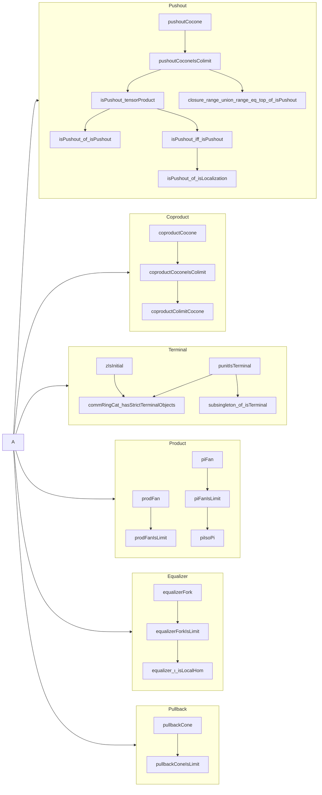

**Technical Brief: Constructions of (Co)limits in `CommRingCat`**

---

### 1. KEY DEFINITIONS & THEOREMS

| Name | Type / Purpose |
|------|----------------|
| `pushoutCocone R A B` | `Limits.PushoutCocone (CommRingCat.ofHom (algebraMap R A)) (CommRingCat.ofHom (algebraMap R B))` — explicit cocone for pushout in `CommRingCat`, with vertex $A \otimes_R B$. |
| `pushoutCoconeIsColimit R A B` | `Limits.IsColimit (pushoutCocone R A B)` — verifies tensor product over $R$ is the categorical pushout. |
| `isPushout_tensorProduct R A B` | `IsPushout ...` — rephrases `pushoutCoconeIsColimit` as a universal property of pushouts. |
| `isPushout_of_isPushout` | Uses `isPushout_tensorProduct` to lift scalar tower pushouts to `CommRingCat`. |
| `isPushout_iff_isPushout` | Equivalence between categorical pushout in `CommRingCat` and algebraic pushout (`Algebra.IsPushout`). |
| `isPushout_of_isLocalization` | Shows localization squares are pushouts in `CommRingCat`. |
| `closure_range_union_range_eq_top_of_isPushout` | If $R \to A, R \to B$ form a pushout, then the images generate the whole ring $X$. |
| `coproductCocone A B` | `BinaryCofan A B` — cocone for binary coproduct, vertex $A \otimes_{\mathbb{Z}} B$. |
| `coproductCoconeIsColimit A B` | `IsColimit (coproductCocone A B)` — shows tensor over $\mathbb{Z}$ is binary coproduct. |
| `zIsInitial` | `IsInitial (CommRingCat.of ℤ)` — $\mathbb{Z}$ is initial object. |
| `punitIsTerminal` | `IsTerminal (CommRingCat.of PUnit)` — trivial ring is terminal. |
| `commRingCat_hasStrictTerminalObjects` | `HasStrictTerminalObjects CommRingCat` — strict terminal object exists. |
| `prodFan A B` | `BinaryFan A B` — product fan with vertex $A \times B$. |
| `prodFanIsLimit A B` | `IsLimit (prodFan A B)` — Cartesian product is categorical product. |
| `piFan R` | `Fan R` — product fan for family $R : \iota \to \mathsf{CommRingCat}$, vertex $\prod_i R_i$. |
| `piFanIsLimit R` | `IsLimit (piFan R)` — arbitrary products are Cartesian products. |
| `piIsoPi R` | $\prod^c R \cong \mathrm{of}(\prod_i R_i)$ — categorical product ≅ set-theoretic product. |
| `equalizerFork f g` | `Fork f g` — equalizer fork with vertex $\mathrm{eqLocus}(f, g) \hookrightarrow A$. |
| `equalizerForkIsLimit f g` | `IsLimit (equalizerFork f g)` — equalizers are set-theoretic equalizers. |
| `pullbackCone f g` | `PullbackCone f g` — pullback cone with vertex $\mathrm{eqLocus}(f \circ \pi_1, g \circ \pi_2) \subseteq A \times B$. |
| `pullbackConeIsLimit f g` | `IsLimit (pullbackCone f g)` — pullbacks are subrings of products defined by equalizers. |

---

### 2. NAMING CONVENTIONS

- **Prefixes**:
  - `pushoutCocone`, `coproductCocone`, `prodFan`, `piFan`, `equalizerFork`, `pullbackCone`: explicit (co)cones.
  - `isPushout_`, `isInitial`, `isTerminal`: properties of objects.
  - `closure_range_union_range_eq_top_of_`: structural consequences of universal properties.

- **Suffixes**:
  - `IsColimit`, `IsLimit`, `IsPushout`: universal properties (colimit/limit/pushout).
  - `Cocone`, `Fan`, `Fork`, `Cone`: standard limit/cocolimit diagram types.

- **Helper suffixes**:
  - `pt`, `inl`, `inr`, `fst`, `snd`, `ι`, `π`: accessors for cone/fan components.
  - `hom`, `toIntAlgHom`, `subtype`, `codRestrict`: ring homomorphism constructors.

---

### 3. TACTIC STACK

Frequent tactics used:

| Tactic | Purpose |
|--------|---------|
| `ext` | Extensionality for ring homs, functions, subtypes. |
| `simp` / `simp only` | Simplify using `@[simp]` lemmas (e.g., `pushoutCocone_inl`). |
| `congr` | Apply congruence to equalities involving function application. |
| `rw` / `apply` | Rewrite using lemmas or apply universal properties. |
| `intro` / `rintro` | Introduce hypotheses/constructors. |
| `cases` / `rcases` | Eliminate sum/product types (e.g., `WalkingPair.left/right`). |
| `algebraize` | Simplify algebraic structure using `Algebra` and `RingHom` lemmas. |
| `apply ... injective` | Use injectivity of ring homs (e.g., `RingHom.toIntAlgHom_injective`). |
| `apply Algebra.TensorProduct.ext'` | Prove equality in tensor product via generators. |
| `dsimp`, `change`, `convert` | Fine-grained simplification and conversion. |
| `infer_instance` | Solve typeclass goals (e.g., `IsScalarTower`, `IsLocalization`). |

---

### 4. PROOF LOGIC

**General proof strategy**:

1. **Construct explicit (co)cone** (e.g., `pushoutCocone`, `prodFan`) using concrete ring constructions (tensor product, product, equalizer).
2. **Verify cone laws** (`w`, `fac`, `commutes'`) via `ext` and `simp`.
3. **Show universal property**:
   - Define the mediating morphism (e.g., `AlgHom.toRingHom (Algebra.TensorProduct.productMap f' g')`).
   - Prove factorization (`fac`) using `ext` and `simp`.
   - Prove uniqueness (`uniq`) using injectivity or extensionality (e.g., `RingHom.ext`, `Subtype.ext`).
4. **Leverage algebraic equivalences**:
   - Use `Algebra.TensorProduct.ext'`, `RingHom.toIntAlgHom_injective`, `Algebra.TensorProduct.liftEquiv`.
   - Translate between categorical and algebraic notions via `isPushout_iff_isPushout`, `piIsoPi`.

**Induction / case analysis** is rare — most proofs are *constructive* and *element-wise*.

---

### 5. IMPORTS (PRIMARY DEPENDENCIES)

| Module | Role |
|--------|------|
| `Mathlib.Algebra.Category.Ring.Colimits` | Colimits in `RingCat`/`CommRingCat`. |
| `Mathlib.Algebra.Category.Ring.Instances` | Standard ring category instances. |
| `Mathlib.Algebra.Category.Ring.Limits` | Limits in ring categories. |
| `Mathlib.CategoryTheory.Limits.Shapes.StrictInitial` | Strict initial objects. |
| `Mathlib.RingTheory.Localization.BaseChange` | Base change for localization. |
| `Mathlib.CategoryTheory.Limits.Shapes.Pullback.IsPullback.Basic` | Pullback basics. |

These imports indicate this file is part of the *category theory of commutative rings*, especially focusing on *explicit constructions* of (co)limits.

---

### 6. MERMAID DIAGRAMS

#### Dependency Graph (Top-Level)

```mermaid
graph TD
  A[Constructions.lean] --> B[Mathlib.Algebra.Category.Ring.Colimits]
  A --> C[Mathlib.Algebra.Category.Ring.Instances]
  A --> D[Mathlib.Algebra.Category.Ring.Limits]
  A --> E[Mathlib.CategoryTheory.Limits.Shapes.StrictInitial]
  A --> F[Mathlib.RingTheory.Localization.BaseChange]
  A --> G[Mathlib.CategoryTheory.Limits.Shapes.Pullback.IsPullback.Basic]

  B --> H[Mathlib.CategoryTheory.Limits.Basic]
  C --> I[Mathlib.Algebra.Category.Ring.Objects]
  D --> J[Mathlib.CategoryTheory.Limits.Shapes.Product]
  D --> K[Mathlib.CategoryTheory.Limits.Shapes.Equalizer]
  D --> L[Mathlib.CategoryTheory.Limits.Shapes.Pullback]
  E --> M[Mathlib.CategoryTheory.Limits.Shapes.Terminal]
  F --> N[Mathlib.RingTheory.Localization.Universal]
  G --> O[Mathlib.CategoryTheory.Limits.Shapes.Pullback.IsPullback]
```

#### Overview of `Constructions.lean`

---

### 7. SUMMARY

This file provides **explicit constructions** of all standard (co)limits in `CommRingCat`, grounding abstract category theory in concrete ring-theoretic operations:

- **Pushouts** ↔ tensor products over base ring.
- **Coproducts** ↔ tensor over $\mathbb{Z}$.
- **Products** ↔ Cartesian products (finite and arbitrary).
- **Equalizers** ↔ ring-theoretic equalizers (`eqLocus`).
- **Pullbacks** ↔ subrings of products defined by equalizers.
- **Initial/terminal** ↔ $\mathbb{Z}$ and $0$.

It bridges algebra and category theory via:
- `isPushout_iff_isPushout` (categorical ↔ algebraic pushout),
- `piIsoPi` (categorical product ↔ product type),
- `equalizerForkIsLimit` (equalizer as subring).

The proofs are **elementary**, relying on `ext`, `simp`, and ring-theoretic injectivity/uniqueness lemmas — no homological algebra or spectral sequences needed.

--- 

Let me know if you'd like a **dependency graph of lemmas** or a **proof outline for a specific construction** (e.g., pushout or equalizer).
