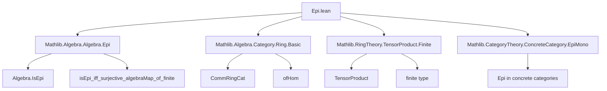
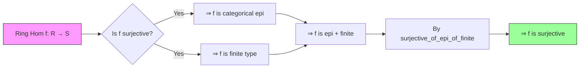

**Technical Brief: `Epi.lean` — Epimorphisms in `CommRingCat`**

---

### 1. KEY DEFINITIONS & THEOREMS

| Name | Type / Signature | Purpose |
|------|------------------|---------|
| `CommRingCat.epi_iff_epi` | `Epi (CommRingCat.ofHom (algebraMap R S)) ↔ Algebra.IsEpi R S` | Relates categorical epimorphism in `CommRingCat` to algebraic epimorphism (`Algebra.IsEpi`) via tensor product condition. |
| `RingHom.surjective_of_epi_of_finite` | `(f : R ⟶ S) → Epi f → RingHom.Finite f.hom → Function.Surjective f` | Shows that a ring homomorphism that is categorical epi *and* finite is surjective. |
| `RingHom.surjective_iff_epi_and_finite` | `Function.Surjective f ↔ Epi f ∧ RingHom.Finite f.hom` | Main equivalence: surjectivity ⇔ (epi + finite). |

> **Note**: `Algebra.IsEpi R S` is defined as:  
> $$
\forall x, y : S,\quad x \otimes 1 = 1 \otimes y \implies x = y
$$  
> (i.e., the multiplication map $S \otimes_R S \to S$ is monic, or equivalently, the two inclusions $S \rightrightarrows S \otimes_R S$ are equal only on the diagonal.)

---

### 2. NAMING CONVENTIONS

- **Prefixes**:
  - `epi_`: categorical epimorphism properties (`epi_iff_epi`, `epi_of_surjective`)
  - `surjective_`: function-theoretic surjectivity (`surjective_of_epi_of_finite`, `surjective_iff_epi_and_finite`)
  - `is_`: algebraic properties (`isEpi_iff_forall_one_tmul_eq`, `isEpi_iff_surjective_algebraMap_of_finite`)
- **Suffixes**:
  - `_of_`: construction from a property (`surjective_of_epi_of_finite`)
  - `_iff_`: equivalence statements (`epi_iff_epi`, `surjective_iff_epi_and_finite`)
- **Category-theoretic terms**: `CommRingCat.ofHom`, `Hom.hom`, `ofAlgebra`, `TensorProduct.lift`, `includeLeftRingHom`, `includeRight`

---

### 3. TACTIC STACK

| Tactic | Usage |
|--------|-------|
| `simp_rw` | Rewriting with `eq_comm`, `Algebra.isEpi_iff_forall_one_tmul_eq`, etc. |
| `ext` | Extensionality for ring homomorphisms and algebra maps (`ext r`, `ext s`) |
| `simp only [...]` | Simplifying tensor expressions (e.g., `smul_tmul`, `algebraMap_eq_smul_one`) |
| `congr` | Congruence for equality of morphisms (`congrArg Hom.hom`, `congr`) |
| `rwa` | Rewrite and assume (`rwa [Algebra.isEpi_iff_surjective_algebraMap_of_finite]`) |
| `algebraize` | Converts ring homomorphism to algebra map (used in `surjective_of_epi_of_finite`) |
| `exact`, `refine`, `intro`, `letI`, `let` | Standard proof construction |

---

### 4. PROOF LOGIC

- **Structure of `epi_iff_epi`**:
  1. **Forward direction** (`→`):
     - Use `H` on two specific maps: `includeLeft` and `includeRight` into the tensor product.
     - Derive equality $x \otimes 1 = 1 \otimes y \implies x = y$.
  2. **Reverse direction** (`←`):
     - Assume `Algebra.IsEpi R S`.
     - Construct algebra maps $f', g' : S \to_T R$ factoring through tensor product.
     - Apply `H` to conclude $f = g$.

- **Structure of `surjective_of_epi_of_finite`**:
  1. Use `algebraize` to treat `f` as an algebra map.
  2. Convert `Epi f` to `Algebra.IsEpi R S` via `epi_iff_epi`.
  3. Apply known equivalence:  
     $$
     \text{IsEpi} + \text{Finite} \iff \text{Surjective}
     $$
     (specifically, `Algebra.isEpi_iff_surjective_algebraMap_of_finite`).

- **Structure of `surjective_iff_epi_and_finite`**:
  - **Forward**: Surjective ⇒ categorical epi (standard) + finite (by assumption or `of_surjective`).
  - **Backward**: Combine `epi` + `finite` ⇒ surjective via `surjective_of_epi_of_finite`.

---

### 5. IMPORTS & DEPENDENCIES

| Module | Role |
|--------|------|
| `Mathlib.Algebra.Algebra.Epi` | Defines `Algebra.IsEpi`, key lemmas like `isEpi_iff_surjective_algebraMap_of_finite` |
| `Mathlib.Algebra.Category.Ring.Basic` | Defines `CommRingCat`, `ofHom`, hom-sets, etc. |
| `Mathlib.RingTheory.TensorProduct.Finite` | Tensor product constructions, finite type conditions, and interaction with algebra maps |
| `Mathlib.CategoryTheory.ConcreteCategory.EpiMono` | General categorical epimorphism facts (e.g., `epi_of_surjective`) |

---

### 6. MERMAID DIAGRAMS

#### Dependency Graph (Module-Level)



#### Overview of Theory Flow



#### Tensor Product Characterization of `Algebra.IsEpi`

```mermaid
flowchart LR
  R --algebraMap--> S
  S --includeLeft--> S ⊗_R S
  S --includeRight--> S ⊗_R S
  includeLeft -.->|equal| includeRight
  style S ⊗_R S fill:#ddf,stroke:#333
```

> `Algebra.IsEpi R S` holds iff the two canonical maps $S \rightrightarrows S \otimes_R S$ are equal *only* on the image of `algebraMap R S`.

---

### 7. KEY EQUATIONS & LOGICAL FORMULAS

- **Algebraic epimorphism condition**:
  $$
  \text{IsEpi}(R \to S) \iff \forall x, y \in S,\quad x \otimes 1 = 1 \otimes y \implies x = y
  $$

- **Surjectivity ↔ (epi + finite)**:
  $$
  f \text{ surjective} \iff f \text{ is categorical epi} \land f \text{ has finite type}
  $$

- **Tensor-based epi test** (used in proof of `epi_iff_epi`):
  $$
  \text{Epi}(f) \iff \forall g, h: S \rightrightarrows T,\quad g \circ f = h \circ f \implies g = h
  $$
  reduced to checking equality on $S \otimes_R S$ via universal property.

---

### 8. SUMMARY

This file establishes a foundational bridge between categorical and algebraic notions of epimorphism in the category of commutative rings. It shows that in `CommRingCat`, epimorphisms are precisely those ring homomorphisms that are both categorical epimorphisms *and* of finite type — a refinement of the classical fact that surjective ring maps are epimorphisms, but not all epimorphisms are surjective (e.g., localization). The tensor product plays a central role in characterizing algebraic epimorphisms, and the equivalence is proven using extensionality, tensor universal properties, and algebraic finite-type conditions.
