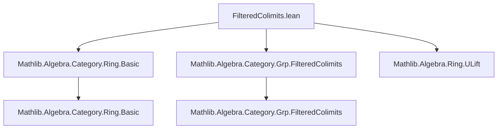
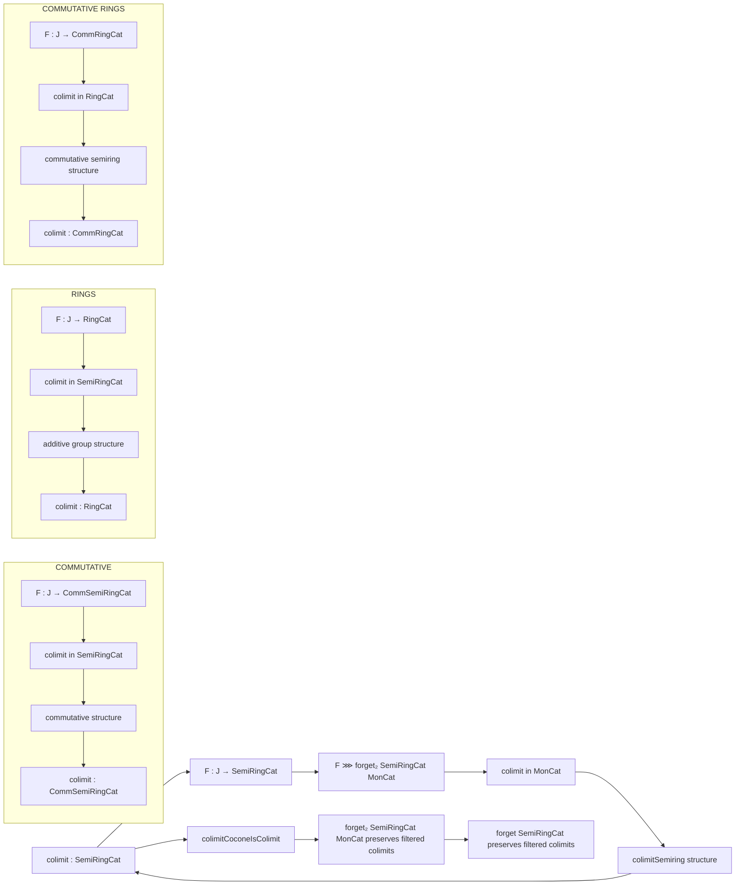

### Technical Brief: `FilteredColimits.lean`

---

#### **1. Key Definitions & Theorems**

| Name | Type / Signature | Purpose |
|------|------------------|---------|
| `colimitSemiring` | `Semiring (R.{v, u} F)` | Constructs a semiring structure on the filtered colimit of a diagram of semirings (viewed as monoids + addition). |
| `colimit` | `SemiRingCat.{max v u}` | Bundled semiring object representing the colimit in `SemiRingCat`. |
| `colimitCocone` | `Cocone F` | The canonical cocone over `F` with vertex `colimit F`. |
| `colimitCoconeIsColimit` | `IsColimit (colimitCocone F)` | Proves that `colimitCocone F` is a colimit in `SemiRingCat`. |
| `forget₂Mon_preservesFilteredColimits` | `PreservesFilteredColimits (forget₂ SemiRingCat MonCat)` | Shows the forgetful functor `SemiRingCat → MonCat` preserves filtered colimits. |
| `forget_preservesFilteredColimits` | `PreservesFilteredColimits (forget SemiRingCat)` | Follows from composition: `SemiRingCat → MonCat → Type`. |
| `colimitCommSemiring` | `CommSemiring (R F)` | Commutative semiring structure on colimit of commutative semirings. |
| `colimitRing` | `Ring (R F)` | Ring structure on colimit of rings (via additive group structure). |
| `colimitCommRing` | `CommRing (R F)` | Commutative ring structure on colimit of commutative rings. |
| `nontrivial` | `Nontrivial c.pt` under assumptions | Ensures colimit of nontrivial commutative rings is nontrivial (uses `ULift ℤ` when $J$ is empty). |

---

#### **2. Naming Conventions**

- **Prefixes:**
  - `colimit_`: for constructions and properties of the colimit object/cocone.
  - `forget₂_`: for forgetful functors between algebraic categories (e.g., `forget₂ SemiRingCat MonCat`).
  - `desc_`: for universal morphisms in colimit universal properties.
  - `isColimitOf_`: for proving colimit uniqueness via reflection.

- **Suffixes:**
  - `_preservesFilteredColimits`: for instances showing preservation of filtered colimits.
  - `_CoconeIsColimit`: for proofs that a given cocone is a colimit.
  - `_quotMk`: for lemmas about behavior on representatives in quotient types.

- **Abbreviations:**
  - `R`: shorthand for the underlying type of the colimit (e.g., `R.{v, u} F`).
  - `ofHom`: used to build morphisms in bundled categories from underlying functions.

---

#### **3. Tactic Stack**

- **Core tactics:**
  - `refine`, `rw`, `erw`, `simp`, `dsimp`, `congr_fun`, `ext`, `obtain`, `cases`
- **Category-theoretic helpers:**
  - `hom_ext`, `RingHom.coe_inj`, `Types.TypeMax.colimitCocone`, `isColimitOfReflects`
- **Algebraic reasoning:**
  - `mul_zero`, `zero_mul`, `left_distrib`, `right_distrib`, `map_zero`, `map_mul`, `map_id`
- **Filtered category machinery:**
  - `IsFiltered.max₃`, `firstToMax₃`, `secondToMax₃`, `thirdToMax₃`
- **Quotient induction:**
  - `Quot.inductionOn`, `Quot.induction_on₃`, `quotMk` lemmas

---

#### **4. Proof Logic**

The proofs follow a standard pattern for algebraic colimits:

1. **Construct underlying type:** Use `MonCat.FilteredColimits.colimit` (or `AddCommMonCat`) as the carrier.
2. **Lift structure:** Define multiplication/additive inverse/etc. using universal properties and filteredness (e.g., represent elements as `⟨j, x⟩`, use filteredness to align indices).
3. **Verify axioms:** Use `Quot.inductionOn` to reduce to elements in the diagram; apply `erw` with colimit lemmas (`colimit_mul_mk_eq`, `colimit_add_mk_eq`, etc.), then use diagram axioms (e.g., distributivity in `F.obj j`).
4. **Universal property:** Define `desc` using `descAddMonoidHom` and `descMonoidHom`, check compatibility with multiplication/zero, then uniqueness via `forget`-conservativity.

For commutative variants, the key step is lifting the commutative monoid structure (via `CommMonCat.FilteredColimits.colimitCommMonoid`) or using reflection (`isColimitOfReflects`) along the forgetful functor.

The `nontrivial` lemma uses:
- `isColimitEquivIsInitialOfIsEmpty` to reduce to `ULift ℤ` when $J$ is empty.
- Filteredness to compare images of $0$ and $1$ via a common extension.

---

#### **5. Imports**

- `Mathlib.Algebra.Category.Ring.Basic`
- `Mathlib.Algebra.Category.Grp.FilteredColimits`
- `Mathlib.Algebra.Ring.ULift`

These indicate the module builds on:
- Basic ring-theoretic category theory (`RingCat`, `SemiRingCat`, etc.)
- Filtered colimits in additive categories (`AddCommGrpCat`, `AddCommMonCat`)
- Technical tools for nontriviality (`ULift ℤ`)

---

#### **6. Mermaid Diagrams**

##### **Dependency Graph (Module-Level)**

##### **Theoretical Flow (Colimit Preservation)**

##### **Overview of Theory Scope**

This file establishes that **all standard forgetful functors from algebraic categories to `Type` preserve filtered colimits**, by:
- Constructing the colimit object in the algebraic category,
- Proving it satisfies the universal property,
- Deriving preservation results for composite forgetful functors.

It covers:
- `SemiRingCat`, `CommSemiRingCat`, `RingCat`, `CommRingCat`
- Via a uniform pattern: lift structure from underlying monoids/groups, verify axioms using filteredness, and apply reflection/universal properties.

The `nontrivial` lemma ensures that filtered colimits of nontrivial commutative rings remain nontrivial — a subtle but important property for algebraic geometry and logic applications.

--- 

Let me know if you'd like a formalized dependency graph (e.g., for `leanproject`), or a summary of how this fits into the broader `Mathlib` architecture (e.g., relation to `Limits`, `Algebra.Category.*.Colimits`).
