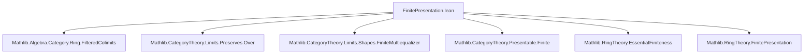
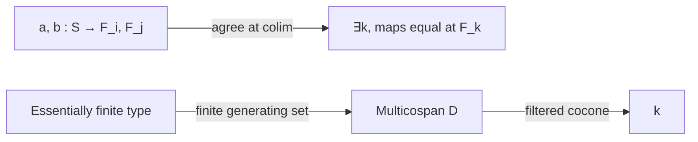

**Technical Brief: `FinitePresentation.lean`**

---

### 1. **Key Definitions & Theorems**

| Name | Type / Signature | Purpose |
|------|------------------|---------|
| `RingHom.EssFiniteType.exists_comp_map_eq_of_isColimit` | `lemma` | Shows *injectivity* of the canonical map $\varinjlim \mathrm{Hom}_R(S, F_i) \to \mathrm{Hom}_R(S, \varinjlim F)$ when $S$ is essentially of finite type over $R$. |
| `RingHom.EssFiniteType.exists_eq_comp_ι_app_of_isColimit` | `lemma` | Shows *surjectivity* of the same map when $S$ is finitely presented over $R$. |
| `CommRingCat.preservesColimit_coyoneda_of_finitePresentation` | `lemma` | Main result: If $S$ is a finitely presented $R$-algebra, then $\mathrm{Hom}_R(S, -)$ preserves filtered colimits in `Under R`. |
| `CommRingCat.preservesFilteredColimits_coyoneda` | `lemma` | Corollary: The coyoneda embedding of $S$ preserves all filtered colimits. |
| `CommRingCat.isFinitelyPresentable_under` | `lemma` | Concludes that $S : \mathrm{Under}\,R$ is *finitely presentable* as an object in the under-category. |
| `CommRingCat.isFinitelyPresentable_hom` | `lemma` | Reformulates finite presentability for morphisms $R \to S$ in terms of `MorphismProperty.isFinitelyPresentable`. |

---

### 2. **Naming Conventions**

- **Prefixes**:
  - `RingHom.EssFiniteType.*`: For properties of ring homs that are *essentially of finite type*.
  - `RingHom.FinitePresentation.*`: For properties of *finitely presented* ring homs.
  - `CommRingCat.preserves*`: For preservation of colimits by hom-functors.
  - `isFinitelyPresentable*`: For categorical finite presentability.

- **Suffixes**:
  - `_of_isColimit`: Assumes a colimit cocone is a colimit (via `IsColimit`).
  - `_of_finitePresentation`: Assumes finite presentation of the algebra.
  - `_under`: Refers to finite presentability in `Under R`.

- **Variable naming**:
  - `f`, `g`, `a`, `b`: Ring homs.
  - `α`: Natural transformation $R \Rightarrow F$ (diagram over $R$).
  - `c`, `hc`: Colimit cocone and its limit property.
  - `i`, `j`, `k`: Index objects in filtered category $J$.

---

### 3. **Tactic Stack**

| Tactic | Frequency | Role |
|--------|-----------|------|
| `classical` | High | Used to enable classical choice for constructing witnesses. |
| `choose` / `choose!` | High | Extracting witnesses from existential quantifiers (e.g., from filtered colimit universal property). |
| `obtain` / `obtain ⟨…⟩` | High | Destructuring existential/universal hypotheses. |
| `ext1`, `ext` | High | Extensionality for ring homs (via `RingHom.ext`, `MvPolynomial.ringHom_ext`). |
| `simp` / `simp only` | Very High | Simplification using algebraic identities, naturality, and category laws. |
| `rw`, `assess_of%`, `reassoc_of%` | Medium | Rewriting using associativity and algebra maps. |
| `apply`, `refine`, `exact` | Medium | Proof construction and goal refinement. |
| `have`, `suffices` | Medium | Intermediate lemma introduction. |
| `cases` | Low | Rarely used (mostly implicit via `obtain`). |
| `aesop` | Not present | Not used in this file. |

---

### 4. **Proof Logic**

The proofs follow a standard *filtered colimit universal property* strategy:

1. **Injectivity lemma** (`exists_comp_map_eq_of_isColimit`):
   - Use the assumption that $S$ is essentially of finite type to reduce to a finite diagram.
   - Construct a multicospan shape from the finite generating set.
   - Use filteredness to find a common cocone point $k$ where the two extensions agree.

2. **Surjectivity lemma** (`exists_eq_comp_ι_app_of_isColimit`):
   - Use finite presentation: $S \cong P / I$ where $P = R[x_1, \dots, x_n]$ and $I$ is finitely generated.
   - Lift a map $S \to \mathrm{colim} F$ to a map $P \to \mathrm{colim} F$, then factor through some $F_i$.
   - Use finite generation of the kernel to kill the relations at some later stage $i' \ge i$.
   - Use filtered colimit properties again to glue and descend to a map $S \to F_k$.

3. **Main theorem** (`preservesColimit_coyoneda_of_finitePresentation`):
   - Apply the two lemmas to verify the universal property of colimit preservation for the coyoneda functor $\mathrm{Hom}(S, -)$.
   - Use `Types.FilteredColimit.isColimitOf` to construct the equivalence.

4. **Corollaries**:
   - Derive filtered colimit preservation and finite presentability in `Under R`.

---

### 5. **Imports**

| Module | Purpose |
|--------|---------|
| `Mathlib.Algebra.Category.Ring.FilteredColimits` | Filtered colimits in `CommRingCat`, preservation lemmas. |
| `Mathlib.CategoryTheory.Limits.Preserves.Over` | Preservation of colimits in over/under categories. |
| `Mathlib.CategoryTheory.Limits.Shapes.FiniteMultiequalizer` | Multicospan/finite multiequalizer constructions. |
| `Mathlib.CategoryTheory.Presentable.Finite` | Finite presentability in category theory. |
| `Mathlib.RingTheory.EssentialFiniteness` | Essential finite type / finite presentation of ring homs. |
| `Mathlib.RingTheory.FinitePresentation` | Definitions and basic properties of finitely presented algebras. |

---

### 6. **Mermaid Diagrams**

#### **Dependency Graph (Module-Level)**



#### **Conceptual Overview (Theory Flow)**

```mermaid
graph TD
  S[Finitely Presented R-Algebra S] --> L1[Injectivity Lemma]
  S --> L2[Surjectivity Lemma]
  L1 & L2 --> M[Preserves Colimit of Hom_R(S, -)]
  M --> C1[Preserves Filtered Colimits]
  C1 --> C2[S is Finitely Presentable in Under R]
  S --> C3[Morphism f: R→S is Finitely Presentable]
```

#### **Proof Structure (Injectivity Sketch)**



#### **Proof Structure (Surjectivity Sketch)**

```mermaid
graph TD
  g[S → colim F] -->|finite presentation| P[P = R[x₁..xₙ]]
  P -->|surjection| S
  P -->|lift g| F_i
  ker[ker = finitely generated] -->|kill generators| F_{i'}
  F_{i'} -->|filtered colimit| K[k]
  K --> g'[S → F_k]
```

---

### 7. **Notable Idioms & Patterns**

- **`Types.FilteredColimit.isColimit_eq_iff`**: Used repeatedly to lift equalities from colimits.
- **`MvPolynomial.ringHom_ext`**: Extensionality for maps out of multivariate polynomial rings.
- **`RingHom.liftOfSurjective`**: Descending maps through surjections (used to kill kernel relations).
- **`Ideal.span_le` + `Ideal.subset_span`**: For verifying ideal containment in finite generation arguments.
- **`Under.homMk` / `Under.UnderMorphism.ext`**: Constructing and extending morphisms in under-categories.

---

### 8. **Summary**

This file establishes the foundational categorical fact that **finitely presented algebras are finitely presentable objects in the under-category `Under R`**, i.e., their hom-functors preserve filtered colimits. The proof leverages:
- The *finite presentation* condition (quotient of a finitely generated polynomial ring by a finitely generated ideal),
- Filtered colimit properties in `CommRingCat`,
- Multicospan constructions for injectivity,
- Surjective presentations and kernel control for surjectivity.

It is a key ingredient for developing the theory of *locally finitely presentable categories* in the context of commutative algebra and algebraic geometry.
