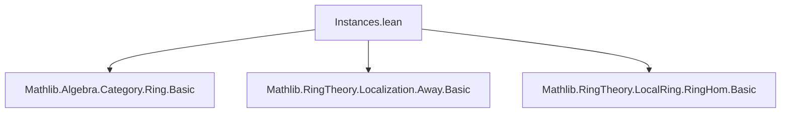

**Technical Brief: `Instances.lean` (Lean 4)**  
*Domain: Categorical Ring Theory / Localization / Local Rings*  

---

### 1. **Key Definitions & Theorems**

| Name | Type | Purpose |
|------|------|---------|
| `localization_unit_isIso` | `IsIso (algebraMap R (Localization.Away (1 : R)))` | Shows the canonical map $R \to R[1]^{-1} = R$ (localization at multiplicative set $\{1\}$) is an isomorphism in `CommRingCat`. |
| `localization_unit_isIso'` | `@IsIso CommRingCat R R ...` | Variant of above, rephrased for explicit domain/codomain typing (used to resolve typeclass inference). |
| `IsLocalization.epi` | `Epi (algebraMap R S)` | Proves the structure map of a localization $R \to S$ is an epimorphism in `CommRingCat`. |
| `Localization.epi` / `Localization.epi'` | `Epi (algebraMap R (Localization M))` | Special cases of `IsLocalization.epi` for `Localization M`. |
| `CommRingCat.isLocalHom_comp` | `IsLocalHom (f ≫ g)` | Composition of local ring homomorphisms is local. |
| `isLocalHom_of_iso` | `IsLocalHom f.hom` | Any isomorphism in `CommRingCat` is a local homomorphism. |
| `isLocalHom_of_isIso` | `IsLocalHom f` (priority 100) | Any isomorphism (as a morphism) in `CommRingCat` is local — *lower priority* to avoid overlap with `isLocalHom_of_iso`. |

---

### 2. **Naming Conventions**

- **Prefixes**:
  - `localization_`: for results about localization (e.g., `localization_unit_isIso`).
  - `isLocalHom_`: for properties of local ring homomorphisms (e.g., `isLocalHom_of_iso`).
  - `epi`: for epimorphism instances (e.g., `Localization.epi`).
- **Suffixes**:
  - `_isIso`: asserts a morphism is invertible.
  - `_epi`: asserts a morphism is an epimorphism.
  - `_comp`: for composition closure.
- **Variants**:
  - `'` (prime) suffix: alternate version, often with explicit type parameters or rephrased for typeclass inference (e.g., `localization_unit_isIso` vs `localization_unit_isIso'`).
  - `'` vs no `'`: sometimes distinguishes between `Type*`-level and `CommRingCat`-level statements.

---

### 3. **Tactic Stack**

| Tactic | Usage Frequency | Purpose |
|--------|-----------------|---------|
| `cases R` / `rcases R` | High | Unpack `CommRingCat` as `⟨α, str⟩`. |
| `exact` | High | Apply known instances/lemmas. |
| `convert` + `simp` | Medium | Prove equality up to definitional equality (e.g., `isUnit_map`). |
| `ring` / `simp_rw` | Not present | Not used here — this file focuses on categorical reasoning. |
| `aesop` | Not present | Not used — proofs are mostly manual or rely on existing lemmas. |

*Dominant proof style*: **Typeclass-based reasoning**, leveraging `IsLocalization`, `IsIso`, `Epi`, `IsLocalHom` typeclasses.

---

### 4. **Proof Logic**

- **Structure**:
  1. **Unpack objects**: `cases R` or `rcases R` to reduce to underlying ring.
  2. **Apply known equivalences**: e.g., `IsLocalization.atOne R ...` gives a ring isomorphism; coerce to `CommRingCatIso`.
  3. **Use categorical lemmas**: e.g., `Iso.isIso_hom`, `IsLocalization.epi`.
  4. **Simplify morphism equalities**: via `CommRingCat.hom_ext`, `ringHom_ext`.
  5. **Leverage `IsLocalHom` closure properties**: composition, inverses.

- **Typical flow**:
  > *Given* $f: R \to S$ a localization map, *show* $f$ is epi:  
  > Use `IsLocalization.epi` + `Localization.epi` + `rcases` to reduce to ring-theoretic case.

---

### 5. **Imports**

| Module | Role |
|--------|------|
| `Mathlib.Algebra.Category.Ring.Basic` | Foundation for `CommRingCat`, morphisms, categorical constructions. |
| `Mathlib.RingTheory.Localization.Away.Basic` | Defines `Localization.Away`, `algebraMap`, and `IsLocalization`. |
| `Mathlib.RingTheory.LocalRing.RingHom.Basic` | Defines `IsLocalHom`, local ring homomorphisms. |

*Scope*: Categorical reinterpretation of classical localization and local ring theory.

---

### 8. **Mermaid Diagrams**

#### **Dependency Graph (Module-Level)**



#### **Overview of Theoretical Flow**

```mermaid
graph LR
  A[CommRingCat] -->|objects| R["R : CommRingCat"]
  R -->|algebraMap| L["Localization.Away (1 : R)"]
  L -->|isIso| R
  R -->|algebraMap| S["Localization M"]
  S -->|epi| R
  R -->|f| S -->|g| T
  g & f -->|IsLocalHom| g ∘ f
  R ≅ S -->|isIso| IsLocalHom
```

#### **Key Logical Dependencies**

```mermaid
graph LR
  IsLocalization.atOne --> localization_unit_isIso
  localization_unit_isIso --> localization_unit_isIso'
  IsLocalization.epi --> Localization.epi
  Localization.epi --> Localization.epi'
  RingHom.isLocalHom_comp --> CommRingCat.isLocalHom_comp
  f ≅ S --> isLocalHom_of_iso
  f : R ⟶ S [IsIso] --> isLocalHom_of_isIso
```

--- 

*End of Brief*
