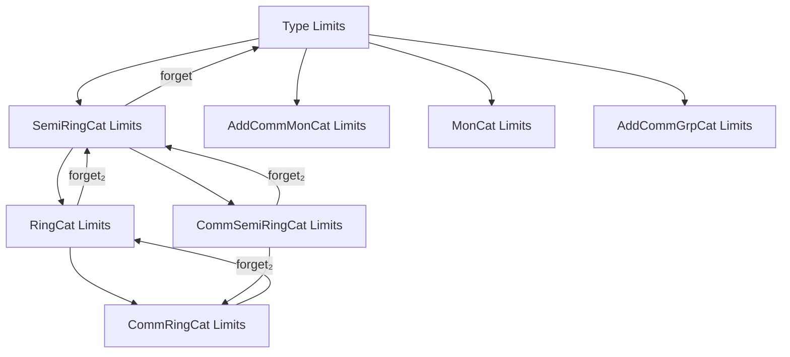
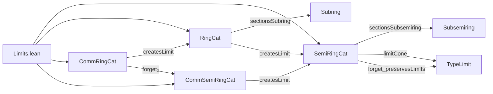
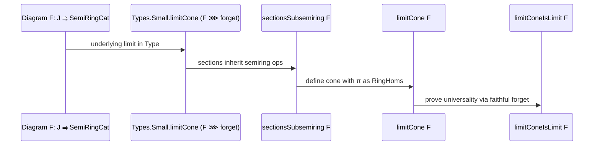

### Technical Brief: Limits in Categories of (Comm.) Rings and Semirings

---

#### **1. Key Definitions & Theorems**

| Name | Type / Signature | Purpose |
|------|------------------|---------|
| `sectionsSubsemiring F` | `Subsemiring (∀ j, F.obj j)` | Constructs the subsemiring of natural sections of a diagram `F : J ⥤ SemiRingCat`. |
| `limitπRingHom j` | `(limit cone pt) →+* F.obj j` | The limit projection as a semiring homomorphism. |
| `limitCone F` | `Cone F` | The candidate limit cone in `SemiRingCat`, built from the limit in `Type`. |
| `limitConeIsLimit F` | `IsLimit (limitCone F)` | Proves the cone is universal — i.e., a limit. |
| `hasLimit F` | `HasLimit F` | Instance asserting every small diagram has a limit. |
| `hasLimits SemiRingCat` | `HasLimits SemiRingCat` | All small limits exist in `SemiRingCat`. |
| `forget_preservesLimits` | `PreservesLimits (forget SemiRingCat)` | Forgetful functor to `Type` preserves limits (i.e., limits are computed pointwise on underlying types). |
| `sectionsSubring F` | `Subring (∀ j, F.obj j)` | For `RingCat`, sections form a subring (additive inverses included). |
| `limitCone` / `limitConeIsLimit` (for `RingCat`, `CommRingCat`, `CommSemiRingCat`) | Same pattern as above | Analogous constructions for rings and commutative variants. |
| `createsLimit` instances | e.g., `CreatesLimit F (forget₂ CommRingCat RingCat)` | Shows that forgetful functors *create* limits — i.e., limits in the target lift uniquely. |
| `forget₂..._preservesLimits` | `PreservesLimits (forget₂ ...)` | Forgetful functors to additive groups, monoids, etc., preserve limits. |

---

#### **2. Naming Conventions**

- **Prefixes**:
  - `sectionsSub*`: Sub-objects (subsemiring, subring, subgroup) of sections.
  - `limitπ*`: Limit projections as structure-preserving maps (`RingHom`, `AddMonoidHom`, etc.).
  - `forget₂*`: Forgetful functors to structured categories (e.g., `forget₂ RingCat AddCommGrpCat`).
  - `hasLimit`, `hasLimitsOfShape`, `hasLimitsOfSize`, `hasLimits`: Existence of limits at increasing levels of generality.
  - `limitCone`, `limitConeIsLimit`: Construction and verification of limit cones.
  - `createsLimit`: Functors that *create* limits (stronger than preserve).

- **Suffixes**:
  - `PreservesLimitsOfSize`, `PreservesLimits`: For size-localized vs. global preservation.
  - `Aux`: Auxiliary lemmas to speed up typeclass inference or reduce redexes.

- **Pattern**: `X_of_Y` often means “X constructed via Y” (e.g., `hasLimit_of_created`, `createsLimitOfReflectsIso`).

---

#### **3. Tactic Stack**

- **Core tactics**:
  - `refine`, `apply`, `exact`: For constructing terms and goals.
  - `rw`, `simp`, `simp only`: Rewriting and simplification using definitional equalities and lemmas.
  - `hom_ext`, `congrArg`, `RingHom.coe_inj`: Extensionality for morphisms in algebraic categories.
  - `equivShrink_add`, `equivShrink_mul`: Use of `Shrink` equivalence to transport structure.
  - `intros`, `intro`, `intro x y`: Standard intro tactics.
  - `let _ : ... := ...`: Local instance inference to guide elaboration.
  - `apply ...; rfl`: Often used after `refine` to discharge trivial subgoals.

- **Library notes**:
  - `by apply` trick used to avoid slow elaboration when target type is complex.

---

#### **4. Proof Logic**

- **General strategy**:
  1. **Construct underlying set**: Use `Types.Small.limitCone` (limit in `Type`) on the composite `F ⋙ forget`.
  2. **Lift structure**: Show sections (or limit point) inherit algebraic structure (e.g., via `Subsemiring`, `Subring`).
  3. **Define cone**: Use `limitπRingHom` to define legs of cone.
  4. **Verify universality**:
     - Use `IsLimit.ofFaithful` with a faithful forgetful functor (e.g., `forget`, `forget₂`).
     - Reduce to known limits in simpler categories (`AddCommMonCat`, `MonCat`, `Type`).
     - Prove structure preservation (e.g., `map_one'`, `map_mul'`, `map_add'`, `map_neg'`) using `simp` and transport lemmas.

- **Key lemmas**:
  - `preservesLimit_of_preserves_limit_cone`: Links preservation of limit cones to preservation of limits.
  - `createsLimitOfReflectsIso`: To show a functor creates limits, verify it reflects isomorphisms and has a lift.

- **Induction / recursion**: Not used — all proofs are categorical/constructional.

---

#### **5. Imports**

| Module | Purpose |
|--------|---------|
| `Mathlib.Algebra.Category.Grp.Limits` | Limits in groups and abelian groups. |
| `Mathlib.Algebra.Category.Ring.Basic` | Definitions of `RingCat`, `CommRingCat`, etc. |
| `Mathlib.Algebra.Ring.Pi` | Product ring/semiring structure. |
| `Mathlib.Algebra.Ring.Shrink` | Use of `Shrink` to handle universe levels. |
| `Mathlib.Algebra.Ring.Subring.Defs` | Subring and subsemiring definitions. |

Also imports `CategoryTheory.Limits` and `CategoryTheory.Functor`.

---

#### **8. Mermaid Diagrams**

##### **Dependency Graph (High-Level)**

##### **Overview of File Structure**

##### **Limit Construction Flow (for `SemiRingCat`)**

---

#### **Summary**

This file formalizes that **all standard algebraic categories of rings and semirings (commutative or not) have all small limits**, and that **forgetful functors to `Type` (and to intermediate categories like `Mon`, `AddCommMon`, `AddCommGrp`) preserve limits**. The proofs rely on:
- Constructing limits in `Type`,
- Showing the limit point inherits algebraic structure via sections or `Shrink`,
- Using faithfulness of forgetful functors to lift universality.

The structure is highly uniform across `SemiRingCat`, `RingCat`, `CommSemiRingCat`, and `CommRingCat`, with each case reusing previous constructions via `createsLimit` and `preservesLimits` instances.
