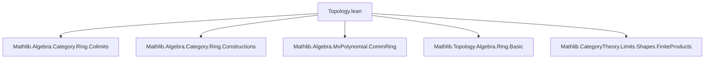

**Technical Brief: Topology on `Hom(R, S)` in Lean 4 (Topology.lean)**  
*Based on `Topology.lean` from the Mathlib repository (author: Andrew Yang, Christian Merten)*

---

### 1. **Key Definitions & Theorems**

| Name | Type / Signature | Purpose |
|------|------------------|---------|
| `CommRingCat.HomTopology.scoped instance` | `TopologicalSpace (A ⟶ R)` | Defines the **initial topology** on `Hom(A, R)` making all evaluation maps `f ↦ f x` continuous. |
| `continuous_apply` | `x : A → Continuous (f ↦ f x)` | Guarantees continuity of point evaluations under the defined topology. |
| `continuous_precomp` | `f : A ⟶ B → Continuous ((f ≫ ·) : (B ⟶ R) → (A ⟶ R))` | Precomposition with a ring homomorphism is continuous. |
| `precompHomeomorph` | `f : A ≅ B → (B ⟶ R) ≃ₜ (A ⟶ R)` | Isomorphic objects induce a **homeomorphism** on hom-sets. |
| `isEmbedding_precomp_of_surjective` | `f : A ⟶ B`, `Function.Surjective f → IsEmbedding (f ≫ ·)` | Surjective maps induce **embeddings** on hom-sets. |
| `isClosedEmbedding_precomp_of_surjective` | `[T1Space R] → IsClosedEmbedding (f ≫ ·)` | If `R` is T1, surjective maps induce **closed embeddings**. |
| `mvPolynomialHomeomorph` | `(MvPolynomial σ A ⟶ R) ≃ₜ (A ⟶ R) × (σ → R)` | Hom out of multivariate polynomial ring is homeomorphic to product of homs and function space. |
| `isClosedEmbedding_hom` | `[IsTopologicalRing R] [T1Space R] → IsClosedEmbedding (f ↦ f.hom)` | Embedding of `Hom(A, R)` into function space `A → R` is closed. |
| `isEmbedding_pushout` | `IsEmbedding (f ↦ (inl ≫ f, inr ≫ f))` | Hom out of pushout (tensor product) embeds into product of hom-sets. |
| `instance T2Space` | `[T2Space R] → T2Space (A ⟶ R)` | Hausdorffness descends to `Hom(A, R)`. |
| `instance CompactSpace` | `[IsTopologicalRing R] [T1Space R] [CompactSpace R] → CompactSpace (A ⟶ R)` | Compactness descends under suitable assumptions. |

---

### 2. **Naming Conventions**

- **Prefixes**:
  - `isEmbedding_`, `isClosedEmbedding_`: indicate embedding/closed embedding properties.
  - `continuous_`: continuity of maps (e.g., `continuous_apply`, `continuous_precomp`).
  - `precomp_`: precomposition-induced constructions (`precompHomeomorph`, `isHomeomorph_precomp`).
- **Suffixes**:
  - `_of_surjective`: condition on the morphism (`Function.Surjective`).
  - `_homeomorph` / `_Homeomorph`: homeomorphism definitions.
  - `_pushout`, `_mvPolynomial`: specific categorical constructions.
- **`[simps]` / `[simps! ...]`**: used to generate simplification lemmas for projections and applications.

---

### 3. **Tactic Stack**

| Tactic | Usage Frequency | Purpose |
|--------|-----------------|---------|
| `fun_prop` | High | Propagates continuity assumptions (e.g., `continuous_precomp`, `mvPolynomialHomeomorph`). |
| `simp` / `simp only` | Very High | Simplifies goals using definitional equalities and lemmas (e.g., `RingHom.liftOfRightInverse_comp_apply`, `MvPolynomial.eval₂_eq`). |
| `ext` | High | Extensionality for functions, ring homs, and products. |
| `rw` | High | Rewriting using equalities (e.g., `RingHom.range_eq_top`, `top_le_iff`). |
| `convert` | Medium | Flexible equality chaining, especially in embedding proofs. |
| `exact`, `refine`, `intro` | Medium | Basic proof structure. |
| `aesop` | Not present | Not used in this file. |
| `ring` / `abel` | Not present | Not needed (ring equalities handled via `simp` + ring lemmas). |

---

### 4. **Proof Logic**

The proofs follow a **constructive-topological strategy**:

1. **Initial topology construction** via `induced` topology along evaluation maps.
2. **Embedding/closed embedding proofs**:
   - Reduce to known embeddings in function spaces (`A → R`).
   - Use surjectivity to lift homs via `RingHom.liftOfSurjective`.
   - Express closedness via intersections of zero sets (`⋂ i ∈ ker f, {f | f i = 0}`).
3. **Homeomorphism proofs**:
   - Construct explicit inverses (e.g., `mvPolynomialHomeomorph` uses `eval₂Hom`).
   - Prove continuity of both directions via `fun_prop` and `continuous_induced_*`.
4. **Pushout case**:
   - Embed `Hom(B ⊗[A] C, R)` into `Hom(MvPolynomial (B ⊕ C) A, R)` via surjection.
   - Use `mvPolynomialHomeomorph` to identify with product of function spaces.
   - Factor through graph embedding and sum/product adjunctions.

Induction is not used; instead, **explicit constructions + universal properties** dominate.

---

### 5. **Imports & Dependencies**

| Module | Role |
|--------|------|
| `Mathlib.Algebra.Category.Ring.Colimits` | Provides `pushout`, tensor product, and colimit machinery. |
| `Mathlib.Algebra.Category.Ring.Constructions` | Initial objects, polynomial rings, `MvPolynomial`, `RingHom.liftOfSurjective`. |
| `Mathlib.Algebra.MvPolynomial.CommRing` | Commutative ring structure on `MvPolynomial`. |
| `Mathlib.Topology.Algebra.Ring.Basic` | Topological ring basics (e.g., `IsTopologicalRing`, `T1Space`, `T2Space`). |
| `Mathlib.CategoryTheory.Limits.Shapes.FiniteProducts` | Product constructions, `prodMap`, `uniqueProd`. |

---

### 6. **Mermaid Diagrams**

#### **Dependency Graph (Module-Level)**



#### **Theoretical Overview (Conceptual Flow)**

```mermaid
graph LR
  A[Topological Ring R] --> B[Hom(A, R) with initial topology]
  B --> C[Embedding into A → R]
  C --> D[Closed if R T1]
  
  A --> E[Hom(MvPolynomial σ A, R)]
  E --> F[Homeo to Hom(A, R) × (σ → R)]
  
  A --> G[Pushout B ⊗[A] C]
  G --> H[Embedding into Hom(B, R) × Hom(C, R)]
  
  B --> I[T2 if R T2]
  B --> J[Compact if R compact & T1]
```

#### **Proof Structure (Pushout Lemma)**

```mermaid
graph TD
  A[Hom(B ⊗[A] C, R)] -->|surj. fBC| B[Hom(MvPolynomial (B ⊕ C) A, R)]
  B -->|mvPolynomialHomeomorph| C[(A → R) × ((B ⊕ C) → R)]
  C -->|graph + sum-product adjunction| D[(A → R) × (B → R)] × [(A → R) × (C → R)]
  D -->|proj| E[Hom(B, R) × Hom(C, R)]
  A -.->|embedding| E
```

---

### 7. **Domain-Specific AI Agent Notes**

- **Key abstractions**: `Hom(A, R)` as a topological space, evaluation maps, surjective ring maps → embeddings.
- **Critical lemmas**: `mvPolynomialHomeomorph`, `isClosedEmbedding_precomp_of_surjective`, `isEmbedding_pushout`.
- **Pattern**: Use `RingHom.liftOfSurjective` + `RingHom.mem_ker` for closedness; `eval₂Hom` for homeomorphisms.
- **Automation potential**: `fun_prop`, `simp`, and `ext` dominate; a domain-specific tactic for embedding proofs (e.g., `ring_embed_tac`) could be beneficial.

--- 

Let me know if you'd like a formalized summary in Lean or a visualization of the `pushout` proof in more detail.
