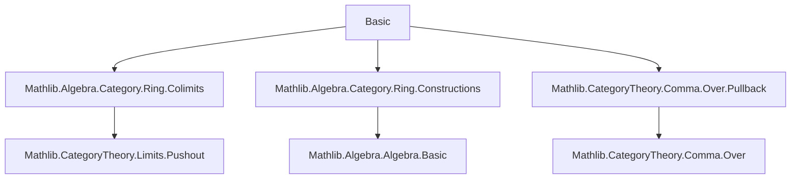
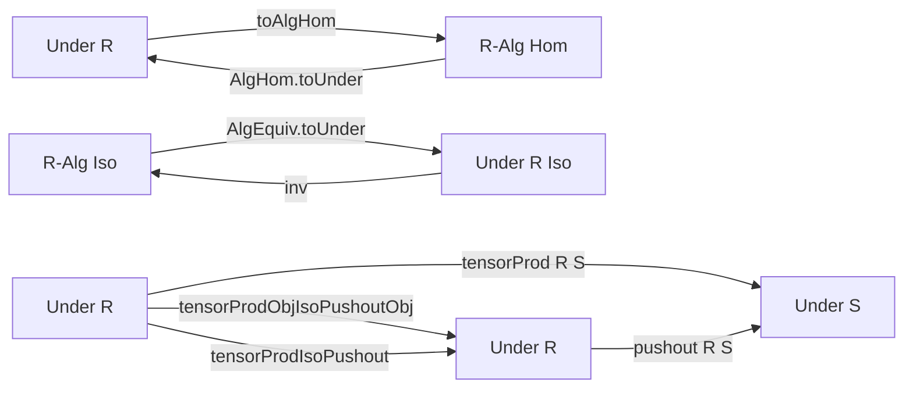

**Technical Brief: `Basic.lean` — Under `CommRingCat`**

---

### 1. KEY DEFINITIONS & THEOREMS

| Name | Type / Signature | Purpose |
|------|------------------|---------|
| `CoeSort (Under R)` | `CoeSort (Under R) (Type u)` | Allows treating objects of `Under R` as types (their underlying ring). |
| `toAlgHom` | `{A B : Under R} → (A ⟶ B) → A →ₐ[R] B` | Converts a morphism in the under-category to an $R$-algebra homomorphism. |
| `mkUnder` | `(A : Type u) [CommRing A] [Algebra R A] → Under R` | Constructs an object in `Under R` from an $R$-algebra. |
| `AlgHom.toUnder` | `(f : A →ₐ[R] B) → mkUnder R A ⟶ mkUnder R B` | Lifts an $R$-algebra homomorphism to a morphism in `Under R`. |
| `AlgEquiv.toUnder` | `(f : A ≃ₐ[R] B) → mkUnder R A ≅ mkUnder R B` | Lifts an $R$-algebra isomorphism to an isomorphism in `Under R`. |
| `tensorProd` | `Under R ⥤ Under S` (given `Algebra R S`) | Base change functor: $A \mapsto S \otimes_R A$. |
| `tensorProdObjIsoPushoutObj` | `mkUnder S (S ⊗[R] A) ≅ pushout(A.hom, algebraMap R S)` | Natural isomorphism between base change and pushout construction. |
| `tensorProdIsoPushout` | `tensorProd R S ≅ Under.pushout (algebraMap R S)` | Natural isomorphism of functors: base change ≅ pushout along $R \to S$. |

**Key lemmas**:
- `toAlgHom_id`, `toAlgHom_comp`, `toAlgHom_apply`: `toAlgHom` is a functorial embedding.
- `mkUnder_ext`: Extensionality for morphisms into `mkUnder`.
- `toUnder_right`, `toUnder_comp`: `AlgHom.toUnder` is fully faithful.
- `toUnder_hom_right_apply`, `toUnder_inv_right_apply`, `toUnder_trans`: `AlgEquiv.toUnder` preserves structure.
- `tensorProd_map_comp`: Functoriality of `tensorProd`.
- `pushout_inl_tensorProdObjIsoPushoutObj_inv_right`, `pushout_inr_...`: Explicit description of the iso’s inverse components.
- `tensorProdIsoPushout_app`: Component-wise equality of the natural isomorphism.

---

### 2. NAMING CONVENTIONS

- **Prefixes**:
  - `toAlgHom`, `toUnder`: “Conversion” functions (categorical → algebraic or vice versa).
  - `mkUnder`: “Construction” of an object in `Under R`.
  - `tensorProd`: Tensor product-based constructions.
  - `pushout`: Pushout-based constructions.

- **Suffixes**:
  - `_obj`, `_app`: Used for object-level or natural transformation components.
  - `_right`: Refers to the `right` component of a morphism in `Under R` (i.e., the underlying ring homomorphism).
  - `_hom`, `_inv`: For isomorphism components.

- **Pattern**: `X_toY` for conversions; `Y_ofX` for constructions.

---

### 3. TACTIC STACK

| Tactic | Frequency | Role |
|--------|-----------|------|
| `simp` | Very high | Simplification using `@[simp]` lemmas, especially `mkUnder_*`, `toUnder_*`, `tensorProd_*`. |
| `ext` | High | Extensionality proofs for morphisms in `Under R` (via `right` component). |
| `rw` / `apply` | Medium | Rewriting using isomorphism laws, naturality, and universal properties. |
| `dsimp`, `convert`, `apply_fun` | Low | Used in subtle naturality or uniqueness arguments. |
| `cancel_*` (e.g., `cancel_epi`, `cancel_mono`) | Medium | Cancellation in monic/epic contexts (pushout/under-category). |
| ` rfl` | High | Proving definitional equalities (e.g., `toAlgHom_id`, `toUnder_comp`). |

No heavy automation like `aesop` or `linarith` — proofs are mostly structural and rely on explicit computation.

---

### 4. PROOF LOGIC

- **Structure**: Proofs follow a *computational category theory* style:
  1. **Extensionality**: Show two morphisms in `Under R` equal by proving equality on the `right` component (i.e., underlying ring homomorphism).
  2. **Definitional reasoning**: Many lemmas are definitional (`rfl`) due to `@[simps!]` attributes.
  3. **Naturality checks**: For natural isomorphisms, verify component-wise commutativity using `hom_ext` or `pushout.hom_ext`.
  4. **Universal property usage**: Pushout and tensor product universal properties are invoked via `IsPushout` and `Algebra.TensorProduct` API.

- **Typical flow**:
  ```text
  intro A B f g
  ext x
  simp [definition]
  -- reduce to algebra-level equation
  exact algebra_lemma
  ```

- **Induction**: Not used — all objects are categorical/structural, not inductive.

---

### 5. IMPORTS & DEPENDENCIES

| Module | Role |
|--------|------|
| `Mathlib.Algebra.Category.Ring.Colimits` | Provides pushouts, colimits in `RingCat`/`CommRingCat`. |
| `Mathlib.Algebra.Category.Ring.Constructions` | Definitions like `ofHom`, `mkUnder`, algebra homs. |
| `Mathlib.CategoryTheory.Comma.Over.Pullback` | `Under` category, morphisms, pushouts in comma categories. |

**Core dependencies**:
- `CategoryTheory.Comma.Over`
- `Algebra.TensorProduct`
- `CategoryTheory.Limits.Pushout`
- `Algebra.Algebra`

---

### 6. MERMAID DIAGRAMS

#### Dependency Graph (Module-Level)



#### Overview of `Under R` ↔ `R-Alg` Equivalence



#### Functorial Square (Base Change ≅ Pushout)

```mermaid
graph LR
  Under R -- tensorProd R S --> Under S
  Under R -- pushout (algebraMap R S) --> Under S
  Under R -.->|tensorProdObjIsoPushoutObj| .-> Under R
  Under S <==|tensorProdIsoPushout|== Under S
```

*(The dashed arrow indicates a natural isomorphism of functors.)*

---

### 7. SUMMARY

This file establishes the foundational equivalence between the under-category `Under R` (for $R$ a commutative ring) and the category of commutative $R$-algebras. It provides:
- Explicit conversion functors (`toAlgHom`, `toUnder`) and their properties.
- A concrete description of the base change functor $A \mapsto S \otimes_R A$.
- A proof that base change coincides with pushout along $R \to S$, via a natural isomorphism.

It serves as a low-level API layer for higher-level work in relative algebraic geometry or descent theory in `Mathlib`.
