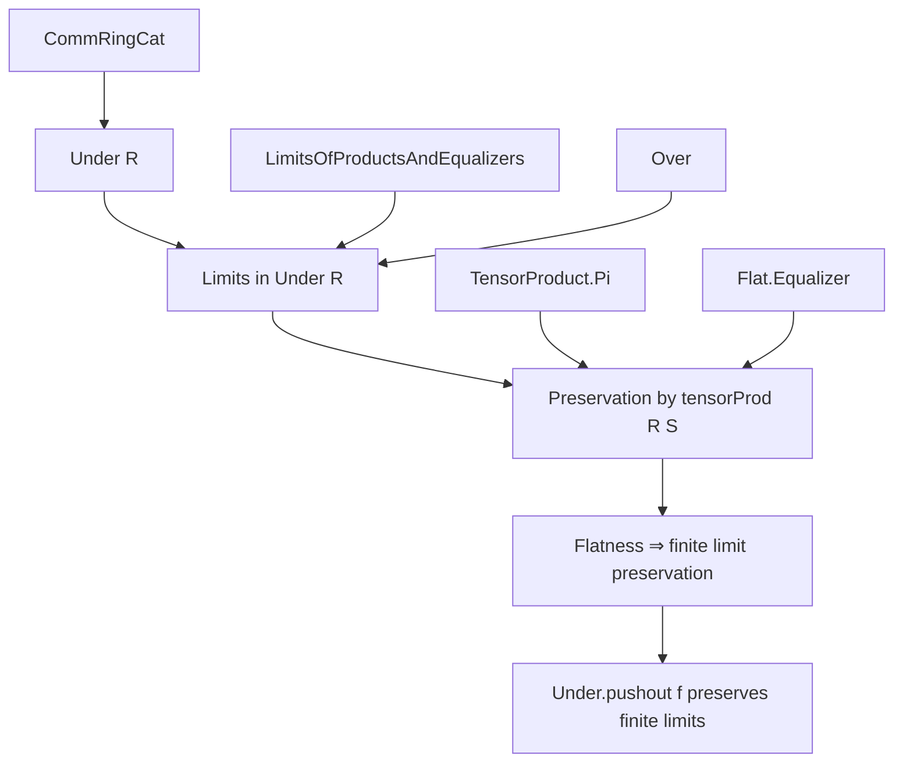
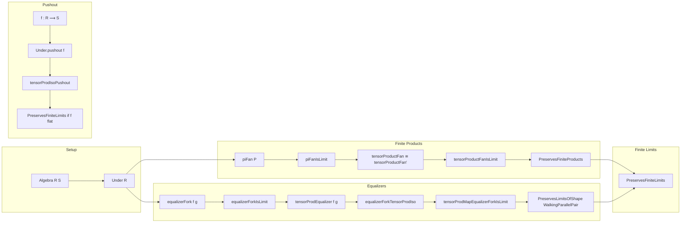

### Technical Brief: Limits in `Under R` and Flat Base Change

---

#### **1. Key Definitions & Theorems**

| Name | Type / Signature | Purpose |
|------|------------------|---------|
| `piFan P` | `Fan P` | Canonical fan over a family `P : ι → Under R`, constructed via `Π i, P i`. |
| `piFanIsLimit` | `IsLimit (piFan P)` | Shows the canonical fan is limiting (i.e., a limit cone). |
| `tensorProductFan S P` | `Fan (i ↦ mkUnder S (S ⊗[R] P i.right))` | Fan induced by tensoring the limit cone with `S`. |
| `tensorProductFan' S P` | Same type as above | Alternative fan using `∀ i, S ⊗[R] P i`. |
| `tensorProductFanIso` | `tensorProductFan S P ≅ tensorProductFan' S P` | Shows the two fans are isomorphic when `ι` is finite. |
| `tensorProductFanIsLimit` | `IsLimit (tensorProductFan S P)` | Proves the tensor-product fan is limiting under finiteness. |
| `piFanTensorProductIsLimit` | `IsLimit ((tensorProd R S).mapCone (Under.piFan P))` | Shows `tensorProd R S` preserves the limit of the canonical fan. |
| `PreservesLimit (Discrete.functor f) (tensorProd R S)` | Instance | `tensorProd R S` preserves limits of finite diagrams. |
| `PreservesFiniteProducts (tensorProd R S)` | Instance | `tensorProd R S` preserves finite products (uses finite products ⇔ finite limits in additive categories). |
| `equalizerFork f g` | `Fork f g` | Canonical fork via equalizer of two parallel arrows in `Under R`. |
| `equalizerForkIsLimit` | `IsLimit (equalizerFork f g)` | Equalizer fork is limiting. |
| `tensorProdEqualizer f g` | `Fork ((tensorProd R S).map f) ((tensorProd R S).map g)` | Fork induced by tensoring the equalizer fork. |
| `equalizerForkTensorProdIso` | `tensorProdEqualizer f g ≅ ...` | Isomorphism of forks when `S` is flat; identifies tensor product of equalizer with equalizer of tensor products. |
| `tensorProdMapEqualizerForkIsLimit` | `IsLimit ((tensorProd R S).mapCone (equalizerFork f g))` | Tensor product preserves equalizers when `S` is flat. |
| `PreservesLimitsOfShape WalkingParallelPair (tensorProd R S)` | Instance | `tensorProd R S` preserves parallel pair limits (i.e., equalizers). |
| `PreservesFiniteLimits (tensorProd R S)` | Instance | `tensorProd R S` preserves all finite limits (when `S` is flat). |
| `Under.pushout f` | `Under R → Under S` | Pushout functor along `f : R → S`. |
| `tensorProdIsoPushout` | `tensorProd R S ≅ Under.pushout f` | Natural isomorphism between tensor product and pushout when `f` is the structure map. |
| `preservesFiniteLimits_of_flat` | Lemma | If `f` is flat, then `Under.pushout f` preserves finite limits. |

---

#### **2. Naming Conventions**

- **Prefixes**:
  - `piFan`, `tensorProductFan`, `equalizerFork`, `tensorProdEqualizer`: indicate construction of (co)cones/forks.
  - `isLimit`, `IsLimit`: predicate for limiting cones.
  - `preserves...`: indicates preservation of limits/products/equalizers.
  - `mapCone`, `mapFork`: apply a functor to a cone/fork.

- **Suffixes**:
  - `IsLimit`: indicates a *proof* that a cone is limiting.
  - `Iso`: indicates an isomorphism of cones/forks.
  - `tensorProd...`: indicates constructions involving `S ⊗[R] -`.
  - `under`, `toUnder`: conversion between algebra maps and morphisms in `Under R`.

- **Variable naming**:
  - `P`, `f`, `g`: families or parallel arrows.
  - `ι`, `J`: indexing types (often finite).
  - `S`, `R`: base rings; `f : R ⟶ S` a ring map.

---

#### **3. Tactic Stack**

- **Core tactics**:
  - `ext`: extensionality for morphisms (especially in `CommRingCat`, `Under R`).
  - `simp only [...]`: heavy use of `simp` with explicit lemmas (e.g., `map_zero`, `AlgHom.coe_id`, `tensorProduct.map_tmul`).
  - `induction c`: on structure of elements (e.g., in tensor product).
  - `dsimp only [...]`: simplification of definitional equalities.
  - `rw [...]`: rewriting using isomorphisms, naturality, or universal properties.
  - `apply ...`: for constructing morphisms via universal properties (e.g., `Fan.ext`, `Fork.ext`).
  - `exact ...`: final step in proofs of `IsLimit`/`PreservesLimit`.

- **Category-theoretic automation**:
  - `isLimitOfReflects`, `preservesLimit_of_preserves_limit_cone`, `equivIsoLimit`: high-level limit-preservation lemmas.
  - `Functor.map_comp`, ` Functor.map_id`: used to manipulate functoriality.

- **Algebraic simplification**:
  - `ring`, `abel`: not used heavily; algebra is handled via `simp` with algebra/tensor product lemmas.

---

#### **4. Proof Logic**

- **General strategy**:
  1. **Construct candidate cones/forks** (e.g., `piFan`, `equalizerFork`).
  2. **Show they are limiting** using reflection of limits by `Under.forget R` (which creates limits pointwise).
  3. **Relate tensoring with the original cone**:
     - For products: use `TensorProduct.piRight` to identify `S ⊗[R] Π P i ≅ Π (S ⊗[R] P i)` when finite.
     - For equalizers: use `AlgHom.tensorEqualizerEquiv` to identify `S ⊗[R] eq(f,g) ≅ eq(1⊗f, 1⊗g)` when `S` is flat.
  4. **Transport limit structure** via isomorphisms of cones/forks (`equivIsoLimit`, `IsLimit.equivIsoLimit`).
  5. **Lift to preservation statements** via `preservesLimit_of_preserves_limit_cone`.

- **Flatness role**:
  - Ensures `S ⊗[R] -` is exact → preserves monomorphisms → equalizers (which are equalities of morphisms).
  - Enables `tensorEqualizerEquiv` to be an isomorphism.

- **Pushout connection**:
  - `Under.pushout f ≅ tensorProd R S` when `f : R → S` is the structure map.
  - So flatness of `f` ⇒ `Under.pushout f` preserves finite limits.

---

#### **5. Imports & Dependencies**

| Import | Role |
|--------|------|
| `Mathlib.Algebra.Category.Ring.Under.Basic` | Basic theory of `Under R` (objects = `R`-algebras, morphisms = algebra maps). |
| `Mathlib.CategoryTheory.Limits.Constructions.LimitsOfProductsAndEqualizers` | Finite limits ⇔ products + equalizers. |
| `Mathlib.CategoryTheory.Limits.Over` | Theory of over-categories (dual to under-categories). |
| `Mathlib.RingTheory.TensorProduct.Pi` | `S ⊗[R] Π P i ≅ Π (S ⊗[R] P i)` for finite products. |
| `Mathlib.RingTheory.RingHom.Flat` | Definition and basic properties of flat ring homomorphisms. |
| `Mathlib.RingTheory.Flat.Equalizer` | Flatness ⇒ preservation of equalizers (via `tensorEqualizerEquiv`). |

---

#### **6. Mermaid Diagrams**

##### **Dependency Graph (High-Level)**

##### **Overview of File Structure**

---

#### **7. Summary**

This file establishes that for a flat ring homomorphism $f : R \to S$, the base change functor $S \otimes_R - : \mathbf{CRing}_{/R} \to \mathbf{CRing}_{/S}$ (i.e., `Under.pushout f`) preserves finite limits. The proof proceeds by:

- Showing $S \otimes_R -$ preserves finite products (via `TensorProduct.piRight`).
- Showing it preserves equalizers (via `tensorEqualizerEquiv`, requiring flatness).
- Concluding finite limit preservation via the standard categorical equivalence.

The formalization is highly structured, leveraging reflection of limits by the forgetful functor `Under.forget R`, and naturality of tensor product constructions. The `noncomputable` markers indicate performance optimizations, not logical necessity.

--- 

Let me know if you'd like a formalized summary in Lean or a diagram of the key isomorphisms.
