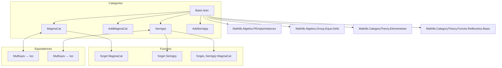
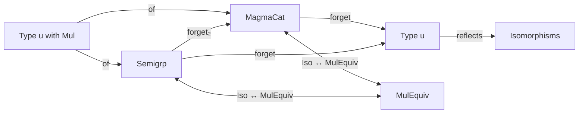

Here's a structured technical brief based on the provided `Basic.lean` file:

---

### **1. Key Definitions & Theorems**

| Name | Type / Structure | Purpose |
|------|------------------|---------|
| `AddMagmaCat` | `Type (u + 1)` | Bundled category of additive magmas and additive magma morphisms. |
| `MagmaCat` | `Type (u + 1)` | Bundled category of magmas and magma morphisms. |
| `AddSemigrp` | `Type (u + 1)` | Bundled category of additive semigroups and additive semigroup morphisms. |
| `Semigrp` | `Type (u + 1)` | Bundled category of semigroups and semigroup morphisms. |
| `of` (e.g., `MagmaCat.of`, `Semigrp.of`) | `Type u → [Mul M] → MagmaCat` | Constructor for bundled objects from type + instance. |
| `Hom.hom'` | `A →ₙ* B` | Underlying multiplicative homomorphism of a morphism in `MagmaCat`/`Semigrp`. |
| `ofHom` | `X →ₙ* Y → of X ⟶ of Y` | Embeds a multiplicative homomorphism as a morphism in the category. |
| `Hom.hom` | `Hom X Y → X → Y` | Projection of underlying function from a morphism. |
| `MulEquiv.toMagmaCatIso` | `X ≃* Y → MagmaCat.of X ≅ MagmaCat.of Y` | Converts a multiplicative equivalence to an isomorphism in `MagmaCat`. |
| `MulEquiv.toSemigrpIso` | `X ≃* Y → Semigrp.of X ≅ Semigrp.of Y` | Converts a multiplicative equivalence to an isomorphism in `Semigrp`. |
| `magmaCatIsoToMulEquiv` | `X ≅ Y → X ≃* Y` | Extracts a multiplicative equivalence from an isomorphism in `MagmaCat`. |
| `semigrpIsoToMulEquiv` | `X ≅ Y → X ≃* Y` | Extracts a multiplicative equivalence from an isomorphism in `Semigrp`. |
| `mulEquivIsoMagmaIso` | `X ≃* Y ≅ (X ≅ Y)` | Equivalence between multiplicative equivalences and isomorphisms in `MagmaCat`. |
| `mulEquivIsoSemigrpIso` | `X ≃* Y ≅ (X ≅ Y)` | Equivalence between multiplicative equivalences and isomorphisms in `Semigrp`. |
| `MagmaCat.forgetReflectsIsos` | Instance | Forgetful functor `MagmaCat ⥤ Type` reflects isomorphisms. |
| `Semigrp.forgetReflectsIsos` | Instance | Forgetful functor `Semigrp ⥤ Type` reflects isomorphisms. |
| `Semigrp.forget₂_full` | Instance | Forgetful functor `Semigrp ⥤ MagmaCat` is full. |

---

### **2. Naming Conventions**

- **Prefixes**:
  - `of`: constructing bundled objects (`of M`).
  - `ofHom`: embedding homs into category morphisms.
  - `hom`: projection of underlying function/homomorphism (`f.hom`).
  - `coe_of`, `coe_id`, `coe_comp`: coercion lemmas for underlying types/functions.
  - `inv_hom_apply`, `hom_inv_apply`: properties of inverses in isomorphisms.

- **Suffixes**:
  - `Hom`: morphism type (`MagmaCat.Hom`, `Semigrp.Hom`).
  - `Iso`: isomorphism-related constructions (`toMagmaCatIso`, `toSemigrpIso`).
  - `Ext`: extensionality lemmas (`ext`, `hom_ext`).
  - `Apply`: application lemmas (`id_apply`, `comp_apply`, `ofHom_apply`).

- **`to_additive` attribute**: used to generate additive analogues of multiplicative definitions/lemmas.

---

### **3. Tactic Stack**

- `rfl`: used extensively for definitional equalities (e.g., `coe_id`, `hom_comp`).
- `simp`: used in lemmas marked with `(attr := simp)` for automatic simplification.
- `ext`: used in extensionality lemmas (`ext`, `hom_ext`).
- `by simp`: common in small proofs (e.g., `id_apply`, `ofHom_apply`).
- `inferInstance`: used to derive instances automatically (e.g., `reflectsIsomorphisms` for `forget₂`).
- `let` + `exact`: used in `reflects` proofs (e.g., constructing `e : X ≃* Y` from `f`).

---

### **4. Proof Logic**

- **Structure**: Most proofs follow a pattern:
  1. **Unbundle** morphisms via `.hom` or `.hom'`.
  2. **Apply definitional equalities** (`rfl`, `simp`) to reduce to underlying function behavior.
  3. **Use extensionality** (`ext`) when proving equality of morphisms via pointwise equality.
  4. **Leverage `ConcreteCategory` infrastructure** for standard lemmas (e.g., `hom_ext`, `ext`).
  5. **Construct equivalences** between isomorphisms and multiplicative equivalences via bidirectional definitions (`hom`, `inv`, `toMagmaCatIso`, `magmaCatIsoToMulEquiv`).

- **Key reasoning pattern**:
  - To show `f = g`, prove `f.hom = g.hom` (via `hom_ext`).
  - To show `f x = g x`, use `ext` with `∀ x, f x = g x`.
  - To show `X ≅ Y`, construct `e : X ≃* Y` and use `e.toMagmaCatIso`.

---

### **5. Imports**

| Import | Purpose |
|--------|---------|
| `Mathlib.Algebra.PEmptyInstances` | Provides `PEmpty` instance for inhabitedness. |
| `Mathlib.Algebra.Group.Equiv.Defs` | Defines `MulEquiv`, `AddEquiv`, and related structures. |
| `Mathlib.CategoryTheory.Elementwise` | Enables elementwise reasoning in categories. |
| `Mathlib.CategoryTheory.Functor.ReflectsIso.Basic` | Provides `ReflectsIsomorphisms` typeclass. |

---

### **6. Mermaid Diagrams**

#### **Dependency Graph (Module Scope)**

#### **Overview of Theory Flow**

---

### **7. Summary**

This file formalizes the **bundled category theory** of magmas, additive magmas, semigroups, and additive semigroups, with morphisms as multiplicative/additive homomorphisms. It establishes:
- Concrete category structures (`ConcreteCategory` instances).
- Forgetful functors and their properties (fullness, reflection of isomorphisms).
- Equivalence between multiplicative equivalences and categorical isomorphisms.
- Standard `simps`-friendly lemmas for coercion and composition.

The design mirrors `MonCat` (monoids), but for weaker algebraic structures, and sets up the foundation for future work on limits and adjunctions (as noted in the `TODO`).

--- 

Let me know if you'd like a formalized dependency graph for the entire `Mathlib` or a comparison with `MonCat`.
