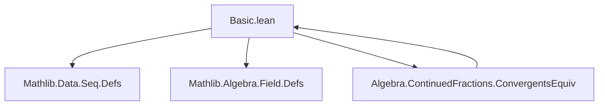
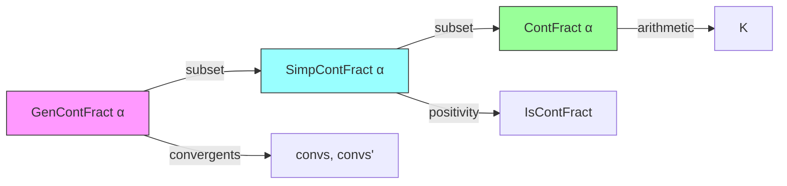

### Technical Brief: `Basic.lean` — Continued Fractions in Lean 4

---

#### **1. Key Definitions & Theorems**

| Name | Type / Signature | Purpose |
|------|------------------|---------|
| `GenContFract.Pair` | `structure` | Stores a pair `(a, b)` representing partial numerator and denominator. |
| `GenContFract` | `structure` | Represents a *generalised continued fraction* (gcf): `h + a₀/(b₀ + a₁/(b₁ + ...))`. Fields: `h : α`, `s : Stream'.Seq (Pair α)`. |
| `GenContFract.ofInteger` | `α → GenContFract α` | Embeds an integer (or element) as a gcf with no fractional part. |
| `GenContFract.partNums`, `partDens` | `GenContFract α → Stream'.Seq α` | Extract sequences of partial numerators (`aᵢ`) and denominators (`bᵢ`). |
| `GenContFract.TerminatedAt`, `Terminates` | `Prop` | Decidable predicates for finite termination of the gcf. |
| `GenContFract.IsSimpContFract` | `Prop` | Predicate for *simple* continued fractions: all `aᵢ = 1`. |
| `SimpContFract` | `Type*` | Subtype of gcfs satisfying `IsSimpContFract`. |
| `SimpContFract.IsContFract` | `Prop` | Predicate for *(regular) continued fractions*: all `bᵢ > 0`. |
| `ContFract` | `Type*` | Subtype of scfs satisfying `IsContFract`. Standardly called `ContFract` in the library. |
| `nextNum`, `nextDen`, `nextConts` | `K → K → Pair K → Pair K → Pair K` | Recurrence step for continuants `Aₙ`, `Bₙ`. |
| `contsAux`, `conts` | `GenContFract K → Stream' (Pair K)` | Computes continuants via recurrence (`Aₙ`, `Bₙ`). |
| `convs` | `GenContFract K → Stream' K` | Returns convergents `Aₙ / Bₙ`. |
| `convs'Aux`, `convs'` | `Stream'.Seq (Pair K) → ℕ → K`, `GenContFract K → ℕ → K` | Direct evaluation of finite truncations of the continued fraction. |

> **Note**: For `ContFract`s, `convs` and `convs'` are proven equivalent (`Algebra.ContinuedFractions.ConvergentsEquiv`), though not defined here.

---

#### **2. Naming Conventions**

- **Prefixes**:
  - `is_`: Predicate definitions (`IsSimpContFract`, `IsContFract`)
  - `part_`: Extractors for components (`partNums`, `partDens`)
  - `next_`, `conts`, `convs`, `convs'`: Computational functions
  - `ofInteger`: Embedding of base elements
- **Suffixes**:
  - `Aux`: Auxiliary/helper definitions (`contsAux`, `convs'Aux`)
  - `'` (prime): Alternative computation (`convs'` vs `convs`)
- **Structure/Type Names**:
  - `GenContFract`, `SimpContFract`, `ContFract`: Hierarchical refinement (gcf → scf → cf)

---

#### **3. Tactic Stack**

- `rfl`, `cases`, `by cases`: For reflexivity and case analysis on equality/option types.
- `infer_instance`: To automatically infer decidability/instance proofs.
- `unfold`: To expand definitions (e.g., `unfold TerminatedAt`).
- `simp`, `norm_cast`: For simplification and coercion normalization (`coe_toPair`, `coe_toGenContFract`).
- `ext`: For extensionality proofs on structures (`@[ext]` attribute on `GenContFract`).

> *No heavy automation (e.g., `aesop`, `ring`, `linarith`) appears in this file — it is mostly definitional.*

---

#### **4. Proof Logic**

- **Definitional**: Most properties are *definitions*, not theorems (e.g., `TerminatedAt`, `IsSimpContFract`).
- **Inductive/Recursive Structure**: `contsAux`, `convs'Aux` use structural recursion on `ℕ` and `Stream'.Seq`.
- **Case Analysis**: On `get? n` (option) or `head`/`tail` of streams.
- **Subtype Reasoning**: For `SimpContFract`, `ContFract`, proofs often reduce to verifying the predicate holds (e.g., `fun n aₙ h ↦ by cases h`).
- **No heavy induction**: The file focuses on *setup*, not deep metatheory.

---

#### **5. Imports**

| Module | Purpose |
|--------|---------|
| `Mathlib.Data.Seq.Defs` | Provides `Stream'.Seq`, `Stream'`, and related operations (`map`, `get?`, `tail`, `TerminatedAt`, `Terminates`). |
| `Mathlib.Algebra.Field.Defs` | Provides `DivisionRing`, `One`, `Zero`, `LT`, `Coe`, `Repr`, `Inhabited`. |

> **Note**: Uses `DivisionRing K` for arithmetic on convergents (to support `+`, `*`, `/`, `0`, `1`).

---

#### **8. Mermaid Diagrams**

##### **Dependency Graph (Module-Level)**



##### **Conceptual Theory Overview**



##### **Data Flow for Convergents**

```mermaid
graph LR
  gcf[GenContFract K] -->|partNums/partDens| seqA[aᵢ], seqB[bᵢ]
  seqA & seqB -->|nextNum/nextDen| contsAux[contsAux g]
  contsAux -->|tail| conts[conts g]
  conts -->|map Pair.a, Pair.b| nums[dens g], dens[nums g]
  nums & dens -->|/| convs[convs g]

  gcf -->|convs'Aux| convs'[convs' g]
```

---

### Summary

This file establishes the *foundational datatype hierarchy* for continued fractions in Lean 4:
- **Generalised → Simple → Regular** as successive subtypes.
- **Two equivalent methods** for computing convergents: recurrence (`convs`) and direct evaluation (`convs'`).
- Heavy use of `Stream'.Seq` for potentially infinite sequences.
- Designed for future metatheory (e.g., convergence, equivalence of definitions, best approximations).

It serves as the *base layer* for deeper results in `Algebra.ContinuedFractions.*`.
