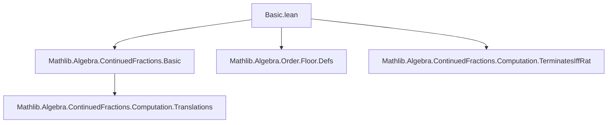
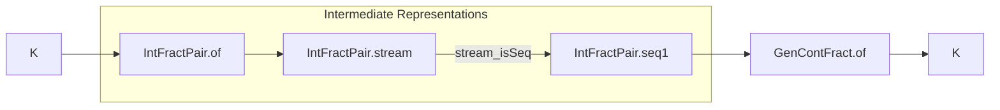

### Technical Brief: `Basic.lean` — Computable Continued Fractions in Lean 4

---

#### **1. Key Definitions & Theorems**

| Name | Type / Signature | Purpose |
|------|------------------|---------|
| `IntFractPair` | `structure IntFractPair (K : Type*) where b : ℤ, fr : K` | Encapsulates integer part (`b = ⌊v⌋`) and fractional part (`fr = v - ⌊v⌋`) of a value `v : K`. |
| `IntFractPair.of` | `v : K → IntFractPair K` | Constructs the integer-fraction pair of `v` using floor and `Int.fract`. |
| `IntFractPair.stream` | `v : K → Stream' (Option (IntFractPair K))` | Recursively generates a stream of optional integer-fraction pairs: `some ⟨⌊v⌋, fract v⟩`, then `some ⟨⌊frₙ⁻¹⌋, fract(frₙ⁻¹)⟩`, etc., stopping when fractional part is `0`. |
| `IntFractPair.stream_isSeq` | `v : K → (IntFractPair.stream v).IsSeq` | Proves that once `none` appears, all subsequent entries are `none` — i.e., the stream satisfies the *sequence property*. |
| `IntFractPair.seq1` | `v : K → Stream'.Seq1 (IntFractPair K)` | Intermediate representation: a head term (`IntFractPair.of v`) + tail stream (from `stream v`). Ensures first element is always present. |
| `GenContFract.of` | `[DivisionRing K] [LinearOrder K] [FloorRing K] → K → GenContFract K` | Computes the generalized continued fraction of `v`. Returns a regular continued fraction that terminates iff `v` is rational. |

> **Note**: `GenContFract.of` uses `seq1` to extract integer parts: head `b₀ = ⌊v⌋`, and sequence of partial denominators `bₙ = ⌊frₙ⁻¹⌋`, with all partial numerators fixed to `1`.

---

#### **2. Naming Conventions**

- **Prefixes**:
  - `IntFractPair.`: namespace for pair-related operations.
  - `of`: constructor-like naming for building objects from data (`IntFractPair.of`, `GenContFract.of`).
  - `stream`: indicates recursive stream generation.
  - `seq1`: intermediate sequence with head + tail.

- **Suffixes**:
  - `pair`, `fr`: denote fractional components.
  - `map`, `coe`, `bind`: standard functional/stream operations.

- **Structure fields**:
  - `b : ℤ` (integer part), `fr : K` (fractional part).

---

#### **3. Tactic Stack**

Frequent tactics used in proofs and definitions:

| Tactic | Usage |
|--------|-------|
| `simp` | Simplification of definitions (e.g., in `stream_isSeq`). |
| `intro`, `exact`, `refl` | Basic proof structure. |
| `rw`, `simp_rw` | Rewriting using definitional equalities (e.g., coercion lemmas). |
| `aesop` | Not present in this file (likely not needed for basic definitions). |
| `ring` | Not used here (no arithmetic simplifications beyond floor/fract). |

Most proofs are short and rely on definitional unfolding and `simp`.

---

#### **4. Proof Logic**

- **Inductive/Recursive Structure**:  
  Definitions are built via *corecursion* (`Stream'`), not induction.  
  - `stream` is defined by cases on natural number index: `0` vs `n+1`.  
  - Conditional logic (`if ... then ... else ...`) handles termination when fractional part is `0`.

- **Proof Style**:
  - `stream_isSeq` is proven by unfolding `stream` and applying `simp` + hypothesis.
  - No heavy automation; relies on definitional equality and basic logic.

- **Termination**:  
  Not explicitly proven here — deferred to `TerminatesIffRat.lean`.  
  The stream is *partial*: may become `none` forever after some point.

---

#### **5. Imports & Dependencies**

| Import | Role |
|--------|------|
| `Mathlib.Algebra.ContinuedFractions.Basic` | Core theory of generalized continued fractions (`GenContFract`, `ContFract`). |
| `Mathlib.Algebra.Order.Floor.Defs` | Defines floor function (`⌊·⌋`), fractional part (`Int.fract`), and `FloorRing`. |
| `DivisionRing`, `LinearOrder`, `FloorRing` | Typeclass constraints on `K` to support floor, reciprocals, and ordering. |

> **Note**: `Int.fract` is imported from `Floor.Defs`, and `Stream'` is from Mathlib’s core stream library.

---

#### **6. Mermaid Diagrams**

##### **Dependency Graph (File-Level)**



##### **Overview of Data Flow in `Basic.lean`**



##### **Continued Fraction Construction (Example: `v = 3.4`)**

```mermaid
flowchart LR
  v = 3.4 --> b₀ = ⌊3.4⌋ = 3
  fr₀ = 0.4 --> b₁ = ⌊1/0.4⌋ = 2
  fr₁ = 0.4⁻¹ - 2 = 0.5 --> b₂ = ⌊1/0.5⌋ = 2
  fr₂ = 0 --> STOP

  style v fill:#f9f,stroke:#333
  style b₀ fill:#bbf,stroke:#333
  style b₁ fill:#bbf,stroke:#333
  style b₂ fill:#bbf,stroke:#333
```

Result: `[3; 2, 2]`

---

#### **7. Summary**

This file formalizes the *algorithmic construction* of regular continued fractions over linearly ordered floor fields. It introduces:
- A pair type `IntFractPair` to hold integer/fractional components.
- A corecursive stream generator `stream` that terminates on rational inputs.
- An intermediate sequence-with-head `seq1` to ensure well-formedness.
- A final constructor `GenContFract.of` that maps any `v : K` to its continued fraction.

All definitions are constructive and computable, with termination tied to rationality (handled elsewhere). The design cleanly separates concerns: pair generation, stream handling, and final CF extraction.

--- 

Let me know if you'd like the next file (`Translations.lean`) analyzed similarly.
