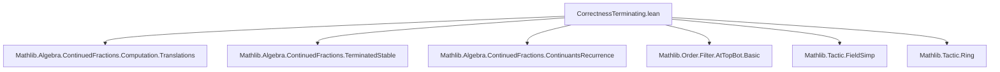

### Technical Brief: Correctness of Terminating Continued Fraction Computations (`CorrectnessTerminating.lean`)

---

#### **1. Key Definitions & Theorems**

| Name | Type / Signature | Purpose |
|------|------------------|---------|
| `compExactValue` | `Pair K → Pair K → K → K` | Computes the exact value from two successive auxiliary continuants and a fractional part: returns `conts.a / conts.b` if `fr = 0`, otherwise computes next continuant using `fr⁻¹`. |
| `compExactValue_correctness_of_stream_eq_some` | `∀ {ifp_n}, IntFractPair.stream v n = some ifp_n → v = compExactValue ...` | Main correctness theorem: shows `compExactValue` recovers `v` when given convergent data and non-zero fractional part. |
| `compExactValue_correctness_of_stream_eq_some_aux_comp` | `((⌊a⌋ * b + c) / fr a + b = (b * a + c) / fr a)` | Technical algebraic lemma used in the main proof; simplifies expressions involving floor and fractional parts. |
| `of_correctness_of_nth_stream_eq_none` | `IntFractPair.stream v n = none → v = (of v).convs (n - 1)` | Shows that if the stream terminates at step `n`, then the previous convergent equals `v`. |
| `of_correctness_of_terminatedAt` | `(of v).TerminatedAt n → v = (of v).convs n` | Direct consequence: if the continued fraction terminates at step `n`, then the `n`-th convergent is exactly `v`. |
| `of_correctness_of_terminates` | `(of v).Terminates → ∃ n, v = (of v).convs n` | Existential version: termination implies exact convergence at some finite step. |
| `of_correctness_atTop_of_terminates` | `(of v).Terminates → ∀ᶠ n in atTop, v = (of v).convs n` | Asymptotic stability: once terminated, all later convergents equal `v`. |

---

#### **2. Naming Conventions**

- **Prefixes**:
  - `compExactValue_`: for correctness lemmas about `compExactValue`.
  - `of_`: for properties of `GenContFract.of`.
  - `convs_`, `contsAux_`: for convergent and auxiliary continuant-related lemmas.
- **Suffixes**:
  - `_correctness_of_...`: correctness statements tied to specific conditions (e.g., `stream_eq_some`, `terminatedAt`).
  - `_aux`: auxiliary computational lemmas.
  - `_atTop`: filter-theoretic asymptotic behavior.

---

#### **3. Tactic Stack**

Frequently used tactics in proofs:
- `field_simp`: simplifies field expressions, especially with inverses.
- `rw [Int.fract]`, `ring`: algebraic manipulation of floor/fractional parts.
- `simp only [...]`: precise simplification using definitions (`nextConts`, `nextNum`, `nextDen`, `compExactValue`, etc.).
- `grind`: custom tactic (likely from `Mathlib.Tactic`) for grinding through algebraic equalities.
- `cases eq_or_ne ...`: case analysis on equality vs inequality.
- `obtain ⟨...⟩` / `have ... := ...`: destructing existential or implication hypotheses.
- `induction n with | zero | succ n IH => ...`: structural induction on natural numbers.

---

#### **4. Proof Logic**

The proofs follow a **structural induction on `n`**, with case analysis on whether the fractional part at step `n` is zero or not:

1. **Base case (`n = 0`)**:
   - Unfold `IntFractPair.of v` and `compExactValue`.
   - Split on `Int.fract v = 0`:
     - If zero: `v = ⌊v⌋`, so `v = conts.a / conts.b`.
     - If non-zero: unfold one step of recurrence to match definition of `compExactValue`.

2. **Inductive step (`n + 1`)**:
   - Use `IntFractPair.succ_nth_stream_eq_some_iff` to relate `stream v n` and `stream v (n+1)`.
   - Again split on `ifp_n.fr = 0`:
     - If zero: reduce to previous case via `IH` and stability of convergents.
     - If non-zero: apply `IH` and reduce to algebraic identity via `compExactValue_correctness_of_stream_eq_some_aux_comp`.

3. **Termination lemmas**:
   - Use equivalence `TerminatedAt n ↔ stream v (n+1) = none`.
   - Apply `of_correctness_of_nth_stream_eq_none` and stability of convergents (`convs_stable_of_terminated`).

4. **Filter-theoretic result**:
   - Use `eventually_atTop` and existence of a terminating index to show eventual constancy.

---

#### **5. Imports & Dependencies**

| Module | Role |
|--------|------|
| `Mathlib.Algebra.ContinuedFractions.Computation.Translations` | Definitions and translations between stream, convergents, and continuants. |
| `Mathlib.Algebra.ContinuedFractions.TerminatedStable` | Properties of terminated continued fractions (stability of convergents). |
| `Mathlib.Algebra.ContinuedFractions.ContinuantsRecurrence` | Recurrence relations for continuants (`contsAux`). |
| `Mathlib.Order.Filter.AtTopBot.Basic` | Filter theory for asymptotic behavior (`atTop`). |
| `Mathlib.Tactic.FieldSimp`, `Mathlib.Tactic.Ring` | Tactics for field arithmetic and ring simplifications. |

---

#### **6. Mermaid Diagrams**

##### **Dependency Graph (Module-Level)**



##### **Overview of Theoretical Flow**

```mermaid
graph LR
  A[GenContFract.of v] --> B[IntFractPair.stream v n]
  B -->|some ifp| C[compExactValue pconts conts fr]
  B -->|none| D[convs (n-1)]
  C --> E[v]
  D --> E
  C -->|aux lemma| F[algebraic identity]
  E --> G[convs n = v]
  G --> H[∀ᶠ n in atTop, convs n = v]
```

---

#### **7. Domain-Specific AI Agent Insights**

- **Core Theory**: Continued fractions over a `Field K` with `FloorRing` structure (e.g., `ℚ`, `ℝ`).
- **Key Objects**: `IntFractPair`, `Pair K`, `convs`, `contsAux`, `TerminatedAt`.
- **Proof Strategy Pattern**: Induction + case analysis on `fr = 0` + algebraic simplification.
- **Automation Opportunities**: 
  - `grind` + `ring` + `field_simp` can be automated for similar recurrence-based correctness proofs.
  - Pattern matching on `stream v n = some / none` is reusable across correctness proofs.

--- 

Let me know if you'd like a formalized summary in Lean or a visualization of the `compExactValue` recurrence step.
