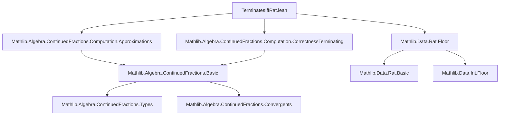
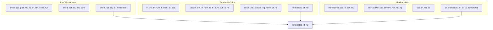

### Technical Brief: `TerminatesIffRat.lean`

---

#### **1. Key Definitions & Theorems**

| Name | Type / Signature | Purpose |
|------|------------------|---------|
| `of` | `K → GenContFract K` | Computes the generalized continued fraction expansion of a value `v : K` (in a floor ring inside a linearly ordered field). |
| `contsAux n`, `conts n` | `Pair K` | Intermediate convergent numerator/denominator pairs (auxiliary and actual). |
| `nums n`, `dens n`, `convs n` | `K` | Numerators, denominators, and convergents (as elements of `K`). |
| `Terminates` | `Prop` | Predicate stating that the continued fraction computation halts (i.e., the stream of fractional parts eventually hits `none`). |
| `IntFractPair.of q` | `IntFractPair ℚ` | Computes the integer–fractional pair decomposition of `q : ℚ`. |
| `IntFractPair.stream q n` | `Option (IntFractPair ℚ)` | The `n`-th step in the iterative fractional part computation. |
| `IntFractPair.coe_of_rat_eq` | `v = ↑q → ((of q).mapFr ↑ = of v)` | Coercion compatibility for `IntFractPair.of`. |
| `IntFractPair.coe_stream_nth_rat_eq` | `v = ↑q → ((stream q n).map ↑ = stream v n)` | Coercion compatibility for stream steps. |
| `IntFractPair.coe_stream'_rat_eq` | `v = ↑q → ((stream q).map ↑ = stream v)` | Coercion compatibility for full streams. |
| `coe_of_h_rat_eq`, `coe_of_s_get?_rat_eq`, `coe_of_s_rat_eq`, `coe_of_rat_eq` | Various coercion lemmas | Show that `of q` and `of v` coincide when `v = ↑q`. |
| `of_terminates_iff_of_rat_terminates` | `v = ↑q → (of v).Terminates ↔ (of q).Terminates` | Termination is preserved under rational coercion. |
| `exists_gcf_pair_rat_eq_of_nth_contsAux` | `∃ conts : Pair ℚ, (of v).contsAux n = conts.map ↑` | Every auxiliary convergent pair at step `n` is a coercion of a rational pair. |
| `exists_rat_eq_nth_conv` | `∃ q : ℚ, (of v).convs n = ↑q` | Every finite convergent is rational. |
| `exists_rat_eq_of_terminates` | `(of v).Terminates → ∃ q : ℚ, v = ↑q` | If the CF terminates, then `v` is rational. |
| `of_inv_fr_num_lt_num_of_pos` | `0 < q → (of q⁻¹).fr.num < q.num` | Key monotonicity: numerator of fractional part of inverse strictly decreases. |
| `stream_nth_fr_num_le_fr_num_sub_n_rat` | `ifp_n.fr.num ≤ (of q).fr.num - n` | Numerator of fractional part decreases at least linearly with `n`. |
| `exists_nth_stream_eq_none_of_rat` | `∃ n, IntFractPair.stream q n = none` | For rational `q`, the fractional part stream eventually terminates. |
| `terminates_of_rat` | `(of q).Terminates` | CF of any rational number terminates. |
| **Main Theorem** `terminates_iff_rat` | `(of v).Terminates ↔ ∃ q : ℚ, v = ↑q` | **Core result**: termination ⇔ rationality. |

---

#### **2. Naming Conventions**

- **Prefixes**:
  - `coe_`: Coercion-related lemmas (e.g., `coe_of_rat_eq`, `coe_of_h_rat_eq`).
  - `of_`: Properties of `of` (e.g., `of_terminates_iff_of_rat_terminates`, `terminates_of_rat`).
  - `nth_`, `contsAux`, `conts`, `nums`, `dens`, `convs`: Index-based components of the CF computation.
  - `stream_`, `stream'_`: Stream-related operations (`IntFractPair.stream`, `IntFractPair.stream'`).
  - `inv_fr_`, `fr_num_`: Fractional part numerator properties.

- **Suffixes**:
  - `_eq`: Equality lemmas (e.g., `coe_of_rat_eq`).
  - `_rat_eq`: Coercion from `ℚ` to `K`.
  - `_rat`: Statements specifically about rational inputs (e.g., `terminates_of_rat`, `of_inv_fr_num_lt_num_of_pos`).
  - `_nth`: Index-specific properties (e.g., `stream_nth_fr_num_le_fr_num_sub_n_rat`).
  - `_iff_`: Biconditional theorems (e.g., `of_terminates_iff_of_rat_terminates`, `terminates_iff_rat`).

---

#### **3. Tactic Stack**

- **Core tactics**:
  - `induction` (strong induction on `n`)
  - `rcases`, `obtain`, `cases` (for destructuring existential/unary options)
  - `simp` / `simp only` (heavily used, especially with `map`, `stream`, `of`, `contsAux`)
  - `rw` (rewriting equalities, especially coercion lemmas)
  - `funext` (extensionality for streams)
  - `have`, `suffices`, `exact`, `solve_by_elim`
  - `norm_cast` (for coercion normalization)
  - `lia`, `ring` (for arithmetic reasoning over ℚ and ℤ)

- **Pattern**:
  - Induction + case analysis on `Option`/`Stream'` + use ofIH + `simp` + arithmetic.

---

#### **4. Proof Logic**

- **Overall structure**:
  1. **Left-to-right (`terminates → rational`)**:
     - Show every finite convergent is rational (`exists_rat_eq_nth_conv`).
     - Use correctness of terminating CF (`of_correctness_of_terminates`) to lift to `v = ↑q`.

  2. **Right-to-left (`rational → terminates`)**:
     - Prove `of q = of v` when `v = ↑q` (`coe_of_rat_eq`).
     - Show `of q` terminates by analyzing numerator decrease in fractional parts:
       - `0 ≤ fract q < 1` ⇒ numerator strictly decreases at each step.
       - Linear decrease ⇒ must hit `0` in ≤ `num(q)` steps.
     - Use `of_terminates_iff_of_rat_terminates` to lift termination to `v`.

- **Key insight**:
  - For `0 < q < 1`, numerator of `fract(q⁻¹)` < numerator of `q`.
  - This yields a *well-founded descent* on natural numbers ⇒ termination.

---

#### **5. Imports**

- `Mathlib.Algebra.ContinuedFractions.Computation.Approximations`
- `Mathlib.Algebra.ContinuedFractions.Computation.CorrectnessTerminating`
- `Mathlib.Data.Rat.Floor`

→ Defines the *computational* and *correctness* foundations for generalized continued fractions over floor rings, and rational floor arithmetic.

---

#### **6. Mermaid Diagrams**

##### **Dependency Graph (Module-Level)**



##### **Overview of Theoretical Flow**

```mermaid
flowchart LR
  subgraph Theory
    A[GenContFract.of v] --> B{Terminates?}
    B -->|Yes| C[∃ q : ℚ, v = ↑q]
    B -->|No| D[v transcendental / irrational]
    C --> E[of q = of v]
    E --> F[of q terminates]
    F --> G[fract numerators ↓]
    G --> H[finite descent ⇒ termination]
  end

  subgraph Proofs
    C <-- exists_rat_eq_of_terminates
    F <-- terminates_of_rat
    E <-- coe_of_rat_eq
    G <-- stream_nth_fr_num_le_fr_num_sub_n_rat
  end
```

##### **Section-wise Structure**



--- 

This module formalizes a classical result in continued fraction theory: *termination ⇔ rationality*, with a constructive proof leveraging descent on numerator size in ℚ.
