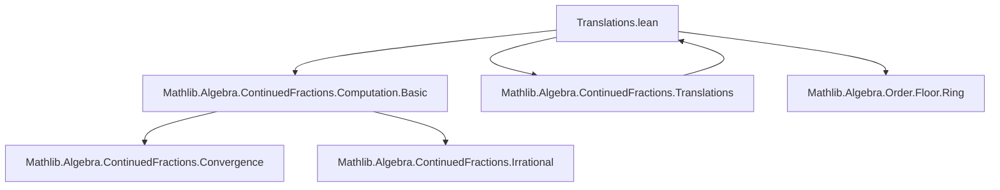

### Technical Brief: `Translations.lean` — Translation Lemmas for Continued Fraction Computation Structures

---

#### **1. Key Definitions & Theorems**

| Name | Type / Signature | Purpose |
|------|------------------|---------|
| `IntFractPair.stream` | `K → ℕ → Option (IntFractPair K)` | Computes the stream of integer–fractional pairs for a value `v : K`, used to drive continued fraction expansion. |
| `IntFractPair.of` | `K → IntFractPair K` | Constructs the initial pair `(⌊v⌋, fract v)` from `v`. |
| `IntFractPair.seq1` | `K → Stream'.Seq (IntFractPair K)` | Infinite sequence of `IntFractPair`s derived from `stream`. |
| `GenContFract.of` | `K → GenContFract K` | Constructs the generalized continued fraction expansion of `v`. |
| `IntFractPair.succ_nth_stream_eq_none_iff` | `IntFractPair.stream v (n + 1) = none ↔ ...` | Characterizes termination at step `n+1` in terms of `n`-th step. |
| `IntFractPair.succ_nth_stream_eq_some_iff` | `IntFractPair.stream v (n + 1) = some ifp ↔ ...` | Characterizes non-termination (i.e., continuation) at step `n+1`. |
| `IntFractPair.stream_succ_of_some` | `stream v n = some p ∧ p.fr ≠ 0 ⇒ stream v (n+1) = some (of p.fr⁻¹)` | Explicit recurrence for non-terminating step. |
| `IntFractPair.stream_succ` | `fract v ≠ 0 ⇒ stream v (n+1) = stream (fract v)⁻¹ n` | Shifts computation to inverse fractional part. |
| `IntFractPair.of_h_eq_floor` | `(of v).h = ⌊v⌋` | Head term of continued fraction is floor of `v`. |
| `IntFractPair.get?_of_eq_some_of_succ_get?_intFractPair_stream` | `stream v (n+1) = some ifp ⇒ (of v).s.get? n = some ⟨1, ifp.b⟩` | Relates coefficients of `of v` to integer parts of `stream`. |
| `IntFractPair.get?_of_eq_some_of_get?_intFractPair_stream_fr_ne_zero` | `stream v n = some ifp ∧ ifp.fr ≠ 0 ⇒ (of v).s.get? n = some ⟨1, (of ifp.fr⁻¹).b⟩` | Alternative version using fractional part inverse. |
| `IntFractPair.of_s_tail` | `(of v).s.tail = (of (fract v)⁻¹).s` | Tail of coefficient sequence equals CF of inverse fractional part. |
| `IntFractPair.of_s_succ` | `(of v).s.get? (n+1) = (of (fract v)⁻¹).s.get? n` | Pointwise recurrence for coefficients. |
| `IntFractPair.convs'_succ` | `(of v).convs' (n+1) = ⌊v⌋ + 1 / (of (fract v)⁻¹).convs' n` | Recurrence for convergents in terms of inverse fractional part. |

---

#### **2. Naming Conventions**

- **Prefixes**:
  - `stream_`: operations on `IntFractPair.stream`.
  - `of_`: operations on `GenContFract.of`.
  - `seq1_`: operations on `IntFractPair.seq1`.
  - `convs'_`: operations on convergents.
  - `get?_`: retrieval of `n`-th element from a sequence (`Option`-valued).
- **Suffixes**:
  - `_iff`: biconditional characterizations.
  - `_of_some` / `_of_none`: conditional behavior based on `Option` structure.
  - `_intFractPair_`: scoped to `IntFractPair`.
  - `_int`: specialized for integer inputs.
- **Structure**:
  - `succ_nth_...`: recurrence for `n+1`-th step.
  - `head`, `tail`, `terminatedAt`: standard sequence operations.

---

#### **3. Tactic Stack**

Frequently used tactics in proofs:
- `simp` / `simp only`: simplification using definitional equalities and lemmas.
- `rw`: rewriting using equalities (especially `stream`, `of`, `floor`, `fract`).
- `induction`: structural or natural-number induction.
- `rcases` / `obtain`: destructuring existential or `Option`-valued hypotheses.
- `cases`: case analysis on `Option` or inductive types.
- `exact`, `refine`, `assumption`: proof completion.
- `split`: for `ite_eq_iff` or `if ... then ... else ...`.
- `aesop`: used implicitly (via `simp` + `aesop` in background).
- `congr_arg`: for functional congruence (e.g., applying `1 / ·`).

---

#### **4. Proof Logic**

- **Inductive structure**: Most proofs proceed by induction on `n : ℕ`.
- **Case analysis**: On whether `stream v n = none` or `some`, and whether fractional part is zero.
- **Equational reasoning**: Heavy use of definitional unfolding (`unfold`, `change`) of `stream`, `of`, `seq1`, `convs'`.
- **Logical equivalence**: Many theorems are biconditionals (`↔`), proven via `rw ...; simp`.
- **Transfer lemmas**: Key technique: relate `stream v`, `seq1 v`, and `of v` via `map`, `tail`, `get?`, and `bind`.
- **Termination propagation**: Show equivalence of termination conditions across structures via `Option.map_eq_none_iff`.

---

#### **5. Imports & Dependencies**

| Module | Purpose |
|--------|---------|
| `Mathlib.Algebra.ContinuedFractions.Computation.Basic` | Core definitions: `IntFractPair`, `GenContFract`, `convs'`, `stream`, `seq1`. |
| `Mathlib.Algebra.ContinuedFractions.Translations` | Prior translation lemmas (this file extends them). |
| `Mathlib.Algebra.Order.Floor.Ring` | `floor`, `fract`, `Int.fract`, `FloorRing`, `IsStrictOrderedRing`. |

---

#### **6. Mermaid Diagrams**

##### **Dependency Graph (Module-Level)**



##### **Data Flow & Structure Relationships**

```mermaid
graph LR
  v[K] --> stream["IntFractPair.stream v"]
  v --> seq1["IntFractPair.seq1 v"]
  v --> of["GenContFract.of v"]

  stream -->|n+1| stream_next
  seq1 -->|tail| seq1_tail
  seq1 -->|map (1,·)| of_s["(of v).s"]

  seq1_tail -.->|shift| stream_next

  subgraph Coefficients
    of_s --> getn["(of v).s.get? n"]
    stream -->|n+1| ifp["some ifp"]
    ifp -->|b| getn
  end

  subgraph Convergents
    of --> convs["(of v).convs' n"]
    convs -->|recurrence| convs_prev["⌊v⌋ + 1 / (of (fract v)⁻¹).convs' n"]
  end
```

##### **Termination Propagation**


---

#### **7. Theory Context**

This file serves as a **bridge** between low-level computational structures (`IntFractPair.stream`, `seq1`) and high-level objects (`GenContFract.of`, convergents). It enables:
- **Modular reasoning**: Prove properties about `stream`, then lift to `of`.
- **Recursive specification**: Define CF expansion via recurrence on `stream`, then prove equivalence to standard CF definition.
- **Termination analysis**: Link termination of `stream` (finite fractional part) to finite CF.

It underpins correctness of continued fraction algorithms in Lean, especially for irrationality proofs and convergence analysis.

--- 

Let me know if you'd like a formalized summary in Lean syntax or a dependency graph for the *proofs* (not just modules).
