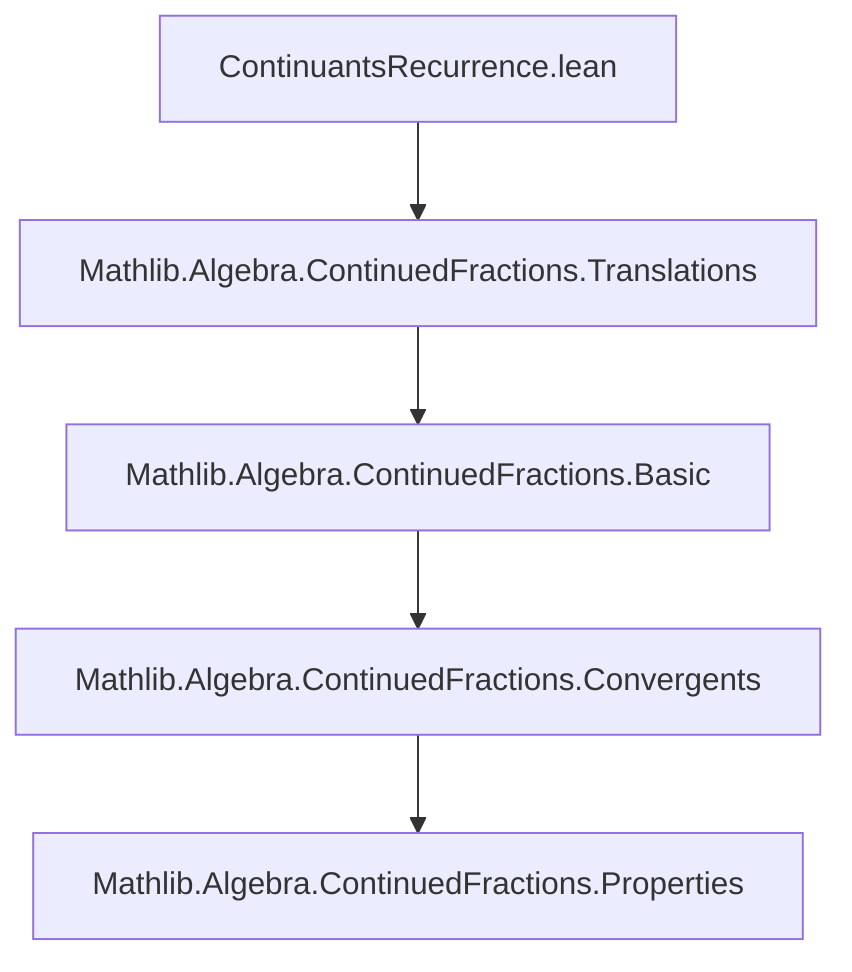
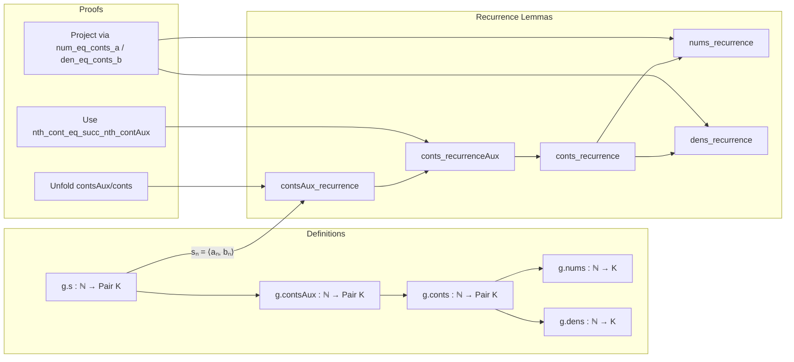

### Technical Brief: `ContinuantsRecurrence.lean`

---

#### **1. Key Definitions & Theorems**

| Name | Type / Signature | Purpose |
|------|------------------|---------|
| `contsAux` | `g.contsAux : ℕ → Pair K` | Auxiliary sequence used to define convergents; builds numerators and denominators incrementally. |
| `conts` | `g.conts : ℕ → Pair K` | Convergents sequence: `g.conts n = ⟨Aₙ, Bₙ⟩`, where `Aₙ / Bₙ` is the $n$-th convergent of the generalized continued fraction. |
| `nums` | `g.nums : ℕ → K` | Numerator sequence: `g.nums n = Aₙ`. |
| `dens` | `g.dens : ℕ → K` | Denominator sequence: `g.dens n = Bₙ`. |
| `contsAux_recurrence` | `∀ gp ppred pred, g.s.get? n = some gp → g.contsAux n = ppred → g.contsAux (n+1) = pred → g.contsAux (n+2) = ⟨gp.b * pred.a + gp.a * ppred.a, gp.b * pred.b + gp.a * ppred.b⟩` | Recurrence for auxiliary sequence `contsAux`. |
| `conts_recurrenceAux` | `∀ gp ppred pred, g.s.get? n = some gp → g.contsAux n = ppred → g.contsAux (n+1) = pred → g.conts (n+1) = ⟨gp.b * pred.a + gp.a * ppred.a, gp.b * pred.b + gp.a * ppred.b⟩` | Intermediate step linking `contsAux` to `conts`. |
| `conts_recurrence` | `∀ gp ppred pred, g.s.get? (n+1) = some gp → g.conts n = ppred → g.conts (n+1) = pred → g.conts (n+2) = ⟨gp.b * pred.a + gp.a * ppred.a, gp.b * pred.b + gp.a * ppred.b⟩` | Main recurrence: $C_{n+2} = b_{n+1} C_{n+1} + a_{n+1} C_n$, where $C_n = \langle A_n, B_n \rangle$. |
| `nums_recurrence` | `∀ gp ppredA predA, g.s.get? (n+1) = some gp → g.nums n = ppredA → g.nums (n+1) = predA → g.nums (n+2) = gp.b * predA + gp.a * ppredA` | Numerator recurrence: $A_{n+2} = b_{n+1} A_{n+1} + a_{n+1} A_n$. |
| `dens_recurrence` | `∀ gp ppredB predB, g.s.get? (n+1) = some gp → g.dens n = ppredB → g.dens (n+1) = predB → g.dens (n+2) = gp.b * predB + gp.a * ppredB` | Denominator recurrence: $B_{n+2} = b_{n+1} B_{n+1} + a_{n+1} B_n$. |

> Notation: For `gp : Pair K`, `gp.a`, `gp.b` denote its components; `g.s.get? n = some ⟨a, b⟩` means the $n$-th partial quotient is $a + b / (\cdots)$, i.e., $a_n = a$, $b_n = b$.

---

#### **2. Naming Conventions**

- **Prefixes**:
  - `contsAux_`: auxiliary sequence lemmas.
  - `conts_`: main convergent sequence lemmas.
  - `nums_`, `dens_`: numerator/denominator projections.
- **Suffixes**:
  - `_recurrence`: recurrence relation proofs.
  - `_Aux`: auxiliary or intermediate versions.
- **Variables**:
  - `gp`: current term (index $n+1$).
  - `ppred`: previous term (index $n$).
  - `pred`: next term (index $n+1$ for `contsAux`, or $n+1$ for `conts`).

---

#### **3. Tactic Stack**

- `simp [*]`: simplifies using all hypotheses and definitions (`contsAux`, `nextConts`, `nextNum`, `nextDen`, `nth_cont_eq_succ_nth_contAux`).
- `rw [...] at ...`: rewrites hypotheses using definitions like `nth_cont_eq_succ_nth_contAux`.
- `obtain ⟨...⟩ : ∃ ..., ... := ...`: existential elimination to extract witness with projection properties.
- `rfl`: after `obtain`, to substitute equality and simplify goal.

No heavy automation (e.g., `aesop`, `linarith`) is used—proofs are mostly definitional.

---

#### **4. Proof Logic**

- **Structure**: All proofs follow a *definitional unfolding* strategy:
  1. Unfold definitions (`contsAux`, `conts`, `nums`, `dens`) via `simp`.
  2. Use recurrence of auxiliary sequence (`contsAux_recurrence`) to derive recurrence for `conts`.
  3. Project to numerator/denominator via `num_eq_conts_a`, `den_eq_conts_b`.
  4. Use `obtain` to lift scalar equalities (`g.nums n = ppredA`) to pair equalities (`g.conts n = ⟨ppredA, _⟩`), enabling use of `conts_recurrence`.

- **Induction**: Not explicitly used—proofs rely on *stepwise recurrence* from definitions.

---

#### **5. Imports**

- `Mathlib.Algebra.ContinuedFractions.Translations`: defines `GenContFract`, `Pair`, `contsAux`, `conts`, `nums`, `dens`, and related operations (`nextConts`, `nextNum`, `nextDen`, `nth_cont_eq_succ_nth_contAux`).

---

#### **8. Mermaid Diagrams**

##### **Dependency Graph (Module-Level)**

##### **Theoretical Overview (File-Level)**

##### **Recurrence Flow (Mathematical)**

$$
\begin{aligned}
&\text{Given } g.s(n+1) = \langle a_{n+1}, b_{n+1} \rangle, \\
&\text{and } \langle A_n, B_n \rangle = g.conts(n),\ \langle A_{n+1}, B_{n+1} \rangle = g.conts(n+1), \\
&\text{then:} \\
&A_{n+2} = b_{n+1} A_{n+1} + a_{n+1} A_n, \\
&B_{n+2} = b_{n+1} B_{n+1} + a_{n+1} B_n.
\end{aligned}
$$

This matches the classical continuant recurrence for convergents of continued fractions.

--- 

Let me know if you'd like a formalized dependency graph for `Mathlib` or a proof sketch in natural deduction style.
