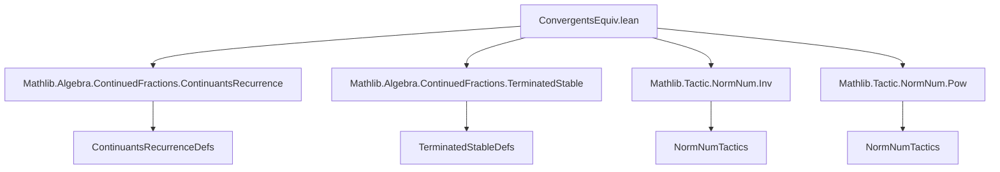

### Technical Brief: `ConvergentsEquiv.lean`

---

#### **1. Key Definitions & Theorems**

| Name | Type / Signature | Purpose |
|------|------------------|---------|
| `squashSeq` | `Stream'.Seq (Pair K) → ℕ → Stream'.Seq (Pair K)` | Combines two consecutive pairs `(aₙ, bₙ)` and `(aₙ₊₁, bₙ₊₁)` into `(aₙ, bₙ + aₙ₊₁ / bₙ₊₁)` at position `n`. |
| `squashGCF` | `GenContFract K → ℕ → GenContFract K` | Lifts `squashSeq` to generalized continued fractions (gcfs); modifies the head at `n = 0`, otherwise applies `squashSeq` to the sequence part. |
| `convs'Aux` | `Stream'.Seq (Pair K) → ℕ → K` | Auxiliary function for direct evaluation of convergents (`convs'`). |
| `convs` | `GenContFract K → ℕ → K` | Convergent computed via recurrence (continuants `Aₙ`, `Bₙ`). |
| `convs'` | `GenContFract K → ℕ → K` | Direct evaluation of the finite continued fraction up to `n`. |
| `contsAux` | `GenContFract K → ℕ → Pair K` | Auxiliary function returning `(Aₙ, Bₙ)` for recurrence. |
| `succ_nth_conv'_eq_squashGCF_nth_conv'` | `g.convs' (n + 1) = (squashGCF g n).convs' n` | Shows direct evaluation of `g` at `n+1` equals that of squashed `g` at `n`. |
| `succ_nth_conv_eq_squashGCF_nth_conv` | `g.convs (n + 1) = (squashGCF g n).convs n` | Shows recurrence-based convergent of `g` at `n+1` equals that of squashed `g` at `n`, assuming nonzero denominators. |
| `convs_eq_convs'` (main thm) | `g.convs n = g.convs' n` | Equivalence of recurrence and direct computation for gcfs under strict positivity of partial numerators/denominators. |
| `ContFract.convs_eq_convs'` | `(↑c : GenContFract K).convs = (↑c : GenContFract K).convs'` | Specialization to regular continued fractions (via coercion). |

---

#### **2. Naming Conventions**

- **Prefixes**:
  - `convs`, `convs'`: recurrence vs. direct convergent computation.
  - `contsAux`, `convs'Aux`: auxiliary functions for recurrence and direct evaluation.
  - `squash*`: operations related to merging two consecutive terms.
  - `nth`, `succ_nth`, `succ_succ_nth`: indexing conventions for positions.
- **Suffixes**:
  - `_eq_*`: equality lemmas (e.g., `succ_nth_conv_eq_squashGCF_nth_conv`).
  - `_of_*`: conditional lemmas (e.g., `convs'Aux_stable_step_of_terminated`, `nth_of_lt`).
  - `_th`: indexing (e.g., `nth`, `n'th`, `succ_n'th`).
- **Variables**:
  - `g`, `s`: gcf and its sequence part.
  - `gp`, `gp_n`, `gp_succ_n`: generic or specific `Pair K`.
  - `a`, `b`, `pa`, `pb`, `ppA`, `ppB`, etc.: components of pairs.

---

#### **3. Tactic Stack**

| Tactic | Usage Frequency | Purpose |
|--------|-----------------|---------|
| `simp` / `simp_all` | Very High | Simplify goals using definitions, lemmas, and hypotheses. |
| `induction` | High | Structural induction on `n`, strong induction for `contsAux_eq_contsAux_squashGCF_of_le`. |
| `cases` | High | Case analysis on `Option` values (`get?`), `n`, `TerminatedAt`, `Decidable.em`. |
| `rw` | High | Rewrite using equalities (e.g., `succ_nth_conv'_eq_squashGCF_nth_conv'`). |
| `grind` | Medium | Automated solving of field/ring equalities (e.g., rational simplifications). |
| `obtain` / `have` | Medium | Extract existential witnesses or intermediate facts. |
| `ext1` / `ext` | Low | Extensionality for stream sequences. |
| `refine` | Medium | Partial proof construction, especially in `convs_eq_convs'`. |
| `simpa` | Medium | Simplify and discharge using equalities. |

---

#### **4. Proof Logic**

- **Overall Strategy**: Induction on `n`, with a *squashing* technique to reduce the `n+1` case to the `n` case.
- **Base Case (`n = 0`)**: Trivial simplification using definitions of `convs`, `convs'`, `squashGCF`.
- **Inductive Step (`n → n+1`)**:
  1. **Squashing**: Construct `g' = squashGCF g n`, so that `g.convs'(n+1) = g'.convs'(n)` and `g.convs(n+1) = g'.convs(n)`.
  2. **IH Application**: Apply induction hypothesis to `g'` (which has fewer terms).
  3. **Positivity Check**: Ensure the squashed denominator `bₙ + aₙ₊₁ / bₙ₊₁` is positive (requires `bₙ₊₁ ≠ 0` and positivity of `aₙ₊₁`, `bₙ₊₁`).
  4. **Continuants Alignment**: Show recurrence for `g` at `n+1` matches that of `g'` at `n`, via algebraic manipulation and `grind`.
- **Key Lemmas**:
  - `succ_nth_conv'_eq_squashGCF_nth_conv'`: Direct evaluation stable under squashing.
  - `succ_nth_conv_eq_squashGCF_nth_conv`: Recurrence stable under squashing (requires field + nonzero denominators).
  - `contsAux_eq_contsAux_squashGCF_of_le`: Continuants unchanged before squashed index.

---

#### **5. Imports & Dependencies**

| Module | Role |
|--------|------|
| `Mathlib.Algebra.ContinuedFractions.ContinuantsRecurrence` | Defines recurrence relations for continuants (`contsAux`, `convs`). |
| `Mathlib.Algebra.ContinuedFractions.TerminatedStable` | Stability lemmas for terminated fractions. |
| `Mathlib.Tactic.NormNum.Inv`, `Mathlib.Tactic.NormNum.Pow` | Normalization tactics for field operations and powers (used in `grind`). |

---

#### **6. Mermaid Diagrams**

##### **Dependency Graph (Module-Level)**



##### **Overview of Theoretical Flow**


##### **Proof Structure (Inductive Step)**

```mermaid
graph TD
  A[Goal: convs(n+1) = convs'(n+1)] --> B[Squash g to g']
  B --> C[convs'(n+1) = convs'(g', n)]
  B --> D[convs(n+1) = convs(g', n)]
  C --> E[IH: convs(g', n) = convs'(g', n)]
  D --> F[Lemma: convs(g, n+1) = convs(g', n)]
  E --> G[convs(g', n) = convs'(g', n)]
  F & G --> H[convs(n+1) = convs'(n+1)]
```

---

#### **7. Domain-Specific Insights**

- **Positivity Assumption**: Crucial for ensuring `bₙ + aₙ₊₁ / bₙ₊₁ > 0`, enabling induction. Alternatives (e.g., strict negativity) are possible but not implemented.
- **Field Requirement**: Needed for division in `squashSeq` and `squashGCF`; `Field K` is used in `succ_nth_conv_eq_squashGCF_nth_conv`.
- **Terminated Fractions**: Handled via `TerminatedAt` and stability lemmas (`convs_stable_of_terminated`, `squashSeq_eq_self_of_terminated`).
- **Coercion to GenContFract**: Regular continued fractions embed naturally; positivity follows from `ContFract.property`.

---

#### **8. Summary**

This file formalizes a foundational equivalence result for generalized continued fractions: the recurrence-based convergents (`convs`) and direct evaluation (`convs'`) coincide under mild positivity assumptions. The proof hinges on a *squashing* technique that reduces the inductive step to a simpler case, supported by detailed algebraic lemmas about stream transformations and continuants. The result extends directly to regular continued fractions, making it a cornerstone for further continued fraction theory in `Mathlib`.
