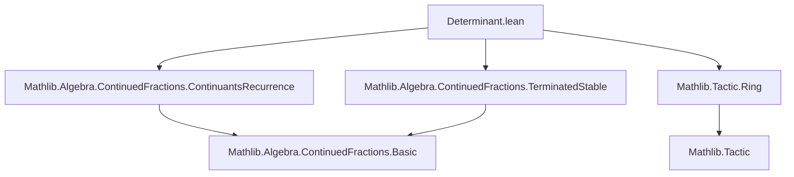
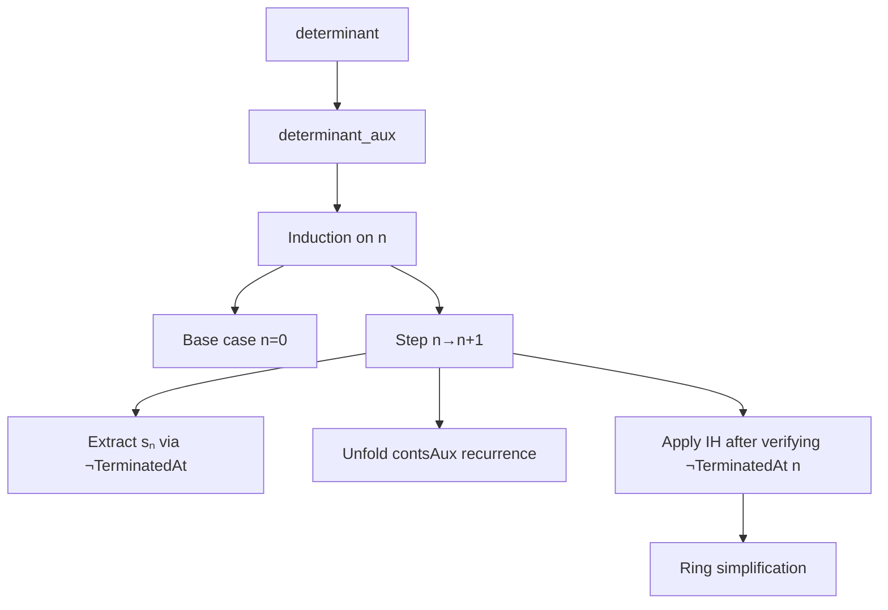

### Technical Brief: Determinant Formula for Simple Continued Fractions in Lean 4

---

#### **1. Key Definitions & Theorems**

| Name | Type / Signature | Purpose |
|------|------------------|---------|
| `contsAux` | `GenContFract K → ℕ → GenContFract.Kernel K` | Auxiliary sequence of convergents (numerator/denominator pairs) for generalized continued fractions. Used to define numerators (`nums`) and denominators (`dens`) of convergents. |
| `SimpContFract` | `Type u → Type u` | Type of *simple* continued fractions over a field `K`. Embeds into `GenContFract K`. |
| `nums`, `dens` | `GenContFract K → ℕ → K` | Numerator and denominator functions for the $n$-th convergent: $A_n = \text{nums}(s, n),\ B_n = \text{dens}(s, n)$. |
| `TerminatedAt` | `GenContFract K → ℕ → Prop` | Predicate stating that the continued fraction terminates at index $n$. |
| `determinant_aux` | `∀ {s : SimpContFract K} {n : ℕ}, (n = 0 ∨ ¬TerminatedAt (↑s : GenContFract K) (n - 1)) → contsAux n.a * contsAux (n+1).b - contsAux n.b * contsAux (n+1).a = (-1)^n` | Intermediate inductive lemma establishing the determinant identity for `contsAux`. |
| `determinant` | `∀ {s : SimpContFract K} {n : ℕ}, ¬TerminatedAt (↑s : GenContFract K) n → nums n * dens (n+1) - dens n * nums (n+1) = (-1)^(n+1)` | Main theorem: determinant formula for simple continued fractions: $A_n B_{n+1} - B_n A_{n+1} = (-1)^{n+1}$. |

---

#### **2. Naming Conventions**

- **Prefixes**:
  - `contsAux`: auxiliary convergent sequence (used internally).
  - `nums`, `dens`: standard abbreviations for numerator/denominator of convergents.
  - `partNum_eq_s_a`: links partial numerators in `GenContFract` to underlying sequence `s`.
- **Suffixes**:
  - `_aux`: auxiliary lemmas (often used in inductive proofs).
  - `_eq`: equality lemmas (e.g., `pred_conts_eq`, `ppred_conts_eq`).
- **Variable naming**:
  - `g`, `gp`, `pred_conts`, `ppred_conts`: shorthand for intermediate objects in proofs.
  - `pA`, `pB`, `ppA`, `ppB`: abbreviations for $A_n, B_n, A_{n-1}, B_{n-1}$.

---

#### **3. Tactic Stack**

| Tactic | Usage Frequency | Purpose |
|--------|-----------------|---------|
| `induction` | High | Structural induction on `n` (natural number). |
| `simp` / `simp only` | High | Simplify using definitions (`contsAux`, `nums`, `dens`, etc.). |
| `ring` | Medium | Simplify polynomial expressions (e.g., after unfolding recurrence). |
| `grind` | Medium | Custom tactic (likely from `Mathlib.Tactic.Ring`) for solving ringequalities automatically. |
| `obtain` / `have` | High | Extract existential witnesses or intermediate facts (e.g., `⟨gp, s_nth_eq⟩`). |
| `rw` | Medium | Rewrite using proven equalities (e.g., `gp_a_eq_one`). |
| `mt`, `Or.resolve_left`, `Or.inr` | Low-Medium | Logical manipulations (e.g., contrapositive, disjunction handling). |

---

#### **4. Proof Logic**

The proof proceeds by **induction on $n$**, with careful handling of termination conditions:

1. **Base case (`n = 0`)**:
   - Direct simplification using `contsAux` definition.
2. **Inductive step (`n + 1`)**:
   - Assume the identity holds for $n$ (IH).
   - Use non-termination at $n$ to extract a partial quotient $g_p = s_n$.
   - Unfold recurrence for `contsAux (n+2)` using `contsAux_recurrence`.
   - Simplify using `gp.a = 1` (property of simple continued fractions).
   - Reduce goal to expression involving $A_n, B_n, A_{n-1}, B_{n-1}$.
   - Apply IH (after verifying non-termination at $n$ via `terminated_stable`).
3. **Main theorem**:
   - Derives from `determinant_aux` by observing that `nums = contsAux.nums`, `dens = contsAux.dens`, and rephrasing the hypothesis.

---

#### **5. Imports & Dependencies**

| Module | Role |
|--------|------|
| `Mathlib.Algebra.ContinuedFractions.ContinuantsRecurrence` | Provides recurrence relations for convergents (`contsAux_recurrence`). |
| `Mathlib.Algebra.ContinuedFractions.TerminatedStable` | Contains lemmas about termination stability (e.g., if not terminated at $n$, then not at $n-1$). |
| `Mathlib.Tactic.Ring` | Provides `ring` and `grind` tactics for algebraic simplification. |

---

#### **8. Mermaid Diagrams**

##### **Dependency Graph (Module-Level)**



##### **Overview of Theoretical Flow**

```mermaid
flowchart LR
  A[SimpContFract K] --> B[Embed to GenContFract K]
  B --> C[contsAux n = ⟨Aₙ, Bₙ⟩]
  C --> D[Recurrence: contsAux (n+1) = ...]
  D --> E[determinant_aux: inductive proof]
  E --> F[determinant: AₙBₙ₊₁ - BₙAₙ₊₁ = (-1)ⁿ⁺¹]
  F --> G[TODO: Generalize to GenContFract]
```

##### **Proof Structure (High-Level)**



---

#### **6. Notes & Extensions**

- **TODO**: Generalization to `GenContFract` would yield  
  $A_n B_{n+1} - B_n A_{n+1} = (-a_0)(-a_1)\cdots(-a_{n+1})$,  
  where $a_i$ are partial numerators (not necessarily 1).
- **Key insight**: Simplicity (`a_i = 1`) collapses the product to $(-1)^{n+1}$.
- **Formalization quality**: Clean use of `let` bindings, clear variable scoping, and minimal reliance on ad-hoc tactics.

--- 

Let me know if you'd like a formalized version of the `GenContFract` generalization or a tactic trace for `determinant_aux`.
