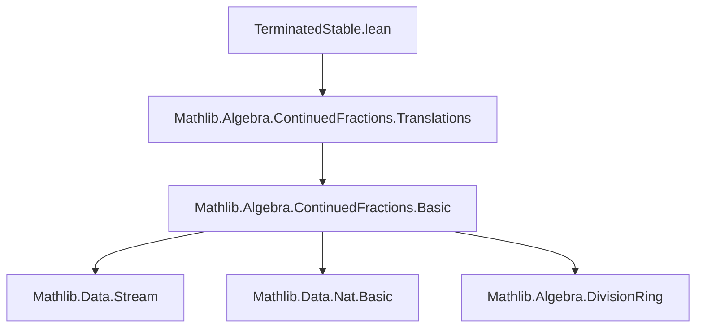
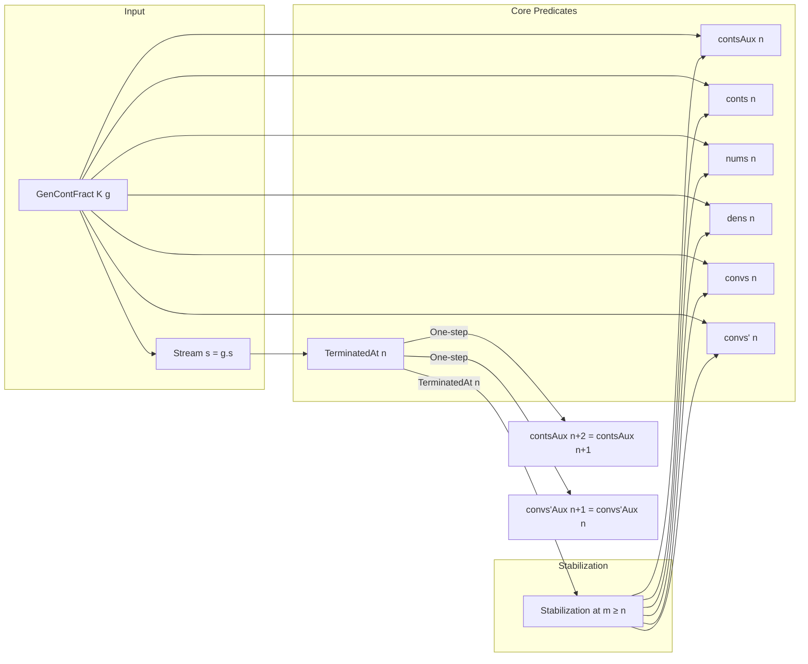

**Technical Brief: `TerminatedStable.lean`**

---

### 1. **Key Definitions & Theorems**

| Name | Type / Signature | Purpose |
|------|------------------|---------|
| `TerminatedAt` | `g.TerminatedAt n : Prop` | Predicate stating that the generalized continued fraction (gcf) `g` terminates at index `n` (i.e., `g.s.get? n = none`). |
| `contsAux` | `g.contsAux : ℕ → K` | Auxiliary sequence of continuants (numerators/denominators of convergents), defined via stream processing. |
| `conts` | `g.conts : ℕ → K` | Full continuant sequence (indexed by `n`), defined as `contsAux (n+1)`. |
| `nums`, `dens` | `g.nums`, `g.dens : ℕ → K` | Numerator and denominator sequences of convergents, defined via `contsAux`. |
| `convs`, `convs'` | `g.convs`, `g.convs' : ℕ → K` | Convergents (as elements of `K`), defined from `nums`/`dens` and `convs'Aux`. |
| `convs'Aux` | `convs'Aux s : ℕ → K` | Auxiliary convergent sequence for stream `s`. |
| `terminated_stable` | `n ≤ m → g.TerminatedAt n → g.TerminatedAt m` | If gcf terminates at `n`, it terminates at all later indices. |
| `contsAux_stable_step_of_terminated` | `g.TerminatedAt n → g.contsAux (n+2) = g.contsAux (n+1)` | Once terminated, `contsAux` becomes constant from `n+1` onward. |
| `contsAux_stable_of_terminated` | `n < m → g.TerminatedAt n → g.contsAux m = g.contsAux (n+1)` | `contsAux` stabilizes to its value at `n+1` for all `m > n`. |
| `convs'Aux_stable_step_of_terminated` | `s.TerminatedAt n → convs'Aux s (n+1) = convs'Aux s n` | `convs'Aux` stabilizes in one step after termination. |
| `convs'Aux_stable_of_terminated` | `n ≤ m → s.TerminatedAt n → convs'Aux s m = convs'Aux s n` | Full stabilization of `convs'Aux` after termination. |
| `conts_stable_of_terminated`, `nums_stable_of_terminated`, `dens_stable_of_terminated`, `convs_stable_of_terminated`, `convs'_stable_of_terminated` | All of type `n ≤ m → g.TerminatedAt n → g.X m = g.X n` | All key sequences (`conts`, `nums`, `dens`, `convs`, `convs'`) stabilize once gcf terminates. |

---

### 2. **Naming Conventions**

- **Prefixes**:
  - `convs'` vs `convs`: primed versions use `convs'Aux`, unprimed use `convs'Aux` + `nums`/`dens`.
  - `contsAux` vs `conts`: `contsAux` is the underlying auxiliary sequence; `conts` is derived.
  - `convs'Aux` vs `convs'Aux`: same pattern.
- **Suffixes**:
  - `_stable_of_terminated`: stabilization lemmas under termination assumption.
  - `_step_of_terminated`: one-step stabilization (e.g., `n+1` vs `n`).
- **Predicate naming**:
  - `TerminatedAt` (capitalized, noun-like), used in assumptions.

---

### 3. **Tactic Stack**

- **Core tactics**:
  - `rw` / `simp only`: heavy use for rewriting definitions and simplifying under hypotheses.
  - `induction`: used for `n_le_m` (induction on ≤) and `n` (induction on natural number).
  - `rcases` / `cases`: to decompose `s.head` and existential witnesses (`⟨k, rfl⟩`).
  - `exact`, `refine`: for proof construction, especially with `Nat.le_induction`.
  - `simp [this, ...]`: to apply induction hypotheses.
- **Domain-specific simplifications**:
  - `terminatedAt_iff_s_none`: rewrites `TerminatedAt` to `s.get? n = none`.
  - `nth_cont_eq_succ_nth_contAux`, `num_eq_conts_a`, `den_eq_conts_b`: definitional lemmas used in `simp`.

---

### 4. **Proof Logic**

- **Inductive structure**:
  - Stabilization proofs follow a two-tier pattern:
    1. **Base step**: Show one-step stabilization (`n+1` vs `n` or `n+2` vs `n+1`) using `simp` and `terminatedAt_iff_s_none`.
    2. **Inductive step**: Extend to all `m ≥ n` via induction on `n ≤ m` (or `n < m`), using `terminated_stable` to propagate termination.
- **Stream-based reasoning**:
  - For `convs'Aux`, proofs proceed by induction on `n`, with case analysis on `s.head`.
  - Tail termination is derived via `Stream'.Seq.TerminatedAt` and `s.get?_tail`.
- **Leveraging monotonicity**:
  - `terminated_stable` is used repeatedly to lift termination from `n` to larger indices.

---

### 5. **Imports**

- **Primary dependency**:
  ```lean
  Mathlib.Algebra.ContinuedFractions.Translations
  ```
  - Provides foundational definitions: `GenContFract`, `TerminatedAt`, `contsAux`, `convs'Aux`, etc.
  - Contains `terminated_stable` for the underlying stream `g.s`.

---

### 8. **Mermaid Diagrams**

#### **Dependency Graph (Module-Level)**



#### **Theoretical Overview (Data Flow)**



#### **Proof Structure (for `contsAux_stable_of_terminated`)**

```mermaid
flowchart TD
  A[n < m, g.TerminatedAt n] --> B[Induction on n < m]
  B --> C[Base: n = m-1]
  C --> D[Apply contsAux_stable_step_of_terminated]
  D --> E[Use terminated_stable to ensure g.TerminatedAt m-1]
  B --> F[Step: assume for k, prove for k+1]
  F --> G[Apply IH + step lemma]
  G --> H[Conclude g.contsAux m = g.contsAux (n+1)]
```

---

**Summary**: This module formalizes the *stabilization property* of generalized continued fractions: once a gcf terminates at index `n`, all derived sequences (`contsAux`, `conts`, `nums`, `dens`, `convs`, `convs'`) become constant for all later indices. Proofs rely on induction over `≤`/`<`, stream decomposition, and definitional simplifications.
