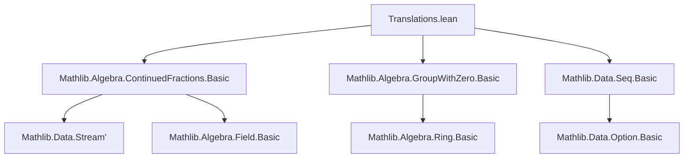
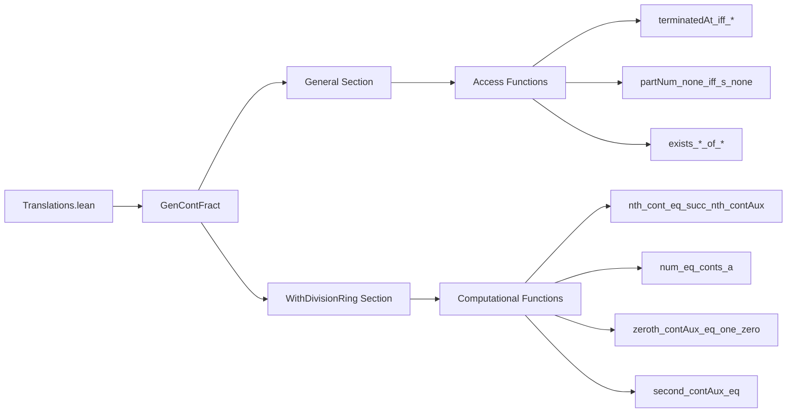

### Technical Brief: `Translations.lean`

---

#### **1. Key Definitions & Theorems**

| Name | Type / Signature | Purpose |
|------|------------------|---------|
| `TerminatedAt` | `GenContFract α → ℕ → Prop` | Indicates whether the continued fraction terminates at index `n`. |
| `partNums`, `partDens`, `s` | `Stream'.Seq α`, `Stream'.Seq (Pair α)` | Accessor functions for numerators, denominators, and underlying sequence of pairs. |
| `conts`, `contsAux` | `GenContFract K → ℕ → Pair K` | Computational continued fraction convergents and auxiliary sequence. |
| `nums`, `dens`, `convs` | `GenContFract K → ℕ → K` | Numerators, denominators, and convergents (as field elements). |
| `convs'`, `convs'Aux` | `Stream'.Seq (Pair K) → ℕ → K` | Alternative convergent definitions via stream processing. |

**Theorems (selected):**

| Theorem | Type | Purpose |
|---------|------|---------|
| `terminatedAt_iff_s_terminatedAt` | `g.TerminatedAt n ↔ g.s.TerminatedAt n` | Equates termination via `TerminatedAt` predicate and stream termination. |
| `terminatedAt_iff_partNum_none` | `g.TerminatedAt n ↔ g.partNums.get? n = none` | Links termination to absence of numerator at index `n`. |
| `nth_cont_eq_succ_nth_contAux` | `g.conts n = g.contsAux (n + 1)` | Relates two definitions of convergent computation. |
| `num_eq_conts_a`, `den_eq_conts_b` | `g.nums n = (g.conts n).a`, `g.dens n = (g.conts n).b` | Connects numerator/denominator functions to pair components. |
| `conv_eq_num_div_den`, `conv_eq_conts_a_div_conts_b` | `g.convs n = g.nums n / g.dens n` | Defines convergents as ratios of numerators/denominators. |
| `zeroth_contAux_eq_one_zero`, `first_contAux_eq_h_one` | `g.contsAux 0 = ⟨1, 0⟩`, `g.contsAux 1 = ⟨g.h, 1⟩` | Base cases for auxiliary convergent sequence. |
| `second_contAux_eq`, `first_cont_eq`, etc. | `g.contsAux 2 = ...`, `g.conts 1 = ...` | Explicit formulas for early convergents in terms of initial pair `gp`. |

---

#### **2. Naming Conventions**

- **Predicates**: `is_`, `TerminatedAt`, `none`-based checks (`get? n = none`)
- **Accessor functions**: `partNums`, `partDens`, `conts`, `contsAux`, `nums`, `dens`, `convs`, `convs'`, `convs'Aux`
- **Auxiliary variants**: suffixed with `Aux` (e.g., `contsAux`, `convs'Aux`)
- **Index-specific base cases**: `zeroth_`, `first_`, `second_` (e.g., `zeroth_cont_eq_h`, `first_num_eq`)
- **Equational lemmas**: `*_eq_*`, `*_iff_*`, `exists_*_of_*`

---

#### **3. Tactic Stack**

- `rfl`: Used heavily for definitional equalities.
- `simp`: For simplifying using definitions (`partNums`, `partDens`, `contsAux`, etc.).
- `cases ... <;> simp [...]`: For case analysis on `get? n` results.
- `simpa [ ... ] using ...`: To discharge existential goals using prior equalities.
- `rw [...]`: For rewriting via equivalence lemmas (e.g., `rw [terminatedAt_iff_s_none, partNum_none_iff_s_none]`).

No heavy automation (e.g., `linarith`, `ring`, `aesop`) is used—proofs are mostly definitional.

---

#### **4. Proof Logic**

- **Definitional reasoning**: Most proofs are direct rewritings or simplifications using definitions.
- **Case analysis on `get? n`**: For lemmas linking `partNums`, `partDens`, and `s`.
- **Inductive structure (implicit)**: For `contsAux`, `convs'Aux`, base cases (`0`, `1`) and recursive steps (`n+1`) are handled explicitly.
- **Existential introduction + `simpa`**: Used to extract witnesses from equality assumptions (e.g., `exists_conts_a_of_num`).
- **Chain of equivalences**: For `TerminatedAt` equivalences, multiple `rw` steps chain definitions.

---

#### **5. Imports**

| Module | Role |
|--------|------|
| `Mathlib.Algebra.ContinuedFractions.Basic` | Core definitions: `GenContFract`, `Pair`, `TerminatedAt`, `partNums`, `partDens`, `conts`, `contsAux`, etc. |
| `Mathlib.Algebra.GroupWithZero.Basic` | Provides `DivisionRing` context and basic algebraic structure (e.g., division, `1`, `0`). |
| `Mathlib.Data.Seq.Basic` | Defines `Stream'.Seq`, `get?`, `head`, `tail`, `map`, and related operations on streams. |

---

#### **6. Mermaid Diagrams**

##### **Dependency Graph (Module-Level)**

##### **Overview of `Translations.lean` Structure**

---

#### **7. Theory Context**

This file serves as a **bridge** between high-level stream-based definitions (`s`, `partNums`, `partDens`) and low-level computational definitions (`conts`, `contsAux`, `nums`, `dens`, `convs`). It ensures that all standard accessors and computational functions are *definitionally aligned* or *propositionally equivalent*, enabling smooth switching between semantic and algorithmic views of continued fractions.

It is foundational for later developments in continued fraction theory (e.g., convergence proofs, periodicity, quadratic irrationals), where one must reason about both the *infinite stream* view and the *finite computation* view.

--- 

Let me know if you'd like a formalized dependency graph or a summary of how this module integrates into the broader `Mathlib` continued fraction pipeline.
