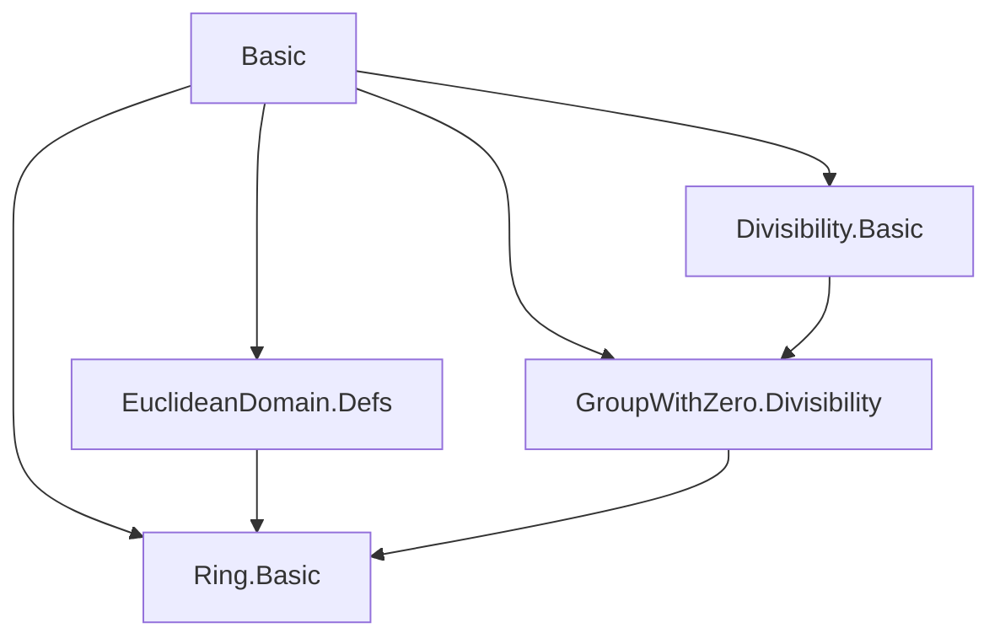
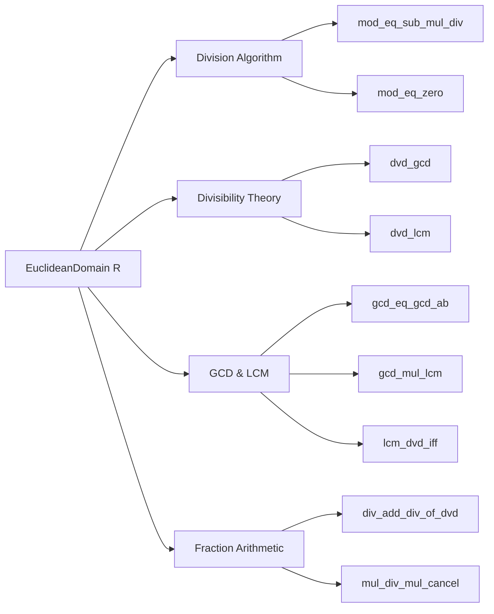

**Technical Brief: `Basic.lean` — Euclidean Domain Lemmas in Lean 4**

---

### 1. **Key Definitions & Theorems**

| Name | Type / Signature | Purpose |
|------|------------------|---------|
| `EuclideanDomain.r` | `R → R → Prop` (notation `≺`) | Well-founded relation satisfying `a % b ≺ b` for `b ≠ 0`. |
| `mod_eq_sub_mul_div` | `a % b = a - b * (a / b)` | Relates remainder to division algorithm. |
| `mod_eq_zero` | `a % b = 0 ↔ b ∣ a` | Connects divisibility and zero remainder. |
| `gcd_dvd`, `gcd_dvd_left`, `gcd_dvd_right` | `gcd a b ∣ a`, `gcd a b ∣ b` | GCD divides both arguments. |
| `gcd_eq_zero_iff` | `gcd a b = 0 ↔ a = 0 ∧ b = 0` | Characterizes zero GCD. |
| `dvd_gcd` | `c ∣ a → c ∣ b → c ∣ gcd a b` | Universal property of GCD. |
| `gcd_eq_left` | `gcd a b = a ↔ a ∣ b` | GCD equals left argument iff it divides right. |
| `gcd_eq_gcd_ab` | `gcd a b = a * gcdA a b + b * gcdB a b` | **Bézout’s identity** for Euclidean domains (explicit form). |
| `lcm_dvd_iff` | `lcm x y ∣ z ↔ x ∣ z ∧ y ∣ z` | Universal property of LCM. |
| `gcd_mul_lcm` | `gcd x y * lcm x y = x * y` | Fundamental relation between GCD and LCM. |
| `mul_div_mul_cancel` | `a * b / (a * c) = b / c` (if `a ≠ 0`, `c ∣ b`) | Cancellation in division under divisibility. |
| `div_add_div_of_dvd` | `x / y + z / t = (t * x + y * z) / (t * y)` (under divisibility) | Addition of fractions in Euclidean domain. |

---

### 2. **Naming Conventions**

- **Prefixes**:
  - `mod_`: properties of remainder (`mod_eq_zero`, `mod_self`, `zero_mod`, `mod_one`).
  - `dvd_`: divisibility lemmas (`dvd_gcd`, `dvd_mod_iff`, `dvd_lcm_left`, `dvd_div_of_dvd`).
  - `gcd_`, `lcm_`: GCD/LCM-specific lemmas (`gcd_dvd`, `gcd_eq_left`, `lcm_dvd`, `lcm_eq_zero_iff`).
  - `div_`: division properties (`div_self`, `div_one`, `zero_div`, `div_pow`, `div_eq_iff_eq_mul_of_dvd`).
  - `mul_`: multiplication/division interaction (`mul_div_cancel'`, `mul_div_assoc`, `mul_div_mul_cancel`).
- **Suffixes**:
  - `_left`, `_right`: indicate argument position (e.g., `gcd_dvd_left`, `dvd_lcm_right`).
  - `_of_dvd`: premises involve divisibility (`div_add_div_of_dvd`, `eq_div_iff_mul_eq_of_dvd`).
  - `_iff`: equivalence statements (`mod_eq_zero`, `gcd_eq_zero_iff`, `lcm_dvd_iff`).
- **Auxiliary functions**:
  - `xgcdAux`, `xgcd`: extended Euclidean algorithm components.
  - `gcdA`, `gcdB`: coefficients in Bézout identity.

---

### 3. **Tactic Stack**

Frequently used tactics in proofs:
- `rw`: rewriting using equalities/simps.
- `simp only [...]`: targeted simplification with lemmas.
- `by_cases`: case split on decidability (e.g., `b = 0`).
- `rcases`: destruct existential/universal hypotheses.
- `exact`, `apply`, `refine`: proof construction.
- `gcongr`: congruence for inequalities/divisibility.
- `induction ... using GCD.induction`: structural induction on Euclidean algorithm.
- `aesop`, `ring`: *not used* — proofs are mostly manual and rely on algebraic rewrites.

---

### 4. **Proof Logic**

- **Inductive structure**: Many proofs (especially GCD/LCM-related) use `GCD.induction`, a well-founded induction on the Euclidean norm (via `≺`).
- **Case analysis**: On `b = 0` or `a = 0` is common, handled via `by_cases`.
- **Divisibility reasoning**: Leverages `dvd_iff_exists_eq_mul_left`, `mul_div_cancel`, and `mod_eq_zero`.
- **Bézout proof strategy**:
  1. Define predicate `P(r, s, t) : r = a * s + b * t`.
  2. Prove `xgcdAux` preserves `P` via induction (`xgcdAux_P`).
  3. Apply to initial state `(a, 1, 0, b, 0, 1)` to get `gcd a b = a * gcdA a b + b * gcdB a b`.
- **Fraction arithmetic**: Proves standard identities by cross-multiplying and using `div_eq_iff_eq_mul_of_dvd`.

---

### 5. **Imports**

| Import | Purpose |
|--------|---------|
| `Mathlib.Algebra.EuclideanDomain.Defs` | Core definition of Euclidean domain. |
| `Mathlib.Algebra.Ring.Divisibility.Basic` | Divisibility theory in rings. |
| `Mathlib.Algebra.GroupWithZero.Divisibility` | Divisibility in monoids with zero. |
| `Mathlib.Algebra.Ring.Basic` | Basic ring theory (needed for `MulDivCancelClass`, etc.). |

---

### 6. **Mermaid Diagrams**

#### **Dependency Graph (Module-Level)**

#### **Overview of Theories in `Basic.lean`**

---

### 7. **Domain-Specific AI Agent Insights**

- **Focus area**: Algebraic structures with division (Euclidean domains, PID, UFD).
- **Key reasoning patterns**:
  - Structural induction on Euclidean norm (`≺`).
  - Case analysis on zero/non-zero elements.
  - Equational reasoning with divisibility constraints.
- **Automation potential**:
  - High for `simp`-based rewrites (e.g., `mod_self`, `zero_div`).
  - Medium for GCD/LCM properties (requires `GCD.induction`).
  - Low for extended Euclidean algorithm correctness (needs careful invariant proof).
- **Critical lemmas for automation**:
  - `gcd_eq_gcd_ab` (Bézout)
  - `gcd_mul_lcm`
  - `div_eq_iff_eq_mul_of_dvd`
  - `dvd_gcd`, `gcd_dvd`

--- 

Let me know if you'd like a **proof sketch generator** or **tactic recommendation engine** for this theory.
