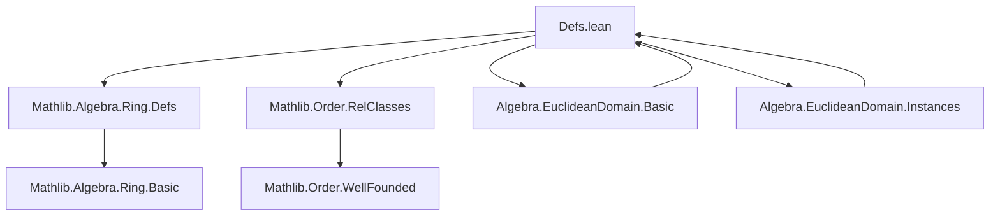
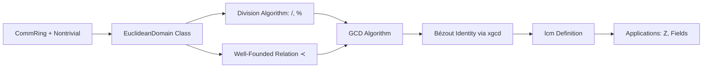

### Technical Brief: `Defs.lean` — Euclidean Domain Formalization in Lean 4

---

#### **1. Key Definitions & Theorems**

| Name | Type / Signature | Purpose |
|------|------------------|---------|
| `EuclideanDomain` | `Type u → Type u` (class) | Defines a nontrivial commutative ring equipped with a division algorithm and a well-founded relation `≺` ensuring termination of the Euclidean algorithm. |
| `quotient` | `R → R → R` | Division function (`/`), satisfies `b * (a / b) + a % b = a`. |
| `remainder` | `R → R → R` | Remainder function (`%`), satisfies same identity. |
| `r` | `R → R → Prop` | Well-founded relation (`≺`) used to generalize valuation (e.g., degree for polynomials, absolute value for ℤ). |
| `r_wellFounded` | `WellFounded r` | Ensures termination of recursive algorithms (e.g., GCD). |
| `remainder_lt` | `∀ a {b}, b ≠ 0 → r (a % b) b` | Key property: remainder is strictly smaller than divisor under `≺`. |
| `mul_left_not_lt` | `∀ a {b}, b ≠ 0 → ¬ r (a * b) a` | Prevents multiplication from decreasing under `≺`. |
| `gcd` | `R → R → R` | Greatest common divisor defined via recursive Euclidean algorithm. |
| `xgcdAux` | `R → R → R → R → R → R → R × R × R` | Extended Euclidean algorithm helper computing triples `(r, s, t)` with `r = s * x + t * y`. |
| `xgcd` | `R → R → R × R` | Returns `(a, b)` such that `gcd x y = x * a + y * b`. |
| `gcdA`, `gcdB` | `R → R → R` | Projections of `xgcd`: coefficients in Bézout identity. |
| `lcm` | `R → R → R` | `lcm x y := x * y / gcd x y`. |
| `div_add_mod`, `mod_add_div`, etc. | `a = b * (a / b) + a % b` | Fundamental division identities. |
| `mod_lt` | `b ≠ 0 → a % b ≺ b` | Direct restatement of `remainder_lt`. |
| `GCD.induction` | Induction principle for Euclidean algorithm | Enables proofs by well-founded recursion on `≺`. |

---

#### **2. Naming Conventions**

- **Prefixes**:
  - `quotient_`, `remainder_`, `r_`, `mul_`, `gcd_`, `xgcd_`: indicate core operations or properties.
  - `zero_left`: for lemmas where first argument is zero (e.g., `gcd_zero_left`, `xgcd_zero_left`).
- **Infix**:
  - `≺` is defined as `EuclideanDomain.r`, used throughout for the well-founded relation.
- **Suffixes**:
  - `_eq`, `_left`, `_right`, `_aux`, `_val`: standard Lean conventions for equations, argument positions, auxiliaries, and values.

---

#### **3. Tactic Stack**

| Tactic | Usage Frequency | Purpose |
|--------|-----------------|---------|
| `simp` / `simp_rw` | High | Simplify using definitional equalities and lemmas like `div_add_mod`, `gcd_zero_left`. |
| `rw` | Very High | Rewrite using identities (e.g., `mul_comm`, `div_add_mod`). |
| `exact` / `assumption` | High | Direct proof steps, especially in `GCD.induction`. |
| `conv` | Medium | Structural rewriting (e.g., in `xgcdAux_rec`). |
| `induction` / `cases` | Medium | Structural induction on `a` in `GCD.induction`. |
| `termination_by` | High (in `def`) | Explicit termination metric for recursive definitions (`gcd`, `xgcdAux`). |
| `classical` | Medium | Used in `GCD.induction` to handle decidable equality. |
| `symm` / `subst` | Medium | For handling equalities like `a0 : a = 0`. |

---

#### **4. Proof Logic**

- **Recursive Definitions**: All core algorithms (`gcd`, `xgcdAux`) are defined via well-founded recursion using `termination_by`, with the well-founded relation `≺` ensuring termination.
- **Inductive Proofs**: `GCD.induction` is the main proof principle — it mirrors the Euclidean algorithm:
  - Base case: `P 0 x`
  - Inductive step: `a ≠ 0 → P (b % a) a → P a b`
- **Termination Guarantees**: Proofs rely on `mod_lt` (`a % b ≺ b`) and `r_wellFounded` to justify recursion.
- **Bézout Identity**: `xgcd` computes coefficients via `xgcdAux`, with correctness lemmas (`xgcd_val`, `gcdA_zero_left`, etc.) proven by unfolding and simplification.

---

#### **5. Imports**

| Module | Role |
|--------|------|
| `Mathlib.Algebra.Ring.Defs` | Provides `CommRing`, `Div`, `Mod`, basic ring theory. |
| `Mathlib.Order.RelClasses` | Provides `WellFounded`, `WellFoundedRelation`, foundational order theory. |

---

#### **8. Mermaid Diagrams**

##### **Dependency Graph (Module-Level)**



##### **Overview of Theory Flow**



##### **Recursive Structure of `gcd` and `xgcdAux`**

```mermaid
graph TD
  gcd[a, b] --> gcd'[b % a, a]
  gcd'[b % a, a] --> gcd''[a % (b % a), b % a]
  gcd'' --> ⋯ --> gcd_final[0, gcd]

  xgcdAux[r, s, t, r', s', t'] --> xgcdAux'[r' % r, s' - q*s, t' - q*t, r, s, t]
  xgcdAux' --> ⋯ --> (r', s', t') when r = 0
```

---

#### **Summary**

This file formalizes the *definition* and *core infrastructure* for Euclidean domains in Lean 4, including:
- A generalized (transfinite) version via well-founded relations.
- Recursive definitions of `gcd`, `xgcd`, and `lcm`.
- Fundamental properties (division identity, termination, Bézout coefficients).
- A clean, tactic-friendly interface using `Div`/`Mod` instances and `≺` notation.

It serves as the foundational module for the broader `Algebra.EuclideanDomain.*` hierarchy, enabling proofs of Bézout’s lemma, structure of PID, and concrete instances like `ℤ` and fields.

--- 

Let me know if you'd like the corresponding `Basic.lean` or `Instances.lean` metadata extracted similarly.
