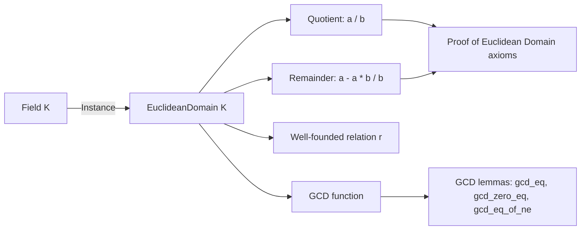
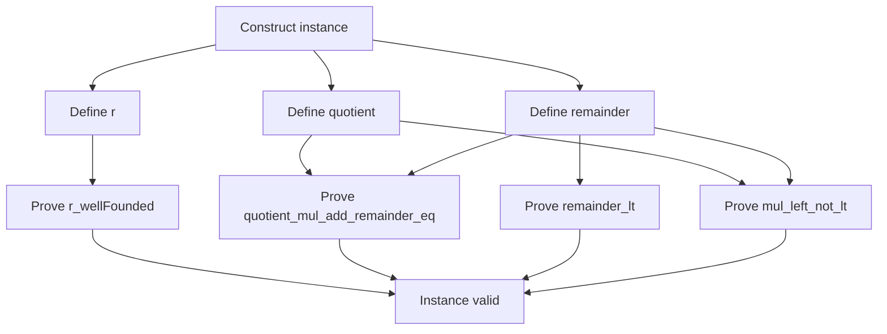

**Technical Brief: `Field.lean` — Euclidean Domain Structure on Fields**

---

### 1. **Key Definitions & Theorems**

| Name | Type / Signature | Purpose |
|------|------------------|---------|
| `toEuclideanDomain` | `instance [Field K] : EuclideanDomain K` | Constructs a Euclidean domain structure on any field `K`, using division with remainder defined as `a - a * b / b`. |
| `mod_eq` | `∀ a b : K, a % b = a - a * b / b` | Verifies that the `remainder` in the Euclidean domain instance coincides with the field-theoretic expression. |
| `gcd_eq` | `∀ a b : K, gcd a b = if a = 0 then b else a` | Computes the Euclidean domain GCD in a field: it returns the nonzero argument (or the second if both zero). |
| `gcd_zero_eq` | `∀ b : K, gcd 0 b = b` | Special case of `gcd_eq` when the first argument is zero. |
| `gcd_eq_of_ne` | `∀ {a b : K}, a ≠ 0 → gcd a b = a` | Special case when the first argument is nonzero. |

---

### 2. **Naming Conventions**

- **Prefixes**:
  - `to_`: for instance constructions (`toEuclideanDomain`)
  - `gcd_`: for GCD-related lemmas (`gcd_eq`, `gcd_zero_eq`, `gcd_eq_of_ne`)
- **Suffixes**:
  - `_eq`: for equalities (`mod_eq`, `gcd_eq`, etc.)
  - `_ne`: for lemmas involving inequality assumptions (`gcd_eq_of_ne`)
- **Pattern**: `Field.[name]` for lemmas and `Field.to[Structure]` for instances.

---

### 3. **Tactic Stack**

- `simp`: heavily used for simplification, especially with `mod_eq`, `div_zero`, `mul_div_cancel₀`.
- `by_cases`: to split on `b = 0` in `toEuclideanDomain`.
- `split_ifs`: used in `gcd_eq` to handle the `if a = 0 then ... else ...` structure.
- `rw`: for rewriting using previously proven lemmas.
- `simp [*, Field.mod_eq]`: common pattern in GCD proofs.
- `False.elim`: used in the `r_wellFounded` proof to eliminate contradictions.
- `Acc.intro`: used to construct accessibility proofs for the well-founded relation.

---

### 4. **Proof Logic**

- **Instance construction (`toEuclideanDomain`)**:
  - Define `quotient` as standard division `· / ·`.
  - Define `remainder` as `a - a * b / b`, which simplifies to `0` when `b ≠ 0`, and to `a` when `b = 0`.
  - Prove key Euclidean domain axioms:
    - `quotient_mul_add_remainder_eq`: uses `by_cases b = 0` and `mul_div_cancel₀`.
    - `r_wellFounded`: defines `r a b ↔ a = 0 ∧ b ≠ 0`, and shows it's well-founded via `Acc.intro` and contradiction.
    - `remainder_lt`: simplifies using `hnb : b ≠ 0`.
    - `mul_left_not_lt`: handles the non-comparability condition using `mul_eq_zero`.

- **GCD lemmas**:
  - Use `gcd_eq` definition and simplify with `mod_eq`.
  - `gcd_zero_eq` and `gcd_eq_of_ne` follow directly by case analysis.

---

### 5. **Imports**

| Import | Role |
|--------|------|
| `Mathlib.Algebra.EuclideanDomain.Defs` | Provides the definition of `EuclideanDomain` and its structure. |
| `Mathlib.Algebra.Field.Defs` | Provides the definition of `Field` and basic field operations. |
| `Mathlib.Algebra.GroupWithZero.Units.Basic` | Supplies basic facts about units and zero-compatible structures (used implicitly via field axioms). |

---

### 6. **Mermaid Diagrams**

#### **Dependency Graph (Module-Level)**

#### **Theoretical Overview (Conceptual Flow)**

#### **Proof Structure (for `toEuclideanDomain`)**

---

### 7. **Notes**

- The `priority := 100` annotation on `toEuclideanDomain` follows Lean’s *Note [lower instance priority]* convention to avoid ambiguity with other `EuclideanDomain` instances (e.g., `Int.toEuclideanDomain`).
- The remainder function is designed to be `0` in all nonzero-divisor cases (i.e., all `b ≠ 0` in a field), aligning with the fact that fields are trivial Euclidean domains where division is always exact.
- The GCD in a field is degenerate: it returns the nonzero argument (or the second if both zero), reflecting that all nonzero elements are units and hence associate.

--- 

Let me know if you'd like a formalized dependency graph (e.g., for `leanproject`), or a comparison with `Int.lean` Euclidean domain instance.
