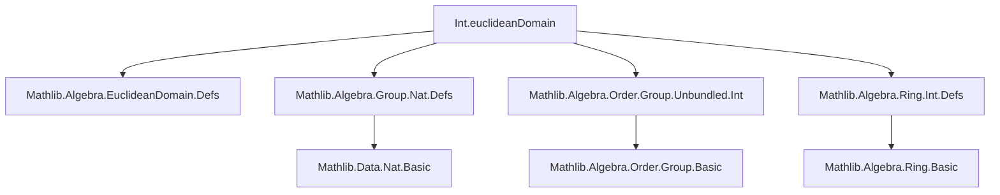

**Technical Brief: `Int.euclideanDomain` Instance in Lean 4**

---

### 1. **Key Definitions & Theorems**

| Name | Type / Signature | Purpose |
|------|------------------|---------|
| `Int.euclideanDomain` | `EuclideanDomain ℤ` | Establishes that the integers $\mathbb{Z}$ form a Euclidean domain, using the absolute value as the Euclidean function. |
| `quotient` | `Int.ediv` (`· / ·`) | Integer division (quotient). |
| `remainder` | `Int.emod` (`· % ·`) | Integer remainder (modulus), satisfying $a = b \cdot (a / b) + (a \% b)$. |
| `r` | `fun a b => a.natAbs < b.natAbs` | Well-founded relation on $\mathbb{Z}$ defined via natural absolute value comparison. |
| `r_wellFounded` | `(measure natAbs).wf` | Proof that the relation $r$ is well-founded (via measure `natAbs`). |
| `remainder_lt` | `∀ a b, b ≠ 0 → a % b < |b|` | Key property of Euclidean division: remainder is strictly smaller than divisor in the Euclidean function. |
| `mul_left_not_lt` | `∀ a b, b ≠ 0 → |a| ≥ |b| → |a| ≥ |b|` (used to ensure no descent violation) | Ensures that if $|a| \ge |b|$, then no smaller element is produced in the Euclidean algorithm. |

---

### 2. **Naming Conventions**

- **Prefixes**:
  - `Int.`: Standard prefix for integer-specific definitions (`Int.ediv`, `Int.emod`, `Int.natAbs`, `Int.ofNat_lt`).
  - `natAbs`: Abbreviation for `Int.natAbs`, mapping $\mathbb{Z} \to \mathbb{N}_0$.
- **Suffixes**:
  - `_eq`, `_lt`, `_le`: Used for equations and inequalities (e.g., `mul_ediv_add_emod`, `emod_lt_abs`).
- **Structure fields**:
  - `quotient`, `remainder`, `r`, `r_wellFounded`, `remainder_lt`, `mul_left_not_lt`: Standard Euclidean domain structure fields.

---

### 3. **Tactic Stack**

- `rw`: Rewriting using known lemmas (e.g., `Int.emod_lt_abs`, `Int.abs_eq_natAbs`, `Int.natAbs_mul`).
- `exact`: Directly applying a proof term.
- `not_lt_of_ge`: Classical logic to convert a ≥ b into ¬(b < a).
- `Int.ofNat_lt.1`: From `n < m` in $\mathbb{N}$ to `↑n < ↑m` in $\mathbb{Z}$.
- `rw [← ...]`: Rewriting with reversed equalities to align terms.
- `apply` / `exact` for well-foundedness (`wf`).
- `aesop` is *not* used here — this is a low-level, explicit construction.

---

### 4. **Proof Logic**

The proof proceeds by **constructive verification of the Euclidean domain axioms**:

1. **Underlying structure**: Uses existing instances:
   - `CommRing ℤ`
   - `Nontrivial ℤ`
2. **Defines Euclidean function**: $r(a,b) \iff |a| < |b|$.
3. **Well-foundedness**: Uses `measure natAbs` and `wf` (from `WellFounded` theory).
4. **Division algorithm identity**: Uses `Int.mul_ediv_add_emod`:  
   $a = b \cdot (a / b) + (a \% b)$.
5. **Remainder size condition**: Proves $|a \% b| < |b|$ for $b \ne 0$, via:
   - `Int.emod_lt_abs` (gives $a \% b < |b|$ in $\mathbb{N}$),
   - `Int.natAbs_of_nonneg`, `Int.abs_eq_natAbs`, and `Int.ofNat_lt`.
6. **No infinite descent**: Shows that if $|a| \ge |b|$, then $|a \% b| < |b| \le |a|$, but descent only occurs when $|a| < |b|$, so the relation is well-founded.

---

### 5. **Imports**

| Module | Role |
|--------|------|
| `Mathlib.Algebra.Group.Nat.Defs` | Basic nat group theory (used for `natAbs`, `measure`, etc.) |
| `Mathlib.Algebra.EuclideanDomain.Defs` | Core definitions of Euclidean domains |
| `Mathlib.Algebra.Order.Group.Unbundled.Int` | Ordered group structure on ℤ (e.g., `Int.ofNat_lt`) |
| `Mathlib.Algebra.Ring.Int.Defs` | Ring structure and basic arithmetic on ℤ (e.g., `Int.ediv`, `Int.emod`) |

---

### 6. **Mermaid Diagrams**

#### **Dependency Graph (Module-Level)**



#### **Theoretical Overview (Data Flow)**

```mermaid
flowchart LR
  subgraph "Underlying Structure"
    CR[CommRing ℤ] --> ED[EuclideanDomain ℤ]
    NT[Nontrivial ℤ] --> ED
  end

  subgraph "Euclidean Function"
    natAbs[|·| : ℤ → ℕ₀] --> r[Relation: |a| < |b|]
    wf[(measure natAbs).wf] --> r
  end

  subgraph "Division Properties"
    ediv[Int.ediv] --> quot[quotient]
    emod[Int.emod] --> rem[remainder]
    mul_ediv_add_emod --> div_alg[a = b·q + r]
    emod_lt_abs --> rem_lt[|r| < |b|]
  end

  ED <-->|constructs| div_alg
  ED <-->|uses| rem_lt
  ED <-->|ensures| wf
```

---

### 7. **Summary**

This module formalizes the classical result that $\mathbb{Z}$ is a Euclidean domain, using the absolute value function as the Euclidean measure. The construction is explicit and leverages existing integer arithmetic lemmas (`Int.emod_lt_abs`, `Int.mul_ediv_add_emod`, etc.), with proofs written in a low-level, tactic-driven style (no automation like `aesop`). It serves as a foundational instance for later developments involving Euclidean algorithms, GCDs, and principal ideal domains in Mathlib.
