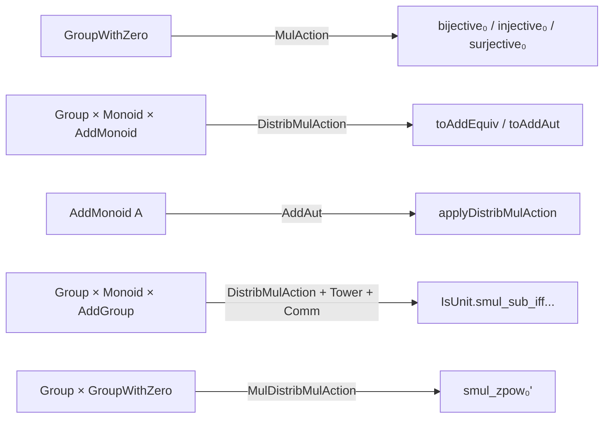

**Technical Brief: Basic.lean — Group Action Definitions and Lemmas**

---

### 1. **Key Definitions & Theorems**

| Name | Type / Signature | Purpose |
|------|------------------|---------|
| `MulAction M α` | `Type u → Type v → Type max u v` | Typeclass for multiplicative monoid/group action on a type; extends `SMul`. |
| `AddAction G P` | `Type u → Type v → Type max u v` | Additive version of `MulAction`; extends `VAdd`. |
| `DistribMulAction G A` | `[Group G] [AddMonoid A] → Prop` | Action of a group $G$ on an additive monoid $A$ preserving addition and zero: $g • (a + b) = g • a + g • b$, $g • 0 = 0$. |
| `SMulCommClass M N α` | `SMul M α → SMul N α → Prop` | Ensures $m • (n • a) = n • (m • a)$ for $m ∈ M, n ∈ N$. |
| `VAddCommClass M N α` | `VAdd M α → VAdd N α → Prop` | Additive counterpart of `SMulCommClass`. |
| `IsScalarTower M N α` | `SMul M N → SMul N α → SMul M α → Prop` | Ensures associativity: $(m • n) • a = m • (n • a)$. |
| `VAddAssocClass M N α` | `VAdd M N → VAdd N α → VAdd M α → Prop` | Additive version of `IsScalarTower`. |
| `IsCentralScalar M α` | `SMul M α → Prop` | Ensures $m • a = a • m$ (i.e., scalars commute with elements). |
| `IsCentralVAdd M N α` | `VAdd M α → Prop` | Additive version of `IsCentralScalar`. |
| `MulAction.bijective₀` | `a ≠ 0 → Bijective (a • ·)` | For `GroupWithZero`, nonzero scalars act bijectively. |
| `MulAction.injective₀`, `MulAction.surjective₀` | `a ≠ 0 → Injective / Surjective (a • ·)` | Immediate corollaries of `bijective₀`. |
| `DistribMulAction.toAddEquiv` | `G → A ≃+ A` | Each group element defines an additive monoid isomorphism. |
| `DistribMulAction.toAddAut` | `G →* AddAut A` | Group homomorphism from $G$ to additive automorphisms of $A$. |
| `AddAut.applyDistribMulAction` | `DistribMulAction (AddAut A) A` | Tautological action of additive automorphisms on the underlying type. |
| `IsUnit.smul_sub_iff_sub_inv_smul` | `IsUnit (r • 1 - a) ↔ IsUnit (1 - r⁻¹ • a)` | Equivalence of invertibility under scalar action, used in ring-theoretic contexts. |
| `smul_zpow₀'` | `g • (x ^ n) = (g • x) ^ n` | Compatibility of scalar multiplication with integer powers in `MulDistribMulAction`. |

---

### 2. **Naming Conventions**

- **Prefixes**:
  - `is_` / `Is`: for properties (e.g., `IsUnit`, `IsScalarTower`, `IsCentralScalar`)
  - `to_`: for canonical constructions (e.g., `toAddEquiv`, `toAddAut`)
  - `smul_`: for scalar-multiplication-related homs (e.g., `smulMonoidWithZeroHom`)
- **Suffixes**:
  - `_₀`: for zero-aware variants (e.g., `bijective₀`, `smul_zpow₀'`)
  - `_hom`, `_equiv`, `_aut`: for morphism, equivalence, automorphism objects
- **Class names**:
  - `MulAction`, `AddAction`, `DistribMulAction`: follow algebraic hierarchy
  - `SMulCommClass`, `VAddCommClass`: commutativity of two scalar actions
  - `IsScalarTower`, `VAddAssocClass`: associativity of nested actions

---

### 3. **Tactic Stack**

Frequently used tactics in this file:

| Tactic | Usage |
|--------|-------|
| `simp` / `simp_rw` | Simplification of `smul`, `vadd`, homomorphism laws |
| `cases n` | Induction-like reasoning on integers (e.g., `zpow`) |
| `rw [← ...]` | Rewriting using equivalences (e.g., `isUnit_smul_iff`) |
| `ext` | Extensionality for functions/automorphisms (e.g., `AddEquiv.ext`) |
| `rfl` | Reflexivity for definitional equalities (e.g., `one_smul`, `mul_smul`) |
| `aesop` | Not present — file avoids heavy automation to stay foundational |
| `apply`, `exact` | Used implicitly in proofs (e.g., via `by` blocks) |

---

### 4. **Proof Logic**

- **Structure**: Mostly direct, definitional reasoning.
- **Common pattern**:
  1. Use `ext` to reduce to element-wise equality.
  2. Apply axioms of `MulAction`, `DistribMulAction`, or `SMul`/`VAdd`.
  3. Simplify using `simp` with `smul_zero`, `smul_add`, `one_smul`, etc.
- **Inductive/recursive reasoning**:
  - For `zpow`, use `cases n` to split into `n ≥ 0` and `n < 0`, then `simp`.
- **Equivalence proofs**:
  - Use `rw [← isUnit_smul_iff ...]` to transform invertibility statements.
- **Homomorphism proofs**:
  - Prove `map_one'` and `map_mul'` separately for `→*` (monoid homs), often via `rfl` or `simp`.

---

### 5. **Imports**

| Import | Purpose |
|--------|---------|
| `Mathlib.Algebra.Group.Action.End` | Endomorphism monoid actions |
| `Mathlib.Algebra.GroupWithZero.Action.Defs` | Definitions of actions for `GroupWithZero` |
| `Mathlib.Algebra.Group.Action.Prod` | Product actions |
| `Mathlib.Algebra.GroupWithZero.Prod` | Product structure for `GroupWithZero` |

> **Note**: Avoids imports from `GroupTheory.GroupAction` to prevent cycles; more advanced lemmas are deferred.

---

### 6. **Mermaid Diagrams**

#### **Dependency Graph (File-level)**

```mermaid
graph TD
  Basic --> GroupActionDefs
  GroupActionDefs -->[imports] GroupWithZero.Action.Defs
  GroupActionDefs -->[imports] Group.Action.End
  GroupActionDefs -->[imports] Group.Action.Prod
  GroupActionDefs -->[imports] GroupWithZero.Prod

  GroupWithZero.Action.Defs --> GroupWithZero.Defs
  Group.Action.End --> Group.End
  Group.Action.Prod --> Group.Prod
  GroupWithZero.Prod --> GroupWithZero.Defs
```

#### **Conceptual Overview (Hierarchy of Actions)**

```mermaid
graph TD
  SMul --> MulAction
  VAdd --> AddAction
  MulAction --> DistribMulAction
  DistribMulAction --> Module[Module (not in this file)]
  
  SMulCommClass --> SMulCommClassHierarchy
  IsScalarTower --> SMulCommClassHierarchy
  IsCentralScalar --> SMulCommClassHierarchy

  MulAction --> MulActionProps
  DistribMulAction --> DistribMulActionProps
  MulActionProps --> Bijective₀
  DistribMulActionProps --> toAddEquiv
  DistribMulActionProps --> toAddAut
```

#### **File-Level Overview**



---

### 7. **Domain-Specific AI Agent Guidance**

- **Focus areas for automation**:
  - Proving `SMulCommClass`, `IsScalarTower`, `IsCentralScalar` via `simp` + `ext`.
  - Deriving injectivity/surjectivity from bijectivity using `bijective₀`.
  - Rewriting invertibility lemmas using `isUnit_smul_iff`.
- **Avoid**:
  - Heavy use of `aesop` or `linarith` — proofs are mostly definitional.
  - Importing `GroupTheory.GroupAction` — keep dependencies minimal.
- **Key lemmas to surface**:
  - `smul_zpow₀'`, `IsUnit.smul_sub_iff_sub_inv_smul`, `toAddEquiv`, `bijective₀`.

--- 

Let me know if you'd like a formalized dependency graph (e.g., in `.lean` format) or a tactic-level trace of a representative proof.
