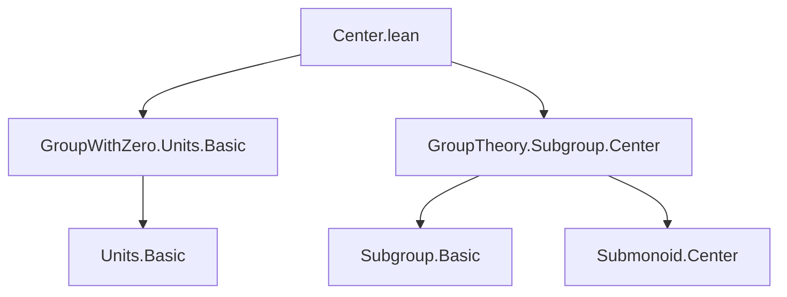
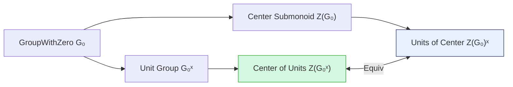

**Technical Brief: `Center.lean` Module**

---

### 1. **Key Definitions & Theorems**

| Name | Type / Signature | Purpose |
|------|------------------|---------|
| `Subgroup.centerUnitsEquivUnitsCenter` | `center G₀ˣ ≃* (Submonoid.center G₀)ˣ` | Establishes a multiplicative equivalence between the center of the unit group of a `GroupWithZero` and the unit group of the center submonoid. This shows the two constructions coincide. |
| `MonoidHom.toHomUnits` | (used internally) | Converts a monoid homomorphism into a homomorphism of unit groups when the codomain is a group. |
| `unitsCenterToCenterUnits` | (used as `invFun`) | The inverse direction of the equivalence; maps a unit in the center to an element in the center of the unit group. |
| `Submonoid.mem_center_iff` | (used in proof) | Characterizes membership in the center of a submonoid: $x \in \text{center}(M) \iff \forall r \in M,\ x \cdot r = r \cdot x$. |
| `Units.mk0` | (used in proof) | Constructs a unit from a nonzero element in a `GroupWithZero`. |

---

### 2. **Naming Conventions**

- **Prefixes / Suffixes**:
  - `center_`: for center-related constructions (`center`, `Submonoid.center`, `centerUnitsEquivUnitsCenter`).
  - `_Equiv_`: for equivalences (`centerUnitsEquivUnitsCenter`).
  - `_to_`: for forward direction of constructions (`toFun` uses `MonoidHom.toHomUnits`).
  - `units_` / `_units`: for unit-related objects (`unitsCenterToCenterUnits`, `G₀ˣ`).
  - `_iff`: for logical characterizations (`mem_center_iff`).

- **Suffixes**:
  - `symm_apply_coe_val`: indicates that the equivalence respects coercion to the underlying type and its inverse.

---

### 3. **Tactic Stack**

- `obtain rfl | hr := eq_or_ne r 0`: case analysis on whether an element is zero or nonzero (standard in `GroupWithZero` contexts).
- `rw [mul_zero, zero_mul]`: simplification using zero-multiplication axioms.
- `congrArg Units.val`: used to lift commutativity from the ambient type to the unit group.
- `rw` and `exact` for straightforward rewrites and completions.
- `simps!` attribute: auto-generates simp lemmas for the equivalence (e.g., `apply_val_coe`, `symm_apply_coe_val`).

No heavy automation (e.g., `aesop`, `ring`, `linarith`) is used—proof is mostly algebraic rewriting and case analysis.

---

### 4. **Proof Logic**

- **Structure**: Construct a multiplicative equivalence by defining:
  1. **Forward direction** (`toFun`):
     - Takes $u \in Z(G₀ˣ)$ (i.e., $u$ is a unit commuting with all units).
     - Shows $u$ commutes with *all* elements of $G₀$ (including zero) using case analysis on $r = 0$ or $r \ne 0$.
     - For $r \ne 0$, $r$ is a unit via `Units.mk0 r hr`, and commutativity follows from $u$ being central in $G₀ˣ$.
  2. **Inverse direction** (`invFun`):
     - Uses `unitsCenterToCenterUnits`, presumably a standard lemma mapping a unit in the center to a central unit.
  3. **Verification**:
     - `map_mul'` is proven by `map_mul _`, indicating it's inherited from the underlying monoid homomorphism.

- **Key idea**: In a `GroupWithZero`, nonzero elements embed into the unit group, so centrality on units extends to centrality on all elements (zero is trivially central).

---

### 5. **Imports**

| Import | Role |
|--------|------|
| `Mathlib.Algebra.GroupWithZero.Units.Basic` | Provides `Units.mk0`, basic facts about units in `GroupWithZero`. |
| `Mathlib.GroupTheory.Subgroup.Center` | Provides `center`, `Submonoid.center`, and `mem_center_iff`. |

These imports define the ambient algebraic structures and basic facts needed.

---

### 6. **Mermaid Diagrams**

#### **Dependency Graph (Module-Level)**

#### **Conceptual Overview (Theory Flow)**

- **Interpretation**: The theorem shows that for a `GroupWithZero`, the two natural ways of defining a “central unit” — (1) units central in the unit group, or (2) units lying in the center of the whole structure — are equivalent.

---

Let me know if you'd like the inverse lemma (`unitsCenterToCenterUnits`) formalized or verified.
