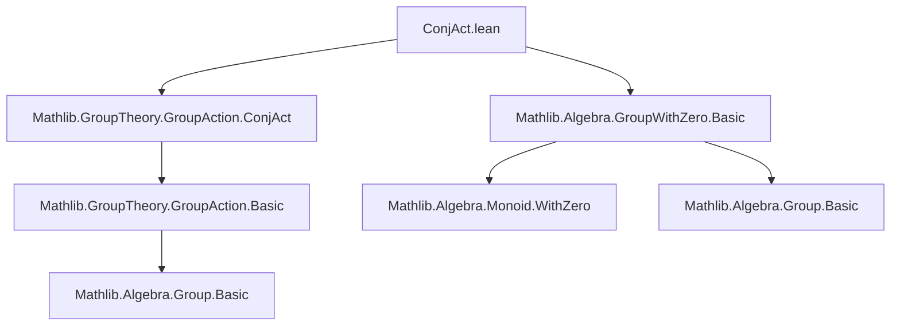

**Technical Brief: `ConjAct.lean` — Conjugation Action of a Group with Zero on Itself**

---

### 1. **Key Definitions & Theorems**

| Name | Type / Signature | Purpose |
|------|------------------|---------|
| `ConjAct G₀` | `Type*` (via `GroupWithZero G₀`) | The *conjugation action* of a `GroupWithZero` on itself; modeled as a type with a `GroupWithZero` structure. |
| `ofConjAct : G₀ → ConjAct G₀` | Function | Embeds an element of `G₀` into its conjugation action representation. |
| `toConjAct : ConjAct G₀ → G₀` | Function | Projects back from the conjugation action to the original type. |
| `instance : GroupWithZero (ConjAct G₀)` | `GroupWithZero (ConjAct G₀)` | Equips the conjugation action type with a `GroupWithZero` structure inherited from `G₀`. |
| `instance mulAction₀` | `MulAction (ConjAct G₀) G₀` | Defines the *left multiplication action* of `ConjAct G₀` on `G₀` via conjugation: $x \cdot g = x * g * x^{-1}$. |
| `instance smulCommClass₀` | `SMulCommClass α (ConjAct G₀) G₀` | Ensures scalar multiplication by `α` commutes with the conjugation action, under assumptions of commutativity and tower law. |
| `instance smulCommClass₀'` | `SMulCommClass (ConjAct G₀) α G₀` | Symmetric version of the above, using `SMulCommClass.symm`. |

**Simp lemmas**:
- `ofConjAct_zero`: `ofConjAct 0 = (0 : G₀)`
- `toConjAct_zero`: `toConjAct (0 : G₀) = 0`

These confirm that the zero element is preserved under the embedding/projection.

---

### 2. **Naming Conventions**

- **Prefixes**:
  - `ofConjAct`, `toConjAct`: Standard “of/to” naming for embeddings/projections between a type and its constructed version.
  - `mulAction₀`, `smulCommClass₀`, `smulCommClass₀'`: Suffix `_₀` indicates usage in the *zero-containing* context (`GroupWithZero`), distinguishing from standard group action versions (e.g., `mulAction` in `GroupAction.lean`).
- **No `is_` or `dist_` prefixes** — this file focuses on *instances* and *lemmas*, not properties like `is_scalar_tower`.

---

### 3. **Tactic Stack**

- `simp`: Dominant tactic, especially with `smul_def`, `mul_assoc`, `mul_smul_comm`, `smul_mul_assoc`.
- `rw`: Used for rewriting using lemmas and assumptions.
- `symm`: Used to flip `SMulCommClass` instances.
- `haveI`: Introduces intermediate instances (e.g., `haveI := SMulCommClass.symm ...`).
- ` rfl`: Used in `@[simp]` lemmas where equality is definitionally equal.

No heavy automation (e.g., `aesop`, `linarith`) — proofs are mostly definitional or rely on algebraic rewrites.

---

### 4. **Proof Logic**

- **Structure**: The file constructs a *new* `GroupWithZero` structure on `ConjAct G₀`, and then defines a `MulAction` of this group on `G₀`.
- **Proof Strategy**:
  1. Use `rfl` for zero lemmas (definitional equality).
  2. For `mulAction₀`, unfold `smul_def` (which defines conjugation action as $x \cdot g = x * g * x⁻¹$), then apply `mul_assoc`.
  3. For `smulCommClass₀`, rewrite both sides using `smul_def`, then apply `mul_smul_comm` and `smul_mul_assoc`.
  4. For `smulCommClass₀'`, reuse symmetry of `SMulCommClass`.

No induction or case analysis — purely algebraic manipulation.

---

### 5. **Imports**

| Import | Purpose |
|--------|---------|
| `Mathlib.Algebra.GroupWithZero.Basic` | Provides `GroupWithZero`, zero, inverses, multiplication, and basic properties. |
| `Mathlib.GroupTheory.GroupAction.ConjAct` | Defines the *abstract* `ConjAct` type and its basic structure (before zero-aware generalization). |

> Note: The file extends `Mathlib.GroupTheory.GroupAction.ConjAct` to the `GroupWithZero` setting.

---

### 6. **Mermaid Diagrams**

#### **Dependency Graph (Module-Level)**



#### **Conceptual Overview (Data Flow)**

```mermaid
flowchart LR
  G₀[GroupWithZero G₀] -->|ConjAct| conj[ConjAct G₀]
  conj -->|GroupWithZero instance| G₀
  conj -->|MulAction₀| G₀
  α[α] -.->|SMul α G₀| G₀
  conj -.->|SMulCommClass₀| α
  α -.->|SMulCommClass₀'| conj
```

#### **Theoretical Context**

- `ConjAct` is a *functorial construction* turning a `GroupWithZero` into another `GroupWithZero` equipped with a canonical action on the original.
- This action models *inner automorphisms* (even in presence of zero, where $0^{-1} = 0$ by convention in `GroupWithZero`).
- The `smulCommClass` instances ensure compatibility with external scalar actions (e.g., ring actions on modules).

---

### 7. **Key Formula**

The conjugation action is defined by:

$$
x \cdot g = x * g * x^{-1}
$$

where $x^{-1}$ is the inverse in `GroupWithZero`, satisfying $0^{-1} = 0$.

The `smul_def` lemma (used implicitly) encodes this as:

```lean
smul_def : ∀ (x : ConjAct G₀) (g : G₀), smul x g = ofConjAct (toConjAct x * g * (toConjAct x)⁻¹)
```

---

### 8. **Summary**

This file formalizes the *conjugation action* of a `GroupWithZero` on itself, extending the standard group-theoretic construction to include zero. It ensures the conjugation type inherits a `GroupWithZero` structure and supports compatible scalar actions. The proofs are lightweight and rely on algebraic simplification, reflecting Lean’s strength in *definitional reasoning* for algebraic structures.
