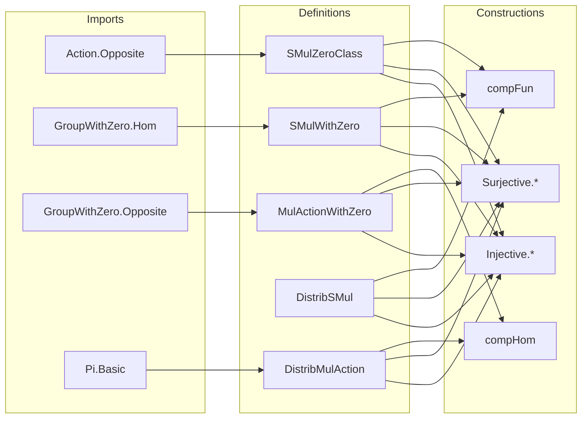

**Technical Brief: Group Action Definitions in Lean 4 (`Defs.lean`)**  
*Based on `mathlib` (Mathematics Library for Lean 4), authored by Chris Hughes & Yury Kudryashov*

---

### 1. KEY DEFINITIONS & THEOREMS

| Name | Type | Purpose |
|------|------|---------|
| `SMulZeroClass` | `class SMulZeroClass (M A : Type*) [Zero A] extends SMul M A` | Scalar multiplication preserves zero: `a • 0 = 0`. |
| `SMulWithZero` | `class SMulWithZero [Zero M₀] [Zero A] extends SMulZeroClass M₀ A` | Scalar multiplication is zero-preserving in *both* arguments: `0 • m = 0` and `a • 0 = 0`. |
| `MulActionWithZero` | `class MulActionWithZero extends MulAction M₀ A` | Extends `MulAction` with compatibility with zero: `r • 0 = 0` and `0 • m = 0`. |
| `DistribSMul` | `class DistribSMul [AddZeroClass A] extends SMulZeroClass M A` | Scalar multiplication distributes over addition: `a • (x + y) = a • x + a • y`. |
| `DistribMulAction` | `class DistribMulAction [Monoid M] [AddMonoid A] extends MulAction M A` | Multiplicative action on an additive monoid that distributes over addition and preserves zero. |
| `MulDistribMulAction` | *Not defined here* — used in `MulDistribMulAction.lean`; assumed imported. |
| `smul_zero` | `∀ a : M, a • (0 : A) = 0` | Core lemma for `SMulZeroClass`. |
| `zero_smul` | `∀ m : A, (0 : M₀) • m = 0` | Core lemma for `SMulWithZero`. |
| `smul_add` | `∀ a x y, a • (x + y) = a • x + a • y` | Distributivity over addition. |
| `one_smul` | `∀ m, (1 : M) • m = m` | Identity action (from `MulAction`). |
| `inv_smul_smul` | `∀ a b, a⁻¹ • (a • b) = b` | Inverse action (from `MulAction`). |
| `smul_eq_zero_iff_eq` | `a • x = 0 ↔ x = 0` (for `Group α`) | Invertible scalars act injectively. |
| `smul_inv₀'` | `g • x⁻¹ = (g • x)⁻¹` | Compatibility of action with inversion in groups with zero. |
| `smul_div₀'` | `g • (x / y) = (g • x) / (g • y)` | Compatibility with division in groups with zero. |

**Key Theorems (Proofs):**
- `smul_ite_zero`, `smul_eq_zero_of_right`, `right_ne_zero_of_smul`, `smul_eq_zero_of_left`, `left_ne_zero_of_smul`: Characterize when scalar multiplication yields zero.
- `ite_zero_smul`, `boole_smul`: Behavior of action on `if-then-else` and `bool`-valued scalars.
- `Pi.single_apply_smul`: Action on `Pi.single` functions.
- `smul_neg`, `smul_sub`: Derived properties for additive groups.
- `smul_inv₀`: Inverse compatibility for `GroupWithZero`.

---

### 2. NAMING CONVENTIONS

| Pattern | Meaning | Examples |
|--------|---------|----------|
| `smul_*` | Properties of scalar multiplication (`•`) | `smul_zero`, `smul_add`, `smul_neg`, `smul_eq_zero_of_left` |
| `zero_*` | Zero preservation in scalar or argument | `zero_smul`, `smul_zero` |
| `*_zero` | Zero-related lemmas (often symmetric) | `smul_zero`, `zero_smul`, `smulWithZero`, `MulActionWithZero` |
| `*_class` | Typeclass names | `SMulZeroClass`, `DistribSMul`, `MulActionWithZero` |
| `comp*` | Composition constructions | `compFun`, `compHom` |
| `Injective.*`, `Surjective.*` | Pullback/pushforward constructions | `Injective.smulZeroClass`, `Surjective.distribSMul` |
| `to*` | Canonical morphism constructions | `toZeroHom`, `toAddMonoidHom`, `toMulAction` |
| `*Hom` | Homomorphism types | `ZeroHom`, `AddMonoidHom`, `MonoidWithZeroHom` |

---

### 3. TACTIC STACK

| Tactic | Usage Frequency | Purpose |
|--------|-----------------|---------|
| `simp` | Very High | Simplify using `@[simp]` lemmas (`smul_zero`, `zero_smul`, etc.) |
| `rw` | High | Rewrite using equalities (e.g., `h.symm ▸ smul_zero a`) |
| `split_ifs` | Medium | Handle `if-then-else` cases |
| `rcases` / `obtain` | Medium | Eliminate existential quantifiers or decidable cases |
| `exact` / `refine` | Medium | Construct proofs by applying lemmas |
| `change` | Low | Rename goal to match lemma type |
| `aesop` | Not used | Not present in this file |
| `ring` | Not used | Not needed (no ring arithmetic) |
| `ext` | Medium | Prove extensionality of homs (via `@[ext]` classes) |
| `by_cases` | Medium | Split on `x = 0` or `c = 0` (common in `GroupWithZero`) |

---

### 4. PROOF LOGIC

**Recurring Proof Strategy:**
1. **Case analysis on zero**: Many proofs split on whether a scalar or argument is zero (`eq_or_ne c 0`, `eq_or_ne x 0`).
2. **Use of injectivity/surjectivity**: For pullback/pushforward constructions, injective/surjective maps are used to transport structure via:
   - `hf (by simp [smul])` (injective case)
   - `rcases hf m with ⟨x, rfl⟩` (surjective case)
3. **Homomorphism properties**: Maps like `f : ZeroHom A B`, `f : B →+ A`, or `f : M₀ →*₀ M₀` are used to preserve structure.
4. **Simp + rewrite chains**: Most proofs are short and rely on `simp` with `@[simp]` lemmas and `rw` for key equalities.
5. **Leverage existing instances**: E.g., `MulActionWithZero.toSMulWithZero`, `DistribMulAction.toDistribSMul`.

**Typical proof skeleton:**
```lean
lemma ... := by
  by_cases hc : c = 0 <;> by_cases hx : x = 0 <;> simp [*]
```
or
```lean
hf <| by simp only [smul, map_zero, smul_zero]
```

---

### 5. IMPORTS (Dependencies)

| Module | Purpose |
|--------|---------|
| `Mathlib.Algebra.Group.Action.Opposite` | Opposite action constructions (`Mᵐᵒᵖ`) |
| `Mathlib.Algebra.GroupWithZero.Hom` | Homomorphisms for groups with zero (`→*₀`) |
| `Mathlib.Algebra.GroupWithZero.Opposite` | Opposite group with zero |
| `Mathlib.Algebra.Notation.Pi.Basic` | `Pi.single`, `Pi.apply`, etc., for dependent functions |

**No imports from `GroupTheory.GroupAction`** — this file avoids circular dependencies.

---

### 6. HIERARCHY & RELATIONSHIPS

#### Typeclass Hierarchy (simplified)

```
SMul M A
│
├─ SMulZeroClass [Zero A]      -- preserves 0 on right
│   │
│   └─ DistribSMul [AddZeroClass A]   -- + preserves
│       │
│       └─ DistribMulAction [Monoid M] [AddMonoid A]  -- + MulAction
│
└─ SMulWithZero [Zero M₀] [Zero A]   -- preserves 0 on both sides
    │
    ├─ MulActionWithZero [MonoidWithZero M₀] [Zero A]  -- + MulAction + 1 compatibility
    │
    └─ (extends to Module over rings)
```

#### Homomorphism Constructions

- `SMulZeroClass.toZeroHom`: `x ↦ (x • ·)` is a zero-preserving map.
- `DistribSMul.toAddMonoidHom`: `x ↦ (x • ·)` is an additive monoid hom.
- `DistribMulAction.toAddMonoidEnd`: `M →* AddMonoid.End A`.

#### Pullback / Pushforward

- **Injective zero-preserving `f : B → A`** ⇒ `SMul M A` ⇒ `SMul M B`
- **Surjective zero-preserving `f : A → B`** ⇒ `SMul M A` ⇒ `SMul M B`

Same for `SMulWithZero`, `MulActionWithZero`, `DistribSMul`, `DistribMulAction`.

---

### 7. MERMAID DIAGRAMS

#### Dependency Graph (Top-Level)

```mermaid
graph TD
  A[SMul M A] --> B[SMulZeroClass]
  A --> C[SMulWithZero]
  B --> D[DistribSMul]
  C --> E[MulActionWithZero]
  D --> F[DistribMulAction]
  E --> F
  F --> G[Module (elsewhere)]
  
  H[ZeroHom A B] -->|Injective| B
  H -->|Surjective| B
  I[AddMonoidHom A B] -->|Injective| D
  I -->|Surjective| D
  J[MonoidWithZeroHom M₀' M₀] -->|compHom| E
```

#### File Overview



---

### 8. SUMMARY

This file establishes the foundational **typeclass hierarchy for group actions preserving zero and addition**, forming the basis for modules, representations, and cohomology. It avoids higher-level group-theoretic results to prevent import cycles, focusing on *structural transport* (via injective/surjective maps) and *compatibility with zero*. The naming and proof patterns are highly systematic, enabling automation and reuse in downstream developments like `Module`, `RepresentationTheory`, and `GroupCohomology`.
