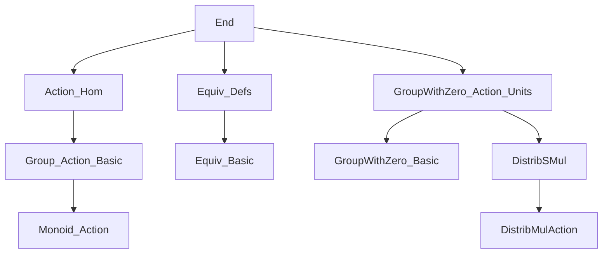
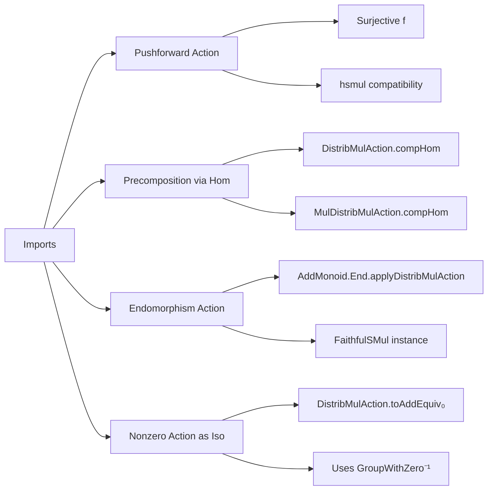

**Technical Brief: `End.lean` — Group Actions and (Endo)morphisms**

---

### 1. **Key Definitions & Theorems**

| Name | Type / Signature | Purpose |
|------|------------------|---------|
| `Function.Surjective.distribMulActionLeft` | `{R S M : Type*} [Monoid R] [AddMonoid M] [DistribMulAction R M] [Monoid S] [SMul S M] → (f : R →* S) → Function.Surjective f → (∀ c x, f c • x = c • x) → DistribMulAction S M` | Pushes forward a `DistribMulAction` along a surjective monoid homomorphism preserving the action. |
| `DistribMulAction.compHom` | `[Monoid N] → (f : N →* M) → DistribMulAction N A` | Precomposes a `DistribMulAction` of `M` on `A` with a monoid homomorphism `f : N → M`. |
| `MulDistribMulAction.compHom` | `[Monoid N] → (f : N →* M) → MulDistribMulAction N A` | Same as above, but for `MulDistribMulAction`. |
| `AddMonoid.End.applyDistribMulAction` | `[AddMonoid α] → DistribMulAction (AddMonoid.End α) α` | Tautological action of additive endomorphisms on the underlying type. Generalizes `Function.End.applyMulAction`. |
| `AddMonoid.End.smul_def` | `(f : AddMonoid.End α) → (a : α) → f • a = f a` | Justifies the action definition: `f • a = f a`. |
| `AddMonoid.End.applyFaithfulSMul` | `[AddMonoid α] → FaithfulSMul (AddMonoid.End α) α` | Shows the action is faithful: distinct endomorphisms act differently. |
| `DistribMulAction.toAddEquiv₀` | `[GroupWithZero α] [AddMonoid β] [DistribMulAction α β] → (x : α) → x ≠ 0 → β ≃+ β` | For nonzero `x` in a `GroupWithZero`, the action by `x` is an additive monoid isomorphism (stronger than `DistribSMul.toAddMonoidHom`). |

---

### 2. **Naming Conventions**

- **Prefixes**:
  - `compHom`: indicates precomposition with a homomorphism.
  - `apply`: as in `applyDistribMulAction`, `applyFaithfulSMul` — action via evaluation.
  - `toAddEquiv₀`: conversion to an additive equivalence, with `₀` indicating dependence on nonzerohood (for `GroupWithZero`).
- **Suffixes**:
  - `₀`: used to denote variants that require nonvanishing (e.g., `toAddEquiv₀`).
  - `Left`: as in `distribMulActionLeft`, `mulActionLeft` — indicates action is induced on the *left* via surjection or homomorphism.

---

### 3. **Tactic Stack**

- `rfl`: used in definitions and proofs where equality is definitional (e.g., `smul_def`, `one_smul`, `mul_smul`).
- `aesop`: likely used in background automation (not explicit in this snippet, but standard in Mathlib).
- `simp_rw`: implied by `@[simp]` attribute on `smul_def`.
- `AddMonoidHom.ext`: used in proof of faithfulness — extensionality for additive monoid homs.
- `inv_smul_smul₀`, `smul_inv_smul₀`: lemmas from `GroupWithZero` theory used in `toAddEquiv₀`.

---

### 4. **Proof Logic**

- **Definitional proofs**: Most properties (e.g., `one_smul`, `mul_smul`, `smul_def`) are immediate from definitions (`rfl`).
- **Faithfulness**: Proven by extensionality of additive monoid homs (`AddMonoidHom.ext`).
- **Isomorphism construction (`toAddEquiv₀`)**:
  - Define inverse as multiplication by `x⁻¹`.
  - Verify left/right inverses using `inv_smul_smul₀` and `smul_inv_smul₀`, which require `x ≠ 0`.
- **Precomposition (`compHom`)**:
  - Uses `DistribSMul.compFun` / `MulAction.compHom`.
  - Verifies remaining axioms (`smul_one`, `smul_mul`) by pulling back along `f`.

---

### 5. **Imports**

| Module | Purpose |
|--------|---------|
| `Mathlib.Algebra.Group.Action.Hom` | Homomorphisms of group actions, `compHom`, etc. |
| `Mathlib.Algebra.Group.Equiv.Defs` | Definitions of equivalences (`≃`), used in `toAddEquiv₀`. |
| `Mathlib.Algebra.GroupWithZero.Action.Units` | Action of units/nonzero elements in `GroupWithZero`; lemmas like `inv_smul_smul₀`. |

---

### 8. **Mermaid Diagrams**

#### **Dependency Graph (Module-Level)**

#### **Overview of `End.lean`**

---

**Summary**: This file formalizes how group (and monoid) actions interact with homomorphisms and endomorphisms. It provides mechanisms to *push forward* actions along surjections, *precompose* actions with homomorphisms, and identify the *tautological action* of endomorphisms — plus a key result that nonzero elements of a `GroupWithZero` act as additive isomorphisms. The proofs rely heavily on definitional equality and standard extensionality principles.
