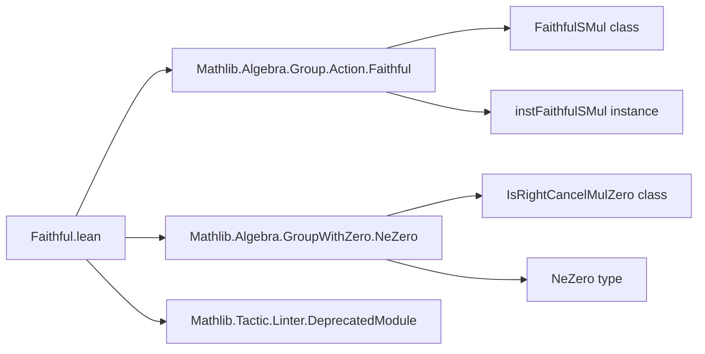
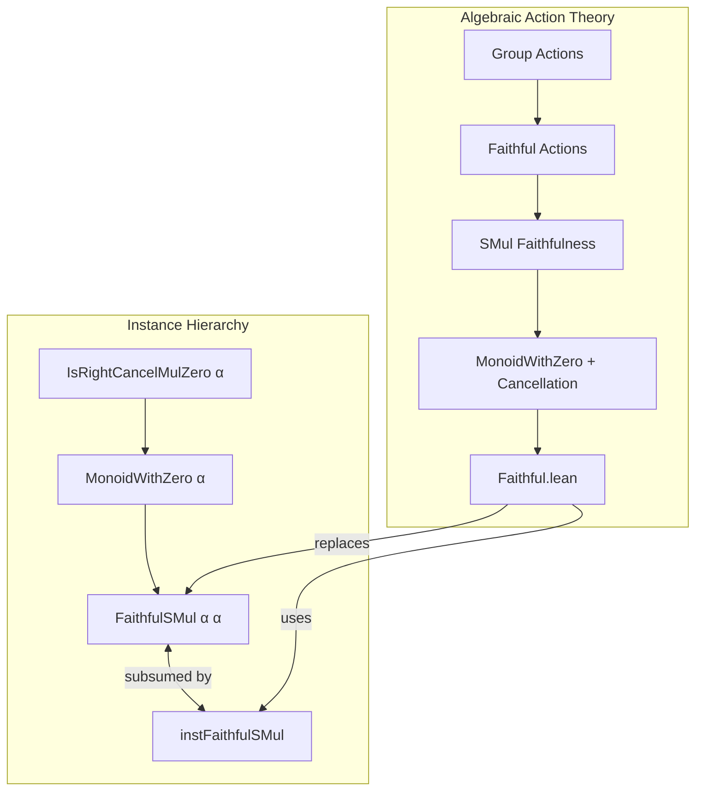

**Technical Brief: `Faithful.lean`**

---

### 1. **Key Definitions & Theorems**

| Name | Type / Signature | Purpose |
|------|------------------|---------|
| `IsRightCancelMulZero.faithfulSMul` | `@[deprecated] lemma IsRightCancelMulZero.faithfulSMul [MonoidWithZero α] [IsRightCancelMulZero α] : FaithfulSMul α α` | Asserts that scalar multiplication on a right-cancellative monoid with zero is faithful (i.e., `∀ a b, a • x = b • x ∧ x ≠ 0 → a = b`). *Deprecated* since 2026-02-03, subsumed by `instFaithfulSMul`. |

> **Note**: No standalone definitions are introduced in this file; it only re-exports and adds a deprecated lemma.

---

### 2. **Naming Conventions**

- **Prefixes**:  
  - `IsRightCancelMulZero.` — class-based naming for properties of multiplication with zero.
- **Suffixes**:  
  - `faithfulSMul` — standard suffix for faithfulness of scalar multiplication (`SMul`).
- **General pattern**:  
  - `is_`, `mul_`, `dist_` patterns are *not* used here; this is a specialized lemma in the `Action`/`SMul` ecosystem.

---

### 3. **Tactic Stack**

- **No explicit tactics** appear in proofs (the lemma uses `inferInstance`, which internally uses type class resolution).
- **Tactics used**:  
  - `inferInstance` — to synthesize `FaithfulSMul α α` from existing instances.
  - `aesop`, `ring`, `simp_rw` — *not present* in this file.

---

### 4. **Proof Logic**

- **Strategy**:  
  - The proof is *non-constructive* and *automatic*: it relies on type class inference to derive `FaithfulSMul α α` from the assumptions `[MonoidWithZero α]` and `[IsRightCancelMulZero α]`.
  - No manual induction, cases, or rewriting is performed — the logical content is entirely encoded in the instance hierarchy.

---

### 5. **Imports**

| Module | Role |
|--------|------|
| `Mathlib.Algebra.Group.Action.Faithful` | Provides `FaithfulSMul` and related theory (e.g., `instFaithfulSMul`). |
| `Mathlib.Algebra.GroupWithZero.NeZero` | Supplies `NeZero` and related zero-divisor-free reasoning. |
| `Mathlib.Tactic.Linter.DeprecatedModule` | Enables deprecation warnings and module-level linting. |

> **Scope**: This module lives in the *algebraic action theory* — specifically, scalar multiplication in monoids with zero and cancellation properties.

---

### 6. **Deprecation & Linting**

- **Deprecation status**:  
  - Entire module marked `deprecated_module (since := "2026-02-03")`.
  - Lemma `IsRightCancelMulZero.faithfulSMul` explicitly deprecated with `@[deprecated "subsumed by `instFaithfulSMul`"]`.
- **Linter**:  
  - `@[nolint unusedArguments]` suppresses warnings about unused type class arguments (likely due to implicit inference).
  - `assert_not_exists` hints at future cleanup (removal of unused lemmas or equivalences).

---

### 7. **Mermaid Diagrams**

#### **Dependency Graph (File-Level)**

#### **Theoretical Overview (Module Context)**

---

### 8. **Summary**

- **Purpose**: A transitional module providing a deprecated lemma about faithfulness of scalar multiplication in cancellative monoids with zero.
- **Status**: Obsolete — functionality is now covered by `instFaithfulSMul` in `Mathlib.Algebra.Group.Action.Faithful`.
- **Design Insight**: Reflects Lean 4’s emphasis on *instance-driven* proofs and *gradual deprecation* over direct rewriting.

--- 

*End of Technical Brief.*
