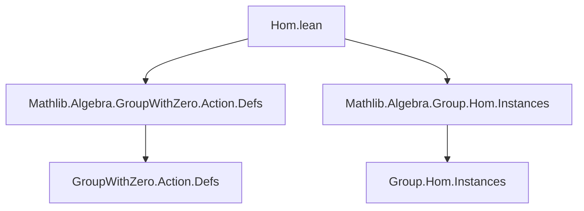
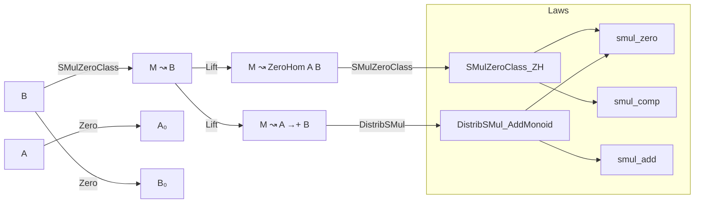
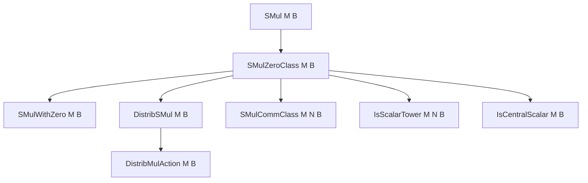

**Technical Brief: `Hom.lean` — Zero-Related `•` Instances on Group-Like Morphisms**

---

### 1. **Key Definitions & Theorems**

| Name | Type / Signature | Purpose |
|------|------------------|---------|
| `ZeroHom` | `structure ZeroHom (A B : Type*) [Zero A] [Zero B]` | Morphisms preserving zero (i.e., $f(0) = 0$) |
| `AddMonoidHom` | `structure AddMonoidHom (A B : Type*) [AddZeroClass A] [AddZeroClass B]` | Additive monoid homomorphisms (i.e., $f(a + b) = f(a) + f(b)$, $f(0) = 0$) |
| `SMulZeroClass` | `class SMulZeroClass (M : Type*) (B : Type*) [Zero B] [SMul M B]` | Ensures $r • 0 = 0$ for all $r : M$ |
| `DistribSMul` | `class DistribSMul (M : Type*) (B : Type*) [AddZeroClass B] [SMul M B]` | Ensures $r • (a + b) = r • a + r • b$ and $r • 0 = 0$ |
| `SMulWithZero`, `MulActionWithZero`, `DistribMulAction` | Classes encoding scalar multiplication with zero compatibility and action laws | Generalize scalar actions to structures with zero |
| `instance [SMulZeroClass M B] : SMulZeroClass M (ZeroHom A B)` | Defines scalar multiplication on zero-preserving maps | Lifts scalar action from codomain to hom-space |
| `instance [DistribSMul M B] : SMulZeroClass M (A →+ B)` | Lifts scalar action to additive monoid homs | Ensures scalar multiplication respects addition and zero |
| `smul_apply` | `(m • f) a = m • f a` | Coherence of scalar multiplication with pointwise action |
| `smul_comp` | `(m • g).comp f = m • g.comp f` | Scalar multiplication commutes with composition |
| `smul_comm`, `smul_assoc`, `op_smul_eq_smul` | Various compatibility laws for scalar actions | Ensure hom-space inherits scalar algebraic structure |

---

### 2. **Naming Conventions**

- **Prefixes**:
  - `smul_`: scalar multiplication on homs (`smul_apply`, `smul_comp`, `smul_zero`, etc.)
  - `coe_`: coercion lemmas (`coe_smul`)
  - `op_`: for opposite/central scalar actions (`op_smul_eq_smul`)
- **Suffixes**:
  - `_apply`: action on pointwise evaluation
  - `_comp`: interaction with composition
  - `_zero`: behavior at zero
- **Class names**:
  - `SMulZeroClass`, `DistribSMul`, `SMulCommClass`, `IsScalarTower`, `IsCentralScalar`, `SMulWithZero`, `MulActionWithZero`, `DistribMulAction`

---

### 3. **Tactic Stack**

- `simp only [map_zero, smul_zero]`: used repeatedly to prove `map_zero'` in instance definitions.
- `ext fun _ => ...`: standard extensionality for homs (functional extensionality + homomorphism property).
- `rfl`: used for definitional equalities (e.g., `coe_smul`, `smul_apply`, `smul_comp`).
- `inferInstance`: to reuse existing instances (e.g., `SMulWithZero` from `SMulZeroClass`).
- `by simp only [map_add, smul_add]`: for additive homs, to verify additivity of scalar multiplication.

---

### 4. **Proof Logic**

- **Pattern**: For each scalar algebraic structure on $B$, lift it to the hom-space:
  1. Define scalar multiplication pointwise: $(r • f)(a) := r • f(a)$.
  2. Prove the resulting function preserves the homomorphism property (e.g., `map_zero'`, `map_add'`).
  3. Use `ext` + `simp` to verify algebraic laws (e.g., `smul_zero`, `smul_add`, `smul_comp`) hold pointwise.
  4. For class instances, reuse existing instances via `inferInstance` where possible.

- **Induction**: Not used — proofs are purely equational and rely on extensionality and simplification.

---

### 5. **Imports**

- `Mathlib.Algebra.GroupWithZero.Action.Defs`: defines scalar actions with zero (e.g., `SMulWithZero`, `MulActionWithZero`).
- `Mathlib.Algebra.Group.Hom.Instances`: provides foundational homomorphism instances (e.g., `AddMonoidHom`, `ZeroHom`).

---

### 6. **Mermaid Diagrams**

#### **Dependency Graph (Module-Level)**

#### **Theory Overview (Hom-Space Scalar Lifting)**

#### **Class Hierarchy (Scalar Actions)**

---

### 7. **Domain Summary**

This file formalizes how scalar multiplication (with zero compatibility) on a codomain $B$ lifts to:
- **Zero-preserving maps** (`ZeroHom A B`)
- **Additive monoid homomorphisms** (`A →+ B`)

It ensures that standard algebraic structures on scalars (`SMul`, `SMulWithZero`, `MulActionWithZero`, `DistribMulAction`, etc.) induce corresponding structures on hom-spaces, preserving composition, addition, and zero. This is foundational for module-like structures on hom-objects in algebraic settings (e.g., modules over rigs, group representations with zero).

--- 

Let me know if you'd like a formalization roadmap or a comparison with `Module.Hom`.
