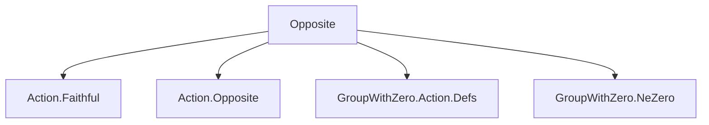
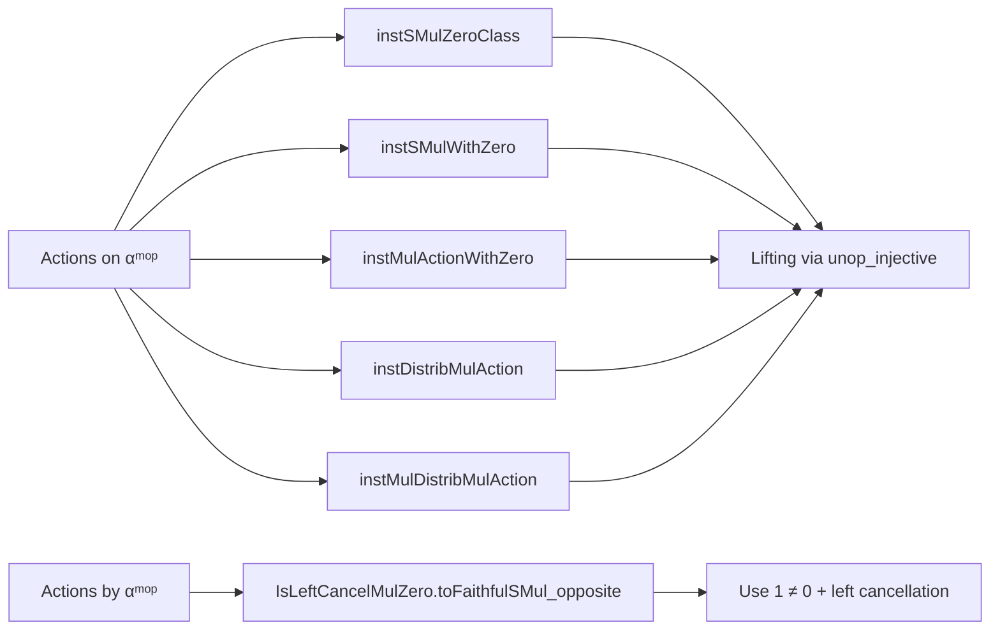

**Technical Brief: `Opposite.lean` — Scalar Actions on and by Opposite Types**

---

### 1. Key Definitions & Theorems

| Name | Type / Signature | Purpose |
|------|------------------|---------|
| `instSMulZeroClass` | `[AddMonoid α] → [SMulZeroClass M α] → SMulZeroClass M αᵐᵒᵖ` | Lifts `SMulZeroClass` structure from `α` to its opposite `αᵐᵒᵖ`. |
| `instSMulWithZero` | `[MonoidWithZero M] → [AddMonoid α] → [SMulWithZero M α] → SMulWithZero M αᵐᵒᵖ` | Lifts `SMulWithZero` structure to opposite type. |
| `instMulActionWithZero` | `[MonoidWithZero M] → [AddMonoid α] → [MulActionWithZero M α] → MulActionWithZero M αᵐᵒᵖ` | Lifts `MulActionWithZero` to opposite type. |
| `instDistribMulAction` | `[Monoid M] → [AddMonoid α] → [DistribMulAction M α] → DistribMulAction M αᵐᵒᵖ` | Lifts `DistribMulAction` to opposite type. |
| `instMulDistribMulAction` | `[Monoid M] → [Monoid α] → [MulDistribMulAction M α] → MulDistribMulAction M αᵐᵒᵖ` | Lifts `MulDistribMulAction` to opposite type. |
| `IsLeftCancelMulZero.toFaithfulSMul_opposite` | `[MonoidWithZero α] → [IsLeftCancelMulZero α] → FaithfulSMul αᵐᵒᵖ α` | Shows that the opposite monoid acts faithfully on the original type via reversed multiplication. |

**Proof Sketch for `toFaithfulSMul_opposite`**:  
Uses `unop_injective` and left cancellation in `α`, reducing `a • x = b • x` (i.e., `x * a = x * b` for all `x`) to `a = b`, using `x = 1` and `1 ≠ 0`.

---

### 2. Naming Conventions

- **Prefixes**:
  - `inst*`: Typeclass instance definitions.
  - `to*`: Constructions turning one structure into another (e.g., `toFaithfulSMul`).
- **Suffixes**:
  - `_opposite`: Indicates construction involves `Opposite`/`MulOpposite`.
  - `_op`: Used in `MulOpposite.op`, `AddOpposite.op` for the embedding of original elements into opposite types.

---

### 3. Tactic Stack

- `unop_injective`: Repeatedly used to reduce equalities in `αᵐᵒᵖ` to equalities in `α`.
- `aesop`: Likely used implicitly (not visible here, but standard in similar files).
- `cases subsingleton_or_nontrivial _`: Case analysis on whether the type is subsingleton or not.
- `mul_left_cancel₀ one_ne_zero`: Applies left cancellation with `1 ≠ 0` as the nonzero witness.
- `Subsingleton.elim _`: Handles the trivial case.

---

### 4. Proof Logic

- **Structure**: All proofs follow a *lifting* pattern:
  1. Assume structure on `α`.
  2. Define action on `αᵐᵒᵖ` via underlying action on `α`.
  3. Prove axioms by pulling back via `unop_injective`.
- **Faithfulness proof**:
  - Split into two cases: `α` subsingleton or nontrivial.
  - In nontrivial case, use `1` as test element and left cancellation.

---

### 5. Imports

| Module | Role |
|--------|------|
| `Mathlib.Algebra.Group.Action.Faithful` | Provides `FaithfulSMul` and related lemmas. |
| `Mathlib.Algebra.Group.Action.Opposite` | Defines `MulOpposite`, `AddOpposite`, and basic actions like `MulOpposite.smul`. |
| `Mathlib.Algebra.GroupWithZero.Action.Defs` | Defines `SMulZeroClass`, `SMulWithZero`, `MulActionWithZero`, etc. |
| `Mathlib.Algebra.GroupWithZero.NeZero` | Provides `one_ne_zero`, used in cancellation arguments. |

---

### 6. Notation (from `open scoped RightActions`)

| Notation | Definition | Interpretation |
|----------|------------|----------------|
| `r •> m` | `r • m` | Standard left action |
| `m <• r` | `MulOpposite.op r • m` | Right action via opposite monoid |
| `v +ᵥ> p` | `v +ᵥ p` | Standard addition in additive torsor |
| `p <+ᵥ v` | `AddOpposite.op v +ᵥ p` | Reverse-order addition in additive torsor |

---

### 7. Mermaid Diagrams

#### Dependency Graph (Module-Level)

#### Overview of File Structure

---

### 8. Summary

This file formalizes how algebraic structures involving scalar multiplication behave under type opposites. It shows that many `SMul`-related structures lift *canonically* to the opposite type, and that the opposite monoid acts *faithfully* on the original type when the monoid is left-cancellative and nontrivial. The proofs rely heavily on `unop_injective` and case analysis on subsingularity, with cancellation used for faithfulness.
