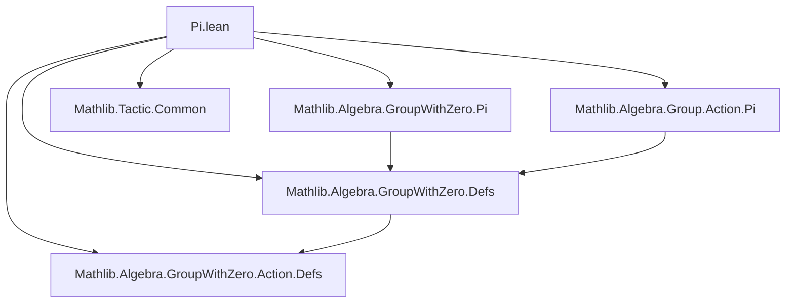
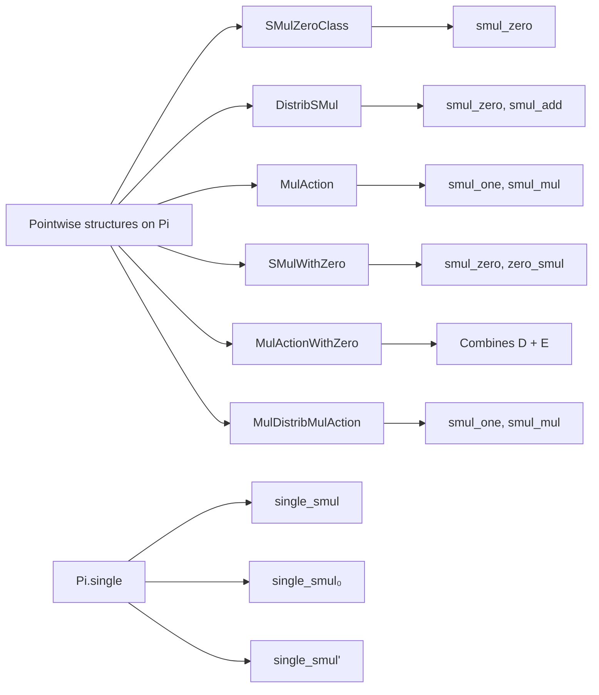
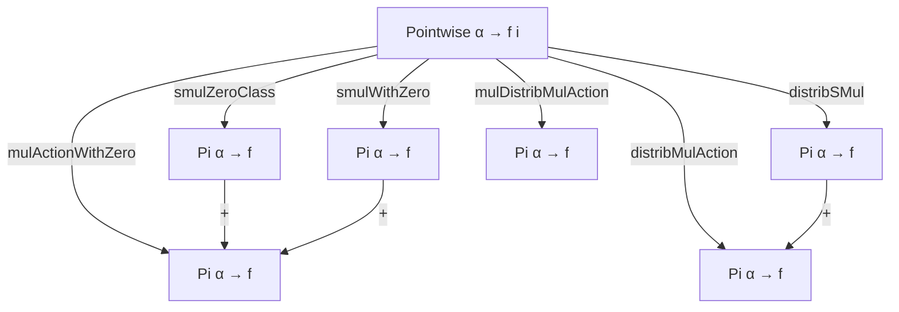

### Technical Brief: `Pi.lean` — Pi Instances for Multiplicative Actions with Zero

---

#### **1. Key Definitions & Theorems**

| Name | Type / Structure | Purpose |
|------|------------------|---------|
| `smulZeroClass` | `@SMulZeroClass α (∀ i, f i)` | Lifts `SMulZeroClass` to dependent function spaces (`Pi` types). |
| `smulZeroClass'` | `@SMulZeroClass (∀ i, f i) (∀ i, g i)` | Lifts `SMulZeroClass` in the *codomain* direction (i.e., between `Pi` types). |
| `distribSMul` | `@DistribSMul α (∀ i, f i)` | Ensures scalar multiplication distributes over addition in `Pi` types. |
| `distribSMul'` | `@DistribSMul (∀ i, f i) (∀ i, g i)` | Same as `distribSMul`, but for codomain-wise actions. |
| `distribMulAction` | `@DistribMulAction α (∀ i, f i)` | Constructs a `DistribMulAction` on `Pi` from pointwise `DistribMulAction`s. |
| `distribMulAction'` | `@DistribMulAction (∀ i, f i) (∀ i, g i)` | Codomain-wise version of `distribMulAction`. |
| `smulWithZero` | `SMulWithZero α (∀ i, f i)` | Extends `SMulWithZero` to `Pi` types with zero. |
| `smulWithZero'` | `SMulWithZero (∀ i, g i) (∀ i, f i)` | Codomain-wise `SMulWithZero` instance. |
| `mulActionWithZero` | `MulActionWithZero α (∀ i, f i)` | Combines `MulAction` and `SMulWithZero` to get `MulActionWithZero`. |
| `mulActionWithZero'` | `MulActionWithZero (∀ i, g i) (∀ i, f i)` | Codomain-wise `MulActionWithZero`. |
| `single_smul` | `single i (r • x) = r • single i x` | Compatibility of scalar multiplication with `Pi.single`. |
| `single_smul'` | Specialization of `single_smul` for non-dependent `Pi`. | Useful when Lean struggles with typeclass inference on dependent `Pi`. |
| `single_smul₀` | `single i (r • x) = single i r • single i x` | Compatibility of scalar multiplication with `single` when both scalar and vector live in `Pi`-types. |
| `mulDistribMulAction` | `@MulDistribMulAction α (∀ i, f i)` | Lifts `MulDistribMulAction` to `Pi` types (preserves multiplication and unit). |
| `mulDistribMulAction'` | `@MulDistribMulAction (∀ i, f i) (∀ i, g i)` | Codomain-wise version of `mulDistribMulAction`. |

---

#### **2. Naming Conventions**

- **Prefixes**:
  - `smulZeroClass`, `distribSMul`, `smulWithZero`, `mulActionWithZero`, `mulDistribMulAction`: follow Lean’s naming for algebraic structures (`MulAction`, `DistribMulAction`, etc.).
  - `'` suffix (e.g., `smulZeroClass'`, `distribSMul'`, `mulActionWithZero'`) indicates *codomain-wise* lifting (i.e., action on `Pi g` from `Pi f`).
- **`single_` prefix**: for lemmas about `Pi.single`, e.g., `single_smul`, `single_smul₀`.
- **`₀` suffix**: indicates usage in *zero-containing* contexts (e.g., `single_smul₀` handles `MonoidWithZero` scalars).

---

#### **3. Tactic Stack**

- `funext`: used repeatedly to extend pointwise equalities to function equality.
- `ext`: used in `smulZeroClass'`, `distribSMul'`, `mulDistribMulAction'` to prove function extensionality.
- `exact`: used to apply known lemmas like `smul_zero`, `smul_add`, `zero_smul`, `smul_one`, `smul_mul'`.
- `intros`: used before `ext` to introduce hypotheses.
- `apply`: used in `mulDistribMulAction'` to apply lemmas like `smul_mul'`, `smul_one`.

No heavy automation (e.g., `aesop`, `ring`, `simp`) is used—proofs are mostly direct and rely on unfolding definitions and applying pointwise lemmas.

---

#### **4. Proof Logic**

- **Pattern**: Most proofs follow a *pointwise lifting* strategy:
  1. Define the instance using existing `Pi`-level operations (`Pi.instSMul`, `Pi.mulAction`, etc.).
  2. Prove required axioms by:
     - Introducing arbitrary inputs (`intros`).
     - Extending to function equality (`ext` or `funext`).
     - Applying the corresponding pointwise lemma (e.g., `smul_zero`, `smul_add`).
- **Induction**: Not used—this is purely algebraic lifting, no structural induction.
- **Case analysis**: Only `DecidableEq I` is used in `single_*` lemmas, but no explicit case splitting—`single_op`/`single_op₂` handle the logic.

---

#### **5. Imports**

| Module | Role |
|--------|------|
| `Mathlib.Algebra.Group.Action.Pi` | Provides basic `Pi` instances for `MulAction`, `DistribMulAction`, etc. |
| `Mathlib.Algebra.GroupWithZero.Action.Defs` | Defines `MulActionWithZero`, `SMulWithZero`, etc. |
| `Mathlib.Algebra.GroupWithZero.Defs` | Core definitions for `MonoidWithZero`, `AddMonoidWithZero`, etc. |
| `Mathlib.Algebra.GroupWithZero.Pi` | Provides `Pi.monoid`, `Pi.addMonoid`, etc., for `Pi` types. |
| `Mathlib.Tactic.Common` | Provides common tactics like `funext`, `ext`. |

---

#### **8. Mermaid Diagrams**

##### **Dependency Graph (Module-Level)**

##### **Overview of Theory Flow**

##### **Instance Lifting Hierarchy**

---

This file is a *mechanical but essential* algebraic infrastructure component: it ensures that all standard action-like structures (`SMul`, `DistribSMul`, `MulAction`, `MulActionWithZero`, etc.) behave well under dependent product (`Pi`) constructions—crucial for reasoning about vector-valued functions, product groups, and module-valued families in formalized mathematics.
