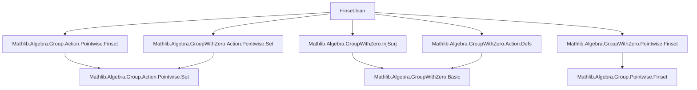

### Technical Brief: `Finset.lean` — Pointwise Operations on Finsets in a Group with Zero

---

#### **1. Key Definitions & Theorems**

| Name | Type / Signature | Purpose |
|------|------------------|---------|
| `Finset.smulZeroClass` | `[Zero β] [SMulZeroClass α β] → SMulZeroClass α (Finset β)` | Lifts scalar multiplication preserving zero from `α × β → β` to `α × Finset β → Finset β`. |
| `Finset.distribSMul` | `[AddZeroClass β] [DistribSMul α β] → DistribSMul α (Finset β)` | Lifts distributivity of scalar multiplication over addition to finsets. |
| `Finset.distribMulAction` | `[Monoid α] [AddMonoid β] [DistribMulAction α β] → DistribMulAction α (Finset β)` | Lifts distributive multiplicative action to finsets. |
| `Finset.mulDistribMulAction` | `[Monoid α] [Monoid β] [MulDistribMulAction α β] → MulDistribMulAction α (Finset β)` | Lifts multiplicative distributive action to finsets. |
| `Finset.NoZeroDivisors` | `[DecidableEq α] [Zero α] [Mul α] [NoZeroDivisors α] → NoZeroDivisors (Finset α)` | Proves finset multiplication inherits no zero divisors from underlying type. |
| `smul_zero_subset` | `s • (0 : Finset β) ⊆ (0 : Finset β)` | Scalar multiplication of zero finset is contained in zero. |
| `Nonempty.smul_zero` | `s.Nonempty → s • 0 = 0` | If `s` is nonempty, scalar multiplication of zero gives zero. |
| `zero_mem_smul_finset` | `(0 : β) ∈ t → (0 : β) ∈ a • t` | Zero is preserved under scalar multiplication if present in target. |
| `zero_smul_subset` | `(0 : Finset α) • t ⊆ 0` | Zero finset acting on any `t` yields subset of zero. |
| `Nonempty.zero_smul` | `t.Nonempty → (0 : Finset α) • t = 0` | If `t` nonempty, zero finset acting on it yields zero. |
| `zero_smul_finset` | `s.Nonempty → (0 : α) • s = (0 : Finset β)` | Scalar zero acting on nonempty finset yields singleton `{0}`. |
| `smul_mem_smul_finset_iff₀` | `a ≠ 0 → a • b ∈ a • s ↔ b ∈ s` | Invertible scalar multiplication preserves membership. |
| `inv_smul_mem_iff₀` | `a ≠ 0 → a⁻¹ • b ∈ s ↔ b ∈ a • s` | Inverse scalar action characterizes preimage. |
| `mem_inv_smul_finset_iff₀` | `a ≠ 0 → b ∈ a⁻¹ • s ↔ a • b ∈ s` | Dual to above. |
| `smul_finset_subset_smul_finset_iff₀` | `a ≠ 0 → a • s ⊆ a • t ↔ s ⊆ t` | Injectivity of scalar multiplication on finsets. |
| `smul_finset_inter₀`, `smul_finset_sdiff₀`, `smul_finset_symmDiff₀` | `a ≠ 0 →` distributes over `∩`, `\`, `∆` | Scalar multiplication preserves set operations when scalar ≠ 0. |
| `smul_finset_univ₀`, `smul_univ₀`, `smul_univ₀'` | Under `Fintype β`, scalar multiplication of universal finset yields universal finset under nontriviality/nonzero conditions. |
| `inv_smul_finset_distrib₀` | `(a • s)⁻¹ = s⁻¹ <• a⁻¹` | Inverse of scaled finset equals inverse scaled by inverse scalar (right action). |
| `inv_op_smul_finset_distrib₀` | `(s <• a)⁻¹ = a⁻¹ • s⁻¹` | Inverse of right-scaled finset. |
| `smul_finset_neg` | `a • -t = -(a • t)` | Scalar multiplication commutes with negation. |
| `smul_neg` | `s • -t = -(s • t)` | Finset scalar multiplication commutes with negation. |

---

#### **2. Naming Conventions**

- **Prefixes**:
  - `smul_`: scalar multiplication (`•`)
  - `zero_`: behavior at zero (e.g., `zero_smul`, `zero_mem_smul`)
  - `inv_`: inverse actions (`inv_smul`, `inv_op_smul`)
  - `smul_finset_`: finset-level scalar multiplication properties
  - `smul_...₀`: variants assuming nonzero scalar (`a ≠ 0`)
- **Suffixes**:
  - `_subset`: inclusion statements
  - `_iff`: equivalence characterizations
  - `_distrib`: distributivity over operations
  - `_neg`: behavior under additive inverse
- **Notation**:
  - `s • t`: pointwise scalar multiplication
  - `s⁻¹`: pointwise inverse
  - `s <• a`: right scalar multiplication (via `MulOpposite`)
  - `s ∆ t`: symmetric difference

---

#### **3. Tactic Stack**

Frequently used tactics in proofs:
- `simp` / `simp only [...]`: heavily used for rewriting membership, zero, inverse, and action lemmas.
- `ext`: extensionality for finset equality.
- `push_cast`: lifting between `Set` and `Finset` via coercion.
- `rw [...] at ⊢` / `at hs`: rewriting hypotheses/conclusions.
- `exact`, `assumption`, `aesop`: for straightforward goals.
- `obtain rfl | ha := eq_or_ne a 0`: case split on zero/nonzero.
- `antisymm`: proving equality via mutual inclusion.
- `simpa using ...`: simplifying using a hypothesis.

> ⚠️ Note: Some proofs were optimized from slow `simp` to explicit `ext; simp only [...]`, referencing GitHub issue #19751.

---

#### **4. Proof Logic**

- **Structure**:
  1. **Instance definitions**: Lift algebraic structures (`SMulZeroClass`, `DistribSMul`, etc.) via `coe_injective.*` lemmas.
  2. **Zero behavior**: Prove subset/equality lemmas for actions involving zero (e.g., `smul_zero_subset`, `zero_smul_subset`).
  3. **Nonzero behavior**: Use injectivity of units (`MulAction.injective₀`) to derive equivalences and distributivity.
  4. **Inversion & symmetry**: Use `inv_smul_mem_iff₀` and related lemmas to relate actions and inverses.
  5. **Negation**: Leverage `image_smul`, `image_neg_eq_neg`, and `Function.comp_def` for additive inverses.

- **Common pattern**:
  ```lean
  obtain rfl | ha := eq_or_ne a 0
  · simp [*]  -- handle a = 0
  · ext; simp only [..., ha]  -- handle a ≠ 0 using injectivity
  ```

---

#### **5. Imports**

| Module | Purpose |
|--------|---------|
| `Mathlib.Algebra.Group.Action.Pointwise.Finset` | Base definitions of pointwise actions on finsets. |
| `Mathlib.Algebra.GroupWithZero.InjSurj` | Injectivity/surjectivity lemmas for group-with-zero maps. |
| `Mathlib.Algebra.GroupWithZero.Action.Defs` | Definitions of actions in presence of zero. |
| `Mathlib.Algebra.GroupWithZero.Action.Pointwise.Set` | Pointwise actions on *sets* (used via coercion to `Finset`). |
| `Mathlib.Algebra.GroupWithZero.Pointwise.Finset` | Pointwise operations on finsets (e.g., `*`, `inv`, `smul`). |

> These imports indicate the module builds on **pointwise algebraic structures** in the context of **group-with-zero**, extending from sets to finsets.

---

#### **6. Mermaid Diagrams**

##### **Dependency Graph (Module-Level)**



##### **Theoretical Overview (Conceptual Flow)**

```mermaid
flowchart LR
  subgraph "GroupWithZero α"
    GZ[GroupWithZero α]
    M[Monoid α]
    G[Group α]
    Z[Zero α]
    I[Invertible α \ {0}]
  end

  subgraph "Action on β"
    A[Action α β]
    DA[DistribMulAction]
    MA[MulAction]
  end

  subgraph "Lift to Finset β"
    L1[smulZeroClass]
    L2[distribSMul]
    L3[distribMulAction]
    L4[mulDistribMulAction]
  end

  subgraph "Properties"
    P1[Zero behavior]
    P2[Nonzero injectivity]
    P3[Set ops preserved]
    P4[Negation & inverse]
  end

  GZ --> M
  GZ --> Z
  GZ --> I
  M --> DA
  M --> MA
  A --> DA
  A --> MA
  DA --> L3
  MA --> L1
  MA --> L2
  L1 --> P1
  L2 --> P3
  L3 --> P2
  L3 --> P4
```

---

#### **7. Summary**

This module formalizes **pointwise algebraic operations on finsets** in the presence of a **group-with-zero** structure. It systematically lifts scalar multiplication, distributivity, and invertibility properties from the base type to finsets, while carefully handling the special role of zero (e.g., `0 • ∅ ≠ 0`). Key innovations include:
- Nonzero-restricted injectivity lemmas (`₀` suffix),
- Precise treatment of zero actions (subset vs equality),
- Compatibility with additive inverses and group inverses.

The formalization is highly structured, leveraging coercion injectivity (`coe_injective`) to transfer algebraic structures from `Set β` to `Finset β`, and uses extensive case analysis on zero/nonzero to separate degenerate and well-behaved cases.

--- 

Let me know if you'd like a **dependency graph of definitions** or a **proof automation summary** (e.g., which lemmas are `simp`-friendly).
