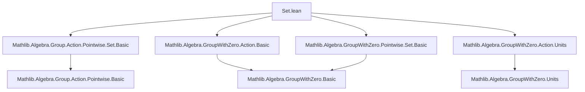

**Technical Brief: `Set.lean` — Pointwise Operations of Sets in a Group with Zero**

---

### 1. **Key Definitions & Theorems**

| Name | Type / Signature | Purpose |
|------|------------------|---------|
| `smul_set_pi₀` | `c • I.pi s = I.pi (c • s)` (under `c ≠ 0`) | Scalar multiplication distributes over indexed product of sets, for nonzero scalars. |
| `smul_set_pi₀'` | `c • I.pi s = I.pi (c • s)` (under `c ≠ 0 ∨ I = univ`) | Generalization of `smul_set_pi₀`, covering the case where the index set is universal. |
| `Set.smulZeroClassSet` | `SMulZeroClass α (Set β)` | Instance: scalar multiplication by `α` preserves zero on sets. |
| `smul_zero_subset` | `s • (0 : Set β) ⊆ 0` | Image of zero under scalar multiplication is contained in zero. |
| `Nonempty.smul_zero` | `s.Nonempty → s • 0 = 0` | If `s` is nonempty, scalar multiplication of zero yields zero. |
| `zero_mem_smul_set` | `(0 ∈ t) → (0 ∈ a • t)` | Zero is in any scalar multiple of a set containing zero. |
| `zero_smul_subset` | `(0 : Set α) • t ⊆ 0` | Multiplying zero set with any `t` yields subset of zero. |
| `Nonempty.zero_smul` | `t.Nonempty → (0 : Set α) • t = 0` | If `t` is nonempty, zero set times `t` is zero. |
| `zero_smul_set` | `s.Nonempty → (0 : α) • s = (0 : Set β)` | Scalar zero acting on nonempty set yields singleton `{0}`. |
| `distribSMulSet` | `DistribSMul α (Set β)` | Instance: distributivity of scalar multiplication over set addition. |
| `distribMulActionSet` | `DistribMulAction α (Set β)` | Instance: distributive multiplicative action on sets. |
| `mulDistribMulActionSet` | `MulDistribMulAction α (Set β)` | Instance: multiplicative action distributes over set multiplication. |
| `instance NoZeroDivisors (Set α)` | `NoZeroDivisors (Set α)` | If `α` has no zero divisors, then so does `Set α` under pointwise multiplication. |
| `smul_mem_smul_set_iff₀` | `a ≠ 0 → (a • x ∈ a • A ↔ x ∈ A)` | Membership equivalence under nonzero scalar multiplication. |
| `mem_smul_set_iff_inv_smul_mem₀` | `a ≠ 0 → (x ∈ a • A ↔ a⁻¹ • x ∈ A)` | Membership in scaled set iff inverse scalar times element is in original set. |
| `smul_set_subset_smul_set_iff₀` | `a ≠ 0 → (a • A ⊆ a • B ↔ A ⊆ B)` | Subset relation preserved under nonzero scalar multiplication. |
| `smul_set_inter₀`, `smul_set_sdiff₀`, `smul_set_symmDiff₀` | `a ≠ 0 → a • (s ∩ t) = a • s ∩ a • t`, etc. | Scalar multiplication distributes over set operations (intersection, difference, symmetric difference) for nonzero scalars. |
| `smul_set_univ₀` | `a ≠ 0 → a • univ = univ` | Nonzero scalar acts surjectively on the universe. |
| `smul_univ₀` | `¬s ⊆ {0} → s • univ = univ` | Any set not contained in `{0}` scales the universe to itself. |
| `inv_smul_set_distrib₀`, `inv_op_smul_set_distrib₀` | `(a • s)⁻¹ = s⁻¹ <• a⁻¹`, `(s <• a)⁻¹ = a⁻¹ • s⁻¹` | Inversion interacts with scalar multiplication on sets. |

---

### 2. **Naming Conventions**

- **Prefixes**:
  - `smul_`: scalar multiplication on sets.
  - `zero_`: behavior involving zero scalar or zero set.
  - `inv_`: inversion (e.g., `inv_smul`, `inv_op_smul`).
  - `mem_`, `subset_`, `image_`: membership, subset, image-related lemmas.
  - `₀` suffix (e.g., `smul_mem_smul_set_iff₀`): indicates a version that requires a nonzero hypothesis (e.g., `a ≠ 0`).

- **Suffixes**:
  - `_set`: indicates operation on sets (e.g., `smul_set`, `zero_smul_set`).
  - `_₀`: specialized version for nonzero scalars.
  - `_subset`: subset inclusion version.
  - `_iff`: equivalence version.

- **Instance naming**:
  - `Set.[class]Set`: e.g., `smulZeroClassSet`, `distribSMulSet`.

---

### 3. **Tactic Stack**

Frequently used tactics in proofs:

- `simp` / `simp only`: simplification with lemmas like `mem_smul`, `zero_smul`, `singleton_zero`, etc.
- `rw`: rewriting using equalities (especially `←`, `→`).
- `ext`: extensionality for set equality.
- `by_contra!`: contradiction proofs (e.g., in `NoZeroDivisors` instance).
- `obtain` / `cases`: destructuring hypotheses (e.g., `obtain rfl | ha := eq_or_ne a 0`).
- `antisymm`: proving equality via subset antisymmetry.
- `image_` lemmas: `image_subset_iff`, `image_image2_distrib`, `image_diff`, `image_symmDiff`, `image_univ_of_surjective`.
- `mul_mem_mul`, `subset_zero_iff`, `of_smul_left`, `of_smul_right`: for zero-divisor arguments.
- `aesop`: not explicitly used here, but `simp` + `rw` + `exact` suffices.

---

### 4. **Proof Logic**

- **Case analysis on equality with zero** (`eq_or_ne a 0`) is pervasive, especially for handling units vs. zero in `GroupWithZero`.
- **Nonemptiness arguments** are common: `Nonempty`, `Nontrivial`, `not_subset`, `subset_zero_iff`.
- **Subset antisymmetry** (`antisymm`) used to prove equality of sets from mutual inclusion.
- **Image-based reasoning**: many lemmas reduce to properties of `image`, especially injectivity/surjectivity of scalar multiplication (via `MulAction.injective₀`, `surjective₀`).
- **Unit embedding**: nonzero elements are embedded into `Units α` via `Units.mk0`, enabling use of existing lemmas for units.
- **Indirect reasoning**: e.g., `NoZeroDivisors` instance uses contradiction and element extraction.

---

### 5. **Imports**

| Import | Purpose |
|--------|---------|
| `Mathlib.Algebra.Group.Action.Pointwise.Set.Basic` | Basic set-theoretic scalar multiplication lemmas. |
| `Mathlib.Algebra.GroupWithZero.Action.Basic` | Scalar actions in `GroupWithZero` context. |
| `Mathlib.Algebra.GroupWithZero.Action.Units` | Actions of units, especially `Units.mk0`. |
| `Mathlib.Algebra.GroupWithZero.Pointwise.Set.Basic` | Pointwise set operations in `GroupWithZero`. |

These imports define the foundational algebraic and set-theoretic infrastructure for reasoning about scalar multiplication on sets in the presence of zero.

---

### 8. **Mermaid Diagrams**

#### **Dependency Graph (Module-Level)**



#### **Overview of Theory Flow**

```mermaid
flowchart LR
  subgraph Algebra
    G0[GroupWithZero α] --> G1[MulAction α β]
    G0 --> G2[NoZeroDivisors α]
    G1 --> G3[Set β]
  end

  subgraph SetOps
    S0[Set β] --> S1[smul: α → Set β → Set β]
    S1 --> S2[zero_smul, smul_zero]
    S1 --> S3[smul_set_inter, smul_set_sdiff]
    S1 --> S4[smul_mem_iff]
  end

  subgraph Instances
    I0[SMulZeroClass α (Set β)]
    I1[DistribSMul α (Set β)]
    I2[DistribMulAction α (Set β)]
    I3[MulDistribMulAction α (Set β)]
    I4[NoZeroDivisors (Set α)]
  end

  S0 --> I0
  S0 --> I1
  S0 --> I2
  S0 --> I3
  G2 --> I4
```

---

### Summary

This file formalizes the behavior of **pointwise scalar multiplication on sets** in the context of a `GroupWithZero`, emphasizing:
- Preservation of algebraic structure (zero, units, multiplication, inversion),
- Interaction with set operations (intersection, difference, symmetric difference),
- Nonzero scalar invertibility and surjectivity,
- Zero-divisor behavior on sets.

It extends earlier `Pointwise` infrastructure to handle zero carefully, distinguishing between `0 ∈ α`, `0 : Set α`, and `∅`, and uses `Units.mk0` to bridge nonzero elements to invertible ones.

--- 

Let me know if you'd like a **dependency graph of lemmas**, or a **proof sketch** of a specific theorem (e.g., `NoZeroDivisors (Set α)`).
