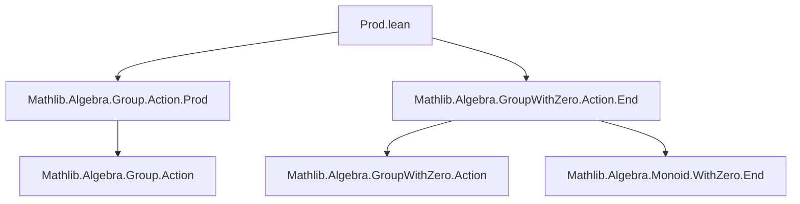

**Technical Brief: `Prod.lean` — Instances for Multiplicative Actions with Zero on Product Types**

---

### 1. **Key Definitions & Theorems**

| Name | Type / Signature | Purpose |
|------|------------------|---------|
| `smul_zero_mk` | `a • (0, c) = (0, a • c)` | Shows scalar multiplication distributes over zero in the first component. |
| `smul_mk_zero` | `a • (b, 0) = (a • b, 0)` | Shows scalar multiplication distributes over zero in the second component. |
| `smulZeroClass` | `[Zero M] [Zero N] [SMulZeroClass R M] [SMulZeroClass R N] → SMulZeroClass R (M × N)` | Lifts `SMulZeroClass` to product types. |
| `distribSMul` | `[AddZeroClass M] [AddZeroClass N] [DistribSMul R M] [DistribSMul R N] → DistribSMul R (M × N)` | Lifts `DistribSMul` to product types. |
| `distribMulAction` | `[Monoid R] [AddMonoid M] [AddMonoid N] [DistribMulAction R M] [DistribMulAction R N] → DistribMulAction R (M × N)` | Lifts `DistribMulAction` to product types. |
| `mulDistribMulAction` | `[Monoid R] [Monoid M] [Monoid N] [MulDistribMulAction R M] [MulDistribMulAction R N] → MulDistribMulAction R (M × N)` | Lifts `MulDistribMulAction` to product types. |
| `smulWithZero` | `[Zero R] [Zero M] [Zero N] [SMulWithZero R M] [SMulWithZero R N] → SMulWithZero R (M × N)` | Lifts `SMulWithZero` to product types. |
| `mulActionWithZero` | `[MonoidWithZero R] [Zero M] [Zero N] [MulActionWithZero R M] [MulActionWithZero R N] → MulActionWithZero R (M × N)` | Lifts `MulActionWithZero` to product types. |
| `DistribMulAction.prodOfSMulCommClass` | `[DistribMulAction M α] [DistribMulAction N α] [SMulCommClass M N α] → DistribMulAction (M × N) α` | Constructs a `DistribMulAction` of the product monoid from commuting actions. |
| `DistribMulAction.prodEquiv` | `DistribMulAction (M × N) α ≃ Σ' (M-action) (N-action), SMulCommClass M N α` | Equivalence between actions of `M × N` and commuting actions of `M` and `N`. |

---

### 2. **Naming Conventions**

- **Prefixes**:
  - `smul_`, `distrib_`, `mul_`, `zero_`, `withZero_`: indicate structure being defined or lifted.
  - `prodOf_`, `prodEquiv`: denote constructions involving product types.
- **Suffixes**:
  - `_mk`: for lemmas about `Prod.mk` (i.e., pair constructors).
  - `_class`: for typeclass instances.
  - `_equiv`: for equivalences (bijective correspondences).
- **Pattern**: `structureType.prodOf_...` or `structureType._mk` for component-wise behavior.

---

### 3. **Tactic Stack**

- `rw [...]`: rewriting using lemmas like `Prod.smul_mk`, `smul_zero`, `smul_add`, etc.
- `ext`: extensionality for products (and sometimes dependent sums).
- `exact ...`: to close goals directly using previously proven lemmas.
- `rfl`: for definitional equalities.
- `change ...`: to rewrite the goal into a more convenient form before rewriting.
- `conv_rhs => rw [...]`: for targeted rewriting on the right-hand side.
- `congr 1`, `funext`, `proof_irrel_heq ..`: for proving equality of dependent sums and higher structure.

---

### 4. **Proof Logic**

- **Component-wise reasoning**: Most proofs use `ext` to reduce to component-wise equalities, then apply known lemmas (`smul_zero`, `smul_add`, etc.) per component.
- **Inductive/structural lifting**: Instances are built by combining existing instances on components using `{ ... with }` syntax (e.g., `Prod.mulAction, Prod.distribSMul with`).
- **Equivalence proofs**:
  - `prodEquiv` uses:
    - `compHom` to restrict actions along inclusions `inl`, `inr`.
    - `MulAction.prodEquiv` to get the underlying `MulAction` equivalence.
    - Verification of `SMulCommClass` and coherence conditions via `rfl` and `one_smul` simplifications.
  - `left_inv` and `right_inv` use `dsimp`, `ext`, and `one_smul` to simplify compositions.

---

### 5. **Imports**

- `Mathlib.Algebra.Group.Action.Prod`: foundational product action lemmas.
- `Mathlib.Algebra.GroupWithZero.Action.End`: endomorphism and zero-compatible actions.

These imports define the base theory for multiplicative actions with zero and their behavior on products.

---

### 6. **Dependency & Theory Overview**

#### **Mermaid Diagram: Module Dependencies**



#### **Mermaid Diagram: Theory Flow**

```mermaid
graph TD
  A[SMulZeroClass] --> B[SMulWithZero]
  C[DistribSMul] --> D[DistribMulAction]
  D --> E[MulActionWithZero]
  B --> E
  E --> F[Prod.lean: Product Instances]
  G[DistribMulAction M α] & H[DistribMulAction N α] & I[SMulCommClass M N α] --> J[DistribMulAction (M × N) α]
  J --> K[DistribMulAction.prodEquiv]
```

#### **Summary**

This file formalizes how multiplicative actions with zero (and related structures like `DistribMulAction`, `MulDistribMulAction`) lift to product types. It also establishes a universal property: actions of a product monoid `M × N` correspond bijectively to pairs of commuting actions of `M` and `N`. The proofs rely heavily on component-wise reasoning and standard algebraic lemmas about scalar multiplication and zero.

--- 

Let me know if you'd like a formalized dependency graph or a summary of how this fits into the broader `Mathlib` action hierarchy.
